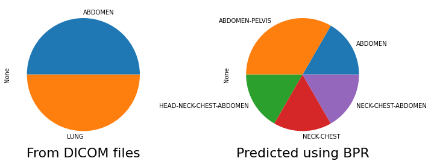

Back to [Projects List](../../README.md#ProjectsList)

# Using Imaging Data Commons to Perform Deep-Learning Based Body Part Regression

## Key Investigators

- Deepa Krishnaswamy (Brigham and Women's Hospital)
- Andrey Fedorov (Brigham and Women's Hospital)

# Project Description

One issue in using deep learning for segmentation of anatomical regions is the ability to obtain datasets that focus on the area of interest. For instance, some DL algorithms may require preprocessing of datasets (cropping volumes before training the algorithm) or postprocessing of the segmentation label output by the removal of false positives. 

Within DICOM data, the body part examined tag may provide some information as to the region captured. Unfortunately, it may be list the incorrect region, or be blank because of removal during the anonymization process. Therefore this tag cannot always be relied upon. 

Therefore, a deep learning method has been developed that creates a new coordinate system that maps each axial slice to a "slice score". These scores are associated with specific anatomy and therefore can be used for a smarter way to crop volumes to aid in preprocessing.  

We plan to leverage the strengths of Imaging Data Commons by using it to obtain data from TCIA, and perform queries. We will obtain a varied CT dataset where the body part regression model can be tested on, and will hopefully demonstate the usefulness of IDC for this type of analysis and visualization. 

## Objective

<!-- Describe here WHAT you would like to achieve (what you will have as end result). -->

1. Objective A. We will demonstate how the body part examined tag is unreliable for describing anatomical regions
1. Objective B. We will show how the slice scores (that correspond to anatomical regions) can be used crop volumes in an efficient manner. 
1. Objective C. We will also show how the body part regression model can be used on a variety of CT data. 

## Approach and Plan

<!-- Describe here HOW you would like to achieve the objectives stated above. -->

1. We will use the trained model from the author (below) to test the neural network on a small dataset obtained from TCIA using IDC. 
1. We will use BigQuery to obtain a more varied dataset that captures differences in CT volumes (pixel spacing, slice thickness, manufacturer). 
1. We will create better visualizations of the cropped results, (either within the notebook, or by sending data back to the OHIF viewer), and compare it to the anatomical regions described by the RTSTRUCT/SEG files. 

## Progress and Next Steps

<!-- Update this section as you make progress, describing of what you have ACTUALLY DONE. If there are specific steps that you could not complete then you can describe them here, too. -->

1. We have used the trained model from the author to test the regression network on a small sample of data. 
1. We have started to obtain a varied CT dataset. 
1. We have started to compare the cropped regions to the anatomy provided by the RTSTRUCT/SEG files. 

# Illustrations

<!-- Add pictures and links to videos that demonstrate what has been accomplished.

-->

# Background and References

<!-- If you developed any software, include link to the source code repository. If possible, also add links to sample data, and to any relevant publications. -->

Schuhegger S. Body Part Regression for CT Images. arXiv preprint arXiv:2110.09148. 2021 Oct 18. https://arxiv.org/abs/2110.09148?context=eess 

Github link: https://github.com/mic-dkfz/bodypartregression \
Inference example: https://github.com/MIC-DKFZ/BodyPartRegression/blob/develop/docs/notebooks/inference-example.ipynb 

