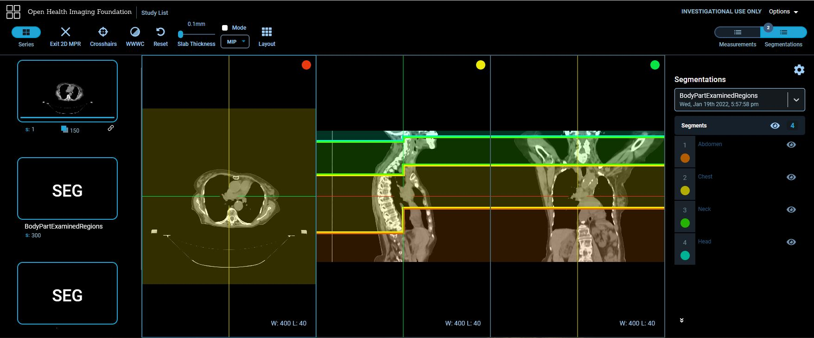

Back to [Projects List](../../README.md#ProjectsList)

# Using Imaging Data Commons to Perform Deep-Learning Based Body Part Regression

## Key Investigators

- Deepa Krishnaswamy (Brigham and Women's Hospital)
- Khaled Younis (Philips)
- Andrey Fedorov (Brigham and Women's Hospital)

# Project Description

One issue in using deep learning for segmentation of anatomical regions is the ability to obtain datasets that focus on the area of interest. For instance, some DL algorithms may require preprocessing of datasets (cropping volumes before training the algorithm) or postprocessing of the segmentation label output by the removal of false positives. 

Within DICOM data, the body part examined tag may provide some information as to the region captured. Unfortunately, it may be list the incorrect region, or be blank because of removal during the anonymization process. Therefore this tag cannot always be relied upon. 

A deep learning method was developed (reference below) that creates a new coordinate system that maps each axial slice to a "slice score". These scores are associated with specific anatomy and therefore can be used for a smarter way to crop volumes to aid in preprocessing.  

We plan to leverage the strengths of Imaging Data Commons by using it to obtain data from TCIA, and perform queries. We will obtain a varied CT dataset where the body part regression model can be tested on, and will hopefully demonstate the usefulness of IDC for this type of analysis and visualization. 

## Objective

<!-- Describe here WHAT you would like to achieve (what you will have as end result). -->

1. Objective A. We will demonstate how the body part examined tag is unreliable for describing anatomical regions
1. Objective B. We will show how the slice scores (that correspond to anatomical regions) can be used crop volumes in an efficient manner. 
1. Objective C. We will also show how the body part regression model can be used on a variety of CT data. 

## Approach and Plan

<!-- Describe here HOW you would like to achieve the objectives stated above. -->

1. We will use BigQuery to obtain a more varied dataset that captures differences in CT volumes (pixel spacing, slice thickness, manufacturer). 
1. We will then use the trained model from the author (below) to test the neural network on the dataset obtained from TCIA using IDC. 
1. Next we will compare the "ground truth" regions from the RTSTRUCT/SEG files to the regions cropped by using BPR, and see if they are within the bounds.
1. We will show the difference between the body part examined tag from the original DICOM files to the ones predicted by BPR. 
1. We will visualize the results by populating the results to DICOM data stores and interacting with them using the OHIF viewer. 

## Progress and Next Steps

<!-- Update this section as you make progress, describing of what you have ACTUALLY DONE. If there are specific steps that you could not complete then you can describe them here, too. -->

1. We have obtained a small, but varied, CT dataset. 
1. We have used the trained model from the author to test the regression network on a sample of data. 
1. We have created our own SEG DICOM files that hold for each patient the "ground truth" anatomical region versus the cropped region produced by BPR. 
1. We have created our own SEG DICOM files that holds the predicted body part examined regions.  
1. We have populated DICOM data stores and used the OHIF viewer to interact with them. 
1. It would be beneficial to test on a larger dataset. 

# Illustrations

We can browse our DICOM data stores and use OHIF (thanks to this [project!](https://projectweek.na-mic.org/PW36_2022_Virtual/Projects/OHIFonGCP/)) to show a comparison of the original lung segmentation along with the predicted cropped volume as a bounding box. We can see that the bounding box captures the lung, demonstrating the usefulness of this method for pre or post-processing for segmentation algorithms. 

We can also compare the body part examined tag distrubtion from the original DICOM files vs the tag predicted by Body Part Regression. In this particular dataset we included patients with kidney and lung segmentations, and by observing these tags, we can see that areas outside of these regions were included in the CT scans. 

Using the same viewer as above, we can also observe the predicted body part examined regions. For this particular example, the body part examined was LUNG, but it can be seen that the predicted regions include ABDOMEN-CHEST-NECK-HEAD. If we scroll in the axial direction, we can see some slices that have two colors - this indicates that the slice was classified as having both regions, for instance both ABDOMEN and CHEST. 

We can look at MPR views to better view the predicted regions. We can see that by looking at the sagittal view, that each axial slice may include multiple predicted regions. We can see that including the regions ABDOMEN-CHEST-NECK-HEAD is more accurate than only LUNG. 

<!-- Add pictures and links to videos that demonstrate what has been accomplished.

-->

# Background and References

<!-- If you developed any software, include link to the source code repository. If possible, also add links to sample data, and to any relevant publications. -->

Schuhegger S. Body Part Regression for CT Images. arXiv preprint arXiv:2110.09148. 2021 Oct 18. https://arxiv.org/abs/2110.09148?context=eess 

Github link to code from thesis: https://github.com/mic-dkfz/bodypartregression 

[Link to the colab notebook](https://colab.research.google.com/drive/1Udqz74i2I6W69t0G3aiJ-5UmlK0f6xxG?usp=sharing)
