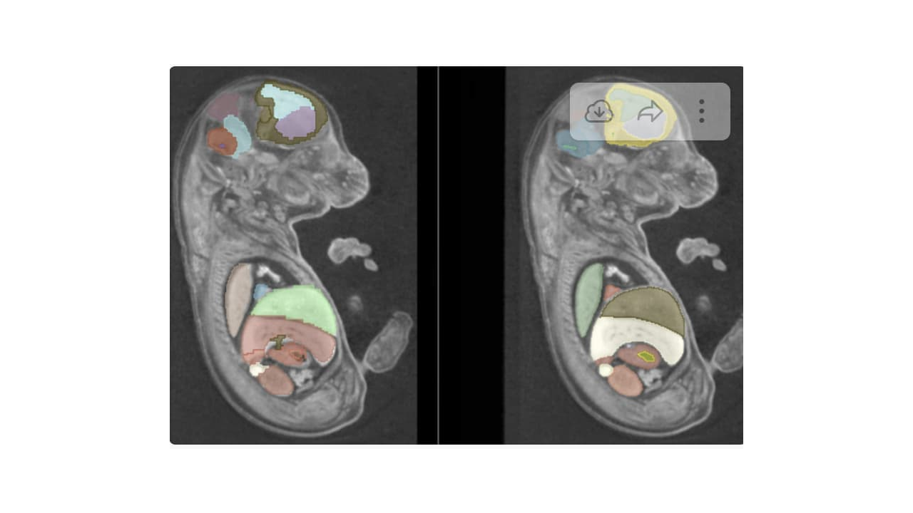
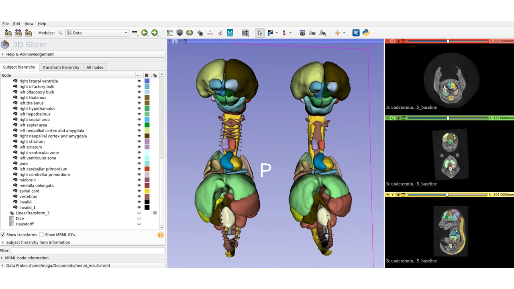

Back to [Projects List](../../README.md#ProjectsList)

# Multi-organ Segmentation in Fetal Mice

## Key Investigators

- Murat Maga (Seattle Children's Research Institute, UW)
- Sara Rolfe (Seattle Children's Research Institute, UW)
- Andres Diaz-Pinto (Kings College, Nvidia)

# Project Description

<!-- Experiment and refine methods to segment multiple organs in contrast-enhanced microCT scans of fetal mice . -->

## Objective

<!-- Describe here WHAT you would like to achieve (what you will have as end result). -->

1. We would like to assess whether MONAILabel can segment internal organs of fetal mice in similar quality to the deformable atlas-based registration. 
2. Evaluate pros and cons of both approach. 

## Approach and Plan

<!-- Describe here HOW you would like to achieve the objectives stated above. -->

1. [3D Fetal mice data comes from International Mouse Phenotyping Consortium](https://www.mousephenotype.org/). VOlumes are approximately 210x250x400 voxels. 
2. [E15 Fetal Mice atlas comes from](http://www.mouseimaging.ca/technologies/mouse_atlas/mouse_embryo_atlas.html). There are a total of 50 unique labels (plus background).
3. We used R implementation of [ANTs](https://github.com/ANTsX/ANTsR) to transfer atlas labels to individual mice using a two-pass deformable registration (initial low-res with SyN + MI, and high-resolution used SyN + CC). It takes approximately 4h to register one sample using 24 threads. 
4. Reviewed the transfered labels on subject space (all resultant templates considered good enough to be used as is, without manual editing
5. Edited the MultiLabel version of DeepEdit to match our label names. 
6. Used 86 such labeled volumes for training data in MonaiLabel with default 0.8/0.2 split. We retained 14 additional samples with labels for inference tests.  

## Progress and Next Steps

<!-- Update this section as you make progress, describing of what you have ACTUALLY DONE. If there are specific steps that you could not complete then you can describe them here, too. -->

1. Initial model training for mouse embryo segmentation was done a spatial resolution of 128x128x128. Training carried out to 500 epochs. While successeful, there wasn't sufficient anatomical detail due to low spatial resolution of model.  
2. Edited the spatial resolution to 192x192x192 (highest we can fit on Nvidia A6000, with 48GB of RAM). Used the initial model weights, and rerun the tranining for further 100 epochs. This improved the detail considerably. We also achievied higher training dice scores on this higher resolution modes. 
3. Currently running inference on unseen data. Inference takes approximately one-minute when monaiserver is local to the Slicer application.  

# Illustrations

<!-- Add pictures and links to videos that demonstrate what has been accomplished.

-->

# Background and References

<!-- If you developed any software, include link to the source code repository. If possible, also add links to sample data, and to any relevant publications. -->
