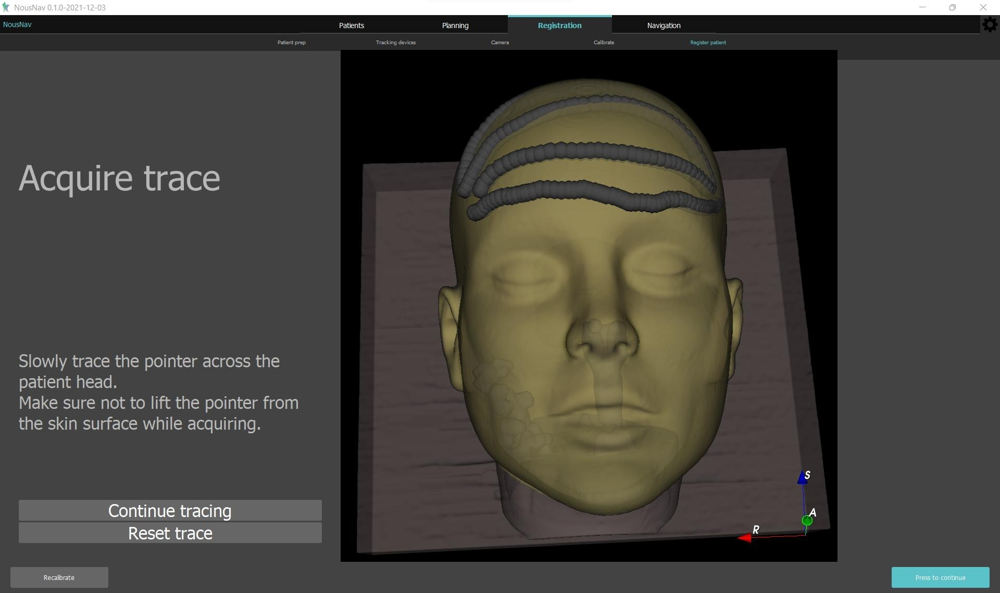

Back to [Projects List](../../README.md#ProjectsList)

# NousNav: Low-cost neuronavigation system

## Key Investigators

- Étienne Léger (BWH)
- Alexandra Golby (BWH)
- Sam Horvath (Kitware)
- Sarah Frisken (BWH)
- David Allemang (Kitware)
- Tina Kapur (BWH)
- Steve Pieper (Isomics)
- Jean-Christophe Fillion-Robin (Kitware)
- Sonia Pujol (BWH)
- Kelly Wang (MIT)

# Project Description

The NousNav project is an initiative led by Dr Alex Golby to develop a low-cost neuronavigation system designed for use in low- and middle-income countries.  We are developing a 3D Slicer based application focused on supporting segmentation, registration and navigation tasks.

The project will also include the development of open source hardware designs for these applications.

## Objective

1. Discuss next steps and current progress
2. Explore ideas to improve surface registration
3. Explore ideas for skin segmentation

## Approach and Plan

1. Discuss specific requirements
2. Test new methods
3. Fix existing bugs

## Progress and Next Steps

1. Added tracing registration to the workflow (see picture below)
2. See other related projects for other updates on tracking, segmentation, etc.

# Illustrations

