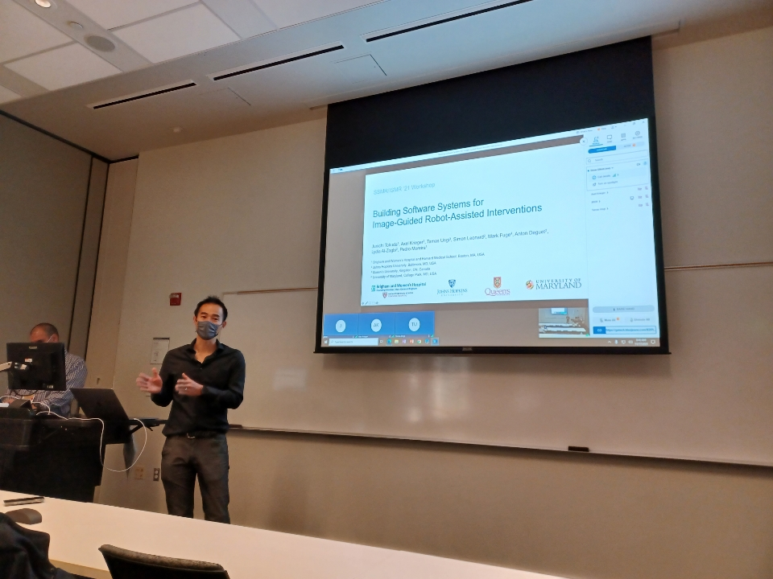

Back to [Projects List](../../README.md#ProjectsList)

# Integration of ROS and 3D Slicer using OpenIGTLink

## Key Investigators

- Junichi Tokuda (BWH)
- Tamas Ungi (Queen's)
- Simon Leonard (JHU)
- Axel Krieger (JHU)
- Mark Fuge (UMD)
- Yiwei Jiang (WPI)

# Project Description

We have been developing [ROS-IGTL-Bridge](https://rosmed.github.io), which is an interface for Robot Operating System (ROS) to exchange data with 3D Slicer.
See [the project page](https://rosmed.github.io) for detail.

## Objective

There are three goals for this project week:

1. Refine the tutorial page, which was created for International Symposium on Medical Robotics (ISMR) 2021.
2. Document the virtual platform (i.e., Docker) used in the tutorial.
3. Ask for feedback from the 3D Slicer community

## Approach and Plan

<!-- Describe here HOW you would like to achieve the objectives stated above. -->

1. Describe specific steps of **what you plan to do** to achieve the above described objectives.
1. ...
1. ...

## Progress and Next Steps

<!-- Update this section as you make progress, describing of what you have ACTUALLY DONE. If there are specific steps that you could not complete then you can describe them here, too. -->

1. Describe specific steps you **have actually done**.
1. ...
1. ...

# Illustrations

<!-- Add pictures and links to videos that demonstrate what has been accomplished.

-->

# Background and References

<!-- If you developed any software, include link to the source code repository. If possible, also add links to sample data, and to any relevant publications. -->
