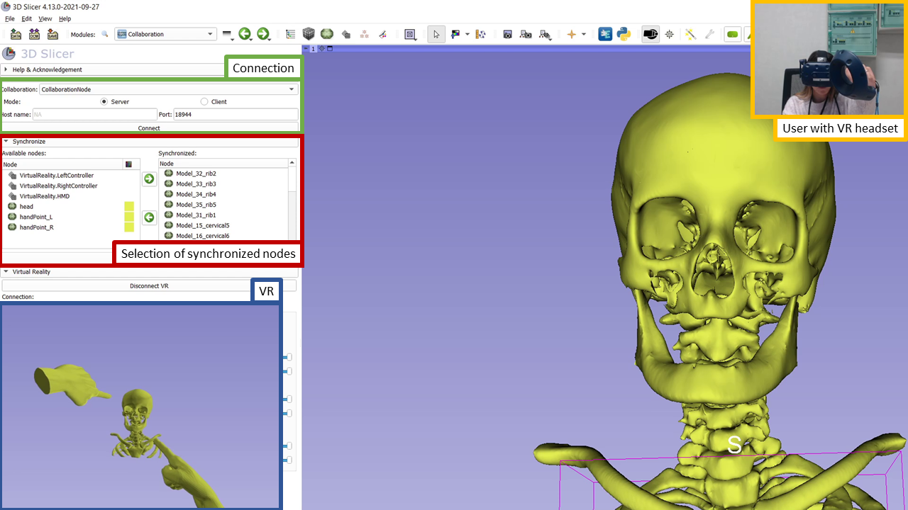
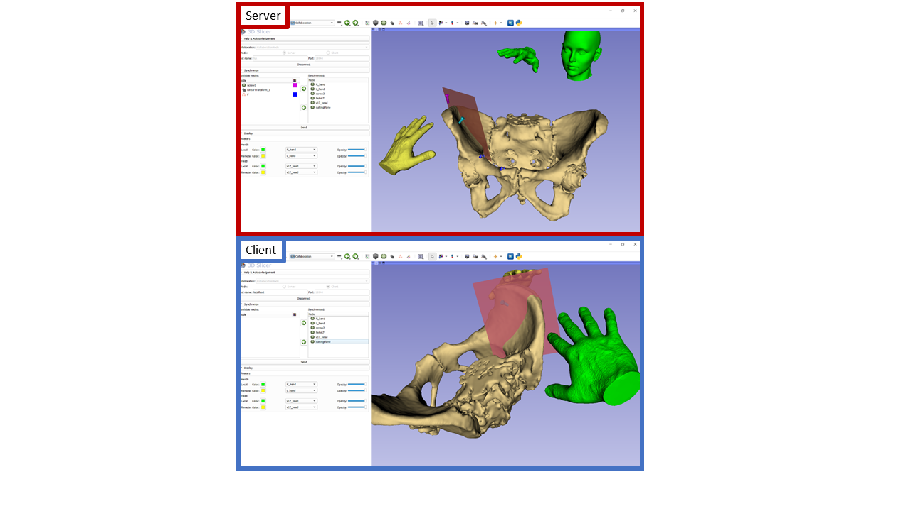

Back to [Projects List](../../README.md#ProjectsList)

# Collaborative Slicer session

## Key Investigators

- Csaba Pinter (EBATINCA)
- Mónica García (ULPGC - Universidad de Las Palmas de Gran Canaria)
- Jean-Christophe Fillion-Robin (Kitware)

# Project Description

<!-- Add a short paragraph describing the project. -->

Slicer module (packaged in an extension) for connecting two or more running Slicer sessions one being the server the other(s) the client(s). The module synchronizes properties and data via OpenIGTLink that have not been supported so far, but are needed for shared session, for example all markup types and display properties of any nodes. This is one of the main components needed for AR/VR collaboration.

## Objective

<!-- Describe here WHAT you would like to achieve (what you will have as end result). -->

1. Objective A. Showcase current progress
1. Objective B. Collect feedback, add select features
1. Objective C. Fix remaining issues

## Approach and Plan

<!-- Describe here HOW you would like to achieve the objectives stated above. -->

1. List all currently used node types in Slicer and decide which are supported, and those that are not how will be supported. Create plan. Special attention to:
    1. Segmentations
    1. Subject hierarchy (folders, reparenting etc.)
3. Remote connections
    1. Try connecting computers on the same network
    1. Brainstorm about how to facilitate connection of instances without fixed IP
4. Integrate necessary commit into SlicerOpenIGTLink

## Progress and Next Steps

<!-- Update this section as you make progress, describing of what you have ACTUALLY DONE. If there are specific steps that you could not complete then you can describe them here, too. -->

1. Demo and discussion about the extension and features, talk about use cases :heavy_check_mark:
1. SlicerOpenIGTLink contribution integrated, see [commit](https://github.com/openigtlink/SlicerOpenIGTLink/commit/a28d381af4542063f60e885c0505e45fbd5e9006) :heavy_check_mark:
1. List of currently used node types in Slicer.
    1. Supported by OpenIGTLink:
        - Models
        - Linear Transforms
        - Text
        - Volumes
        - Fiducial Markups
     1. Not supported by OpenIGTLink, but supported by SlicerCollaboration:
        - Display nodes
        - Remaining Markups
        - Information about the transforms observed by each node
     1. To be supported by SlicerCollaboration:
        - Segmentations
        - Subject hierarchy information

1. Discussion about how to solve remote connections through OpenIGTLink with Slicer running in a computer with no externally visible fixed IP. Suggested solutions:
    1. Setup port forwarding on your router. This way you can call this address from outside and the router automatically redirects traffic to the specified computer on the local network. Downsides: the setup needs to be redone every time your router allocates a new local ip to your computer. It is usually not possible to setup like that in the office unless you have control of the network node going out.
    2. See if there's a way to make a SlicerSharing app for one of the services that already does real time sharing. Teams and Zoom both have hooks for apps.
    3. VNC connect, TeamViewer, etc. use a rendezvous server that allows clients and servers to find each other and connect directly.

# Illustrations

<!-- Add pictures and links to videos that demonstrate what has been accomplished.

-->

Screenshot showing VR usage:

Screenshot showing server/client:

# Background and References

<!-- If you developed any software, include link to the source code repository. If possible, also add links to sample data, and to any relevant publications. -->

* [GitHub repository](https://github.com/EBATINCA/SlicerCollaboration)
