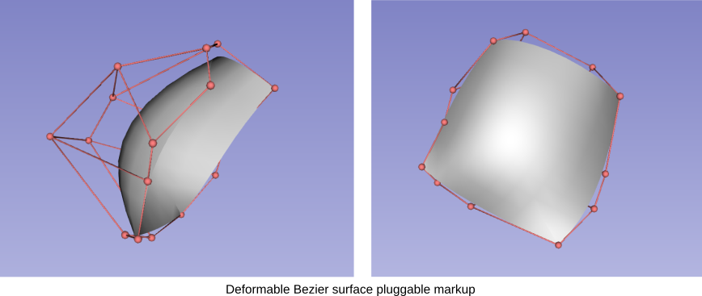

Back to [Projects List](../../README.md#ProjectsList)

# PRISM Volume Rendering

## Key Investigators

- Rafael Palomar (Oslo Unviersity Hospital and NTNU)
- Gabriella d'Albenzio (Oslo University Hospital)
- Ole Vegard Solberg (SINTEF)
- Geir Arne Tangen (SINTEF)
- Ruoyan Meng (NTNU)

# Project Description

This project will continue the development of the *Slicer-Liver* extension
that will be developed through the [ALive project](https://alive-research.no).
The objective of the Slicer-Liver extension is to provide researchers
with tools to perform liver analytics towards planning of liver interventions
(resections, ablations). At this point in the project we need to port early
prototypes of our resection planning algorithms into 3D Slicer.

[Early prototype of the resection planning module](https://youtu.be/7M3DULQp81k)

## Objective

1. Integrate the components developed during the [last
   ProjectWeek](https://github.com/NA-MIC/ProjectWeek/tree/master/PW35_2021_Virtual/Projects/Slicer-Liver
   "Slicer-Liver in the last ProjectWeek") in a resection planning working prototype. 

## Approach and Plan

1. Integration of resection deformation and resection initialization
1. Development of distance measurements visualized in the resections using shaders.
1. Add a GUI to manage resections.

## Progress and Next Steps

The core components of the planning platform have been developed but not
integrated together. Shaders and pluggable markups infrastructure have been used
for the development of the resection initialization, but are not yet integrated
for visualization of other measurments (e.g., safety margins).

# Background and References
1. [Slicer-Liver PW35](https://github.com/NA-MIC/ProjectWeek/tree/master/PW35_2021_Virtual/Projects/Slicer-Liver
   "Slicer-Liver in the last ProjectWeek") (June 2021)
1. [NorMIT-Plan at NA-MIC project week](https://projectweek.na-mic.org/PW33_2020_GranCanaria/Projects/NorMIT-Plan/) (january 2020)
1. [NorMIT-Plan at NA-MIC project week](https://projectweek.na-mic.org/PW34_2020_Virtual/Projects/SlicerLiverAnalysis/) (December 2020)
1. Palomar, Rafael, et al. "A novel method for planning liver resections using deformable Bézier surfaces and distance maps." Computer Methods and Programs in Biomedicine 144 (2017): 135-45.
1. Palomar, Rafael, et al. "Surface reconstruction for planning and navigation of liver resections." Computerized Medical Imaging and Graphics 53 (2016): 30-42.
