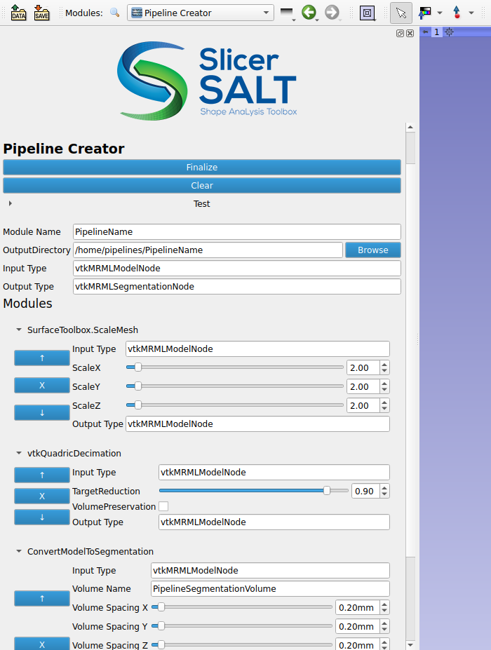
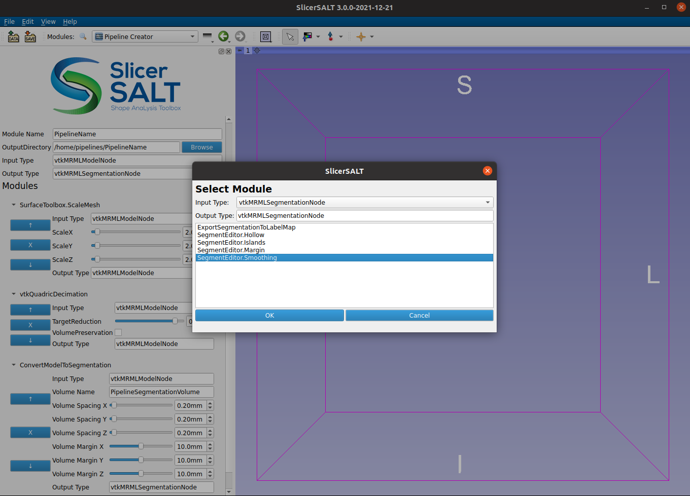
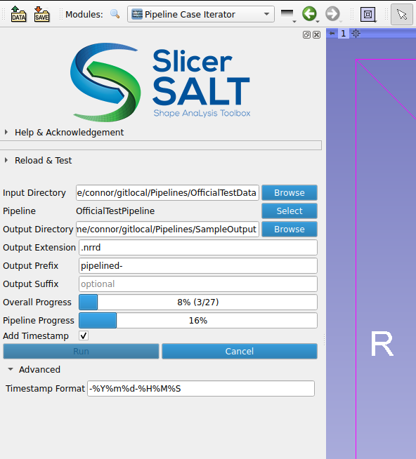

Back to [Projects List](../../README.md#ProjectsList)

# SlicerPipelines

## Key Investigators

- Connor Bowley (Kitware, USA)
- Sam Horvath (Kitware, USA)

# Project Description

A new extension, SlicerPipelines, is currently being developed and allows for GUI create-able modules (pipelines) in 3DSlicer. The term "pipeline" in this context is a module whose logic has a specific interface (or is wrapped to meet the interface), which allows for one MRML node input to one MRML node output algorithms.

In general, the SlicerPipelines extension is meant to help improve efficiency when dealing with simple workflows. Two main modules currently exist, a PipelineCreator module that allows for the creation of pipelines, and a PipelineCaseIterator module that allows for automated running of a pipeline over all files in a directory.

## Objective

<!-- Describe here WHAT you would like to achieve (what you will have as end result). -->

1. Increase usefulness and useability of the extension
1. Allow easier creation of new pipelines from existing modules

## Approach and Plan

<!-- Describe here HOW you would like to achieve the objectives stated above. -->

1. Wrap more existing modules as pipelines to increase usefulness of the extension
    - Pipelines to convert between MRML types (segmentation to model, scalar volume to label map volume, etc). Some of these already exist, but finish them out for the core MRML types.
1. Update [existing wrapper generator for CLI modules](https://github.com/Connor-Bowley/SlicerPipelines/blob/0db7dcb8bf05e14307a2ee7dfdcb009eb0a6c1b0/PipelineModules/PipelineModulesLib/CLIModuleWrapping.py) to be able to be used for more CLIs. Currently implementation is limited in types it supports.
1. Add ability to load newly created pipeline module when it is created, and add it to the additional module paths

<!-- ## Progress and Next Steps -->

<!-- Update this section as you make progress, describing of what you have ACTUALLY DONE. If there are specific steps that you could not complete then you can describe them here, too. -->

<!-- # Illustrations -->

<!-- Add pictures and links to videos that demonstrate what has been accomplished.

-->

# Background and References

- [Discourse post on SlicerPipelines](https://discourse.slicer.org/t/pipelines-in-3d-slicer/20107)
- [Main Github Repository](https://github.com/KitwareMedical/SlicerPipelines)
- [Github fork actively being developed](https://github.com/Connor-Bowley/SlicerPipelines)

