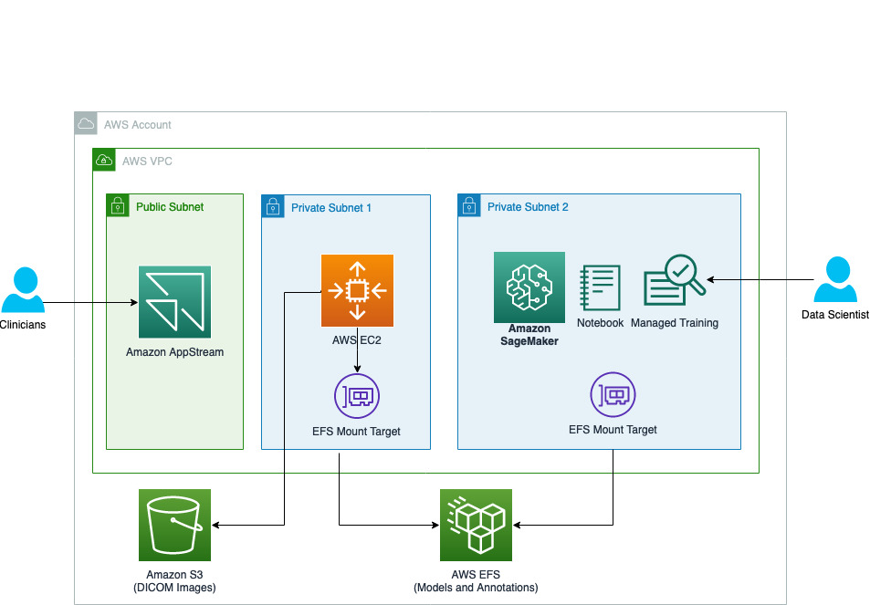

Back to [Projects List](../../README.md#ProjectsList)

# Static DICOM Generator

## Key Investigators

- Chris Hafey (AWS)
- Gang Fu (AWS)
- Jordan Kojouharov (AWS)
- Qing Liu (AWS)
- Dmitry Pavlov (AWS)
- Andres Diaz-Pinto (NVIDIA)
- Sachidanand Alle (NVIDIA)
- YOU

# Project Description

In many cases, a user will have DICOM P10 files and want to access them for viewing or analysis purposes in AWS.  
Today this is typically done by loading these images into an open source DICOM server such as Orthanc or DCM4CHEE and accessed via the included DICOMweb interface.
While these servers work, a simpler more scalable approach is possible for many access use cases by creating a static HTTP site in S3 with objects that correspond to DICOMweb responses.
Amazon S3 is a highly scalable, highly available object store that is perfect to build serverless applications, like serving DICOMWeb client requests from MONAILabel.
The primary outcome of this project to to demonstarte the usability of AI assissted annotations using MONAILabel and 3D Slicer, with DICOM P10 files on Amazon S3.
We will validate the usefullness of this solution using this [National Lung Screening Trial](https://wiki.cancerimagingarchive.net/display/NLST/National+Lung+Screening+Trial#5800702d1a85fbd42314c9eb5cdaef39d568cb8) dataset.

## Objective

<!-- Describe here WHAT you would like to achieve (what you will have as end result). -->

1. Upload and convert large scale Lung CT scans in DICOM P10 files to Amazon S3
2. Visualize and Annotate images using 3D Slicer
3. AI assisted annotations of spines in Lung CT scan

## Approach and Plan

<!-- Describe here HOW you would like to achieve the objectives stated above. -->

1. Upload and convert Lung CT scans in DICOM P10 files to Amazon S3
2. Train spine segementation model using Amazon SageMaker
3. Deploy model to MONAILabel
4. Visualize and Annotate images using 3D Slicer
5. AI assisted annotations of spines in Lung CT scan

## Progress and Next Steps

<!-- Update this section as you make progress, describing of what you have ACTUALLY DONE. If there are specific steps that you could not complete then you can describe them here, too. -->

1. Describe specific steps you **have actually done**.
1. ...
1. ...

# Illustrations

Here is the architecture diagram of this solution on AWS:

# Background and References

https://catalog.us-east-1.prod.workshops.aws/v2/workshops/ff6964ec-b880-45d4-bc1e-468b0c7fa854/en-US/
https://wiki.cancerimagingarchive.net/display/NLST/National+Lung+Screening+Trial#5800702d1a85fbd42314c9eb5cdaef39d568cb8
