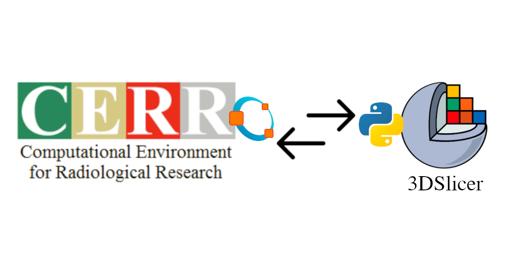
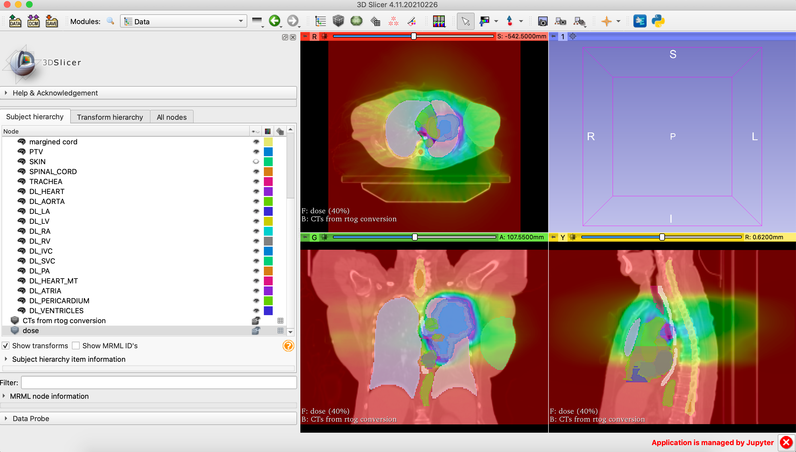
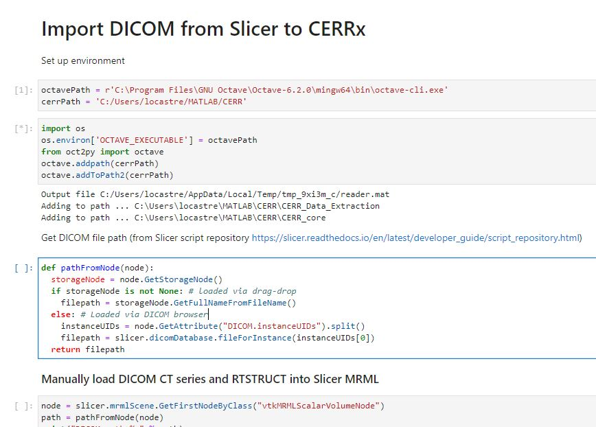

Back to [Projects List](../../README.md#ProjectsList)

# sliCERR

## Key Investigators

- Eve LoCastro (MSKCC)
- Aditya Apte (MSKCC)
- Aditi Iyer (MSKCC)
- Harini Veeraraghavan (MSKCC)

# Project Description

CERRx is an Octave/MATLAB-based software platform for developing and sharing research results using radiation therapy treatment planning and imaging informatics. "sliCERR" is being developed to facilitate the use of CERRx's radiotherapy and image analysis functionality. The extension we envision, "sliCERR", will provide scripted modules for data I/O operations, and will run analysis routines from CERRx.

## Objective

<!-- Describe here WHAT you would like to achieve (what you will have as end result). -->
"sliCERR" will be a scripted module for Slicer, written in Python. We are starting in Jupyter notebooks with 3D Slicer kernel for visualization and image processing. The cerr2mrml module handles the I/O operations of loading native CERR planC format files into the 3DSlicer MRML scene, including import of scan, dose and ROI contours.
1. Easy imaging data IO exchange between CERR and 3D Slicer platforms via module UI
2. Enable CERRx features for dosimetry and image analysis, ROE Radiotherapy Outcomes Estimator, semi-quanitative DCE features, DL-based image segmentation models

## Approach and Plan

<!-- Describe here HOW you would like to achieve the objectives stated above. -->

1. Slicer-Jupyter notebooks to code the data import/export process and analysis as proof-of-concept
2. User interface was development for 3DSlicer GUI to simplify the process of selecting CERR-format datasets for import in 3DSlicer.

## Progress and Next Steps

<!-- Update this section as you make progress, describing of what you have ACTUALLY DONE. If there are specific steps that you could not complete then you can describe them here, too. -->

1. Use of specialized functions in CERR such as Deep Learning-based image segmentation and radiomics texture mapping, demonstrated in Jupyter notebooks publicly available on GitHub.
2. GUI is in development
3. Expand wiki documentation for setup and usage

# Illustrations

Link to Jupyter Notebook demo: https://mskcc.box.com/s/eizbm2nc54uvddcomzmvotw2w8sl82h4

<!--  -->
<!-- Add pictures and links to videos that demonstrate what has been accomplished.

-->

<!--  -->

# Background and References
* ROE: Radiotherapy Outcomes Estimator - An Open-Source Tool for Modeling Radiotherapy Outcomes https://www.aapm.org/meetings/2017am/PRAbs.asp?mid=127&aid=37270
* Extension of CERR for computational radiomics: A comprehensive MATLAB platform for reproducible radiomics research https://pubmed.ncbi.nlm.nih.gov/29896896/
* CERR GitHub Source Repo https://github.com/cerr/CERR
* CERR Wiki https://cerr.github.io/CERR/
* sliCERR Repo https://github.com/cerr/sliCERR
<!-- If you developed any software, include link to the source code repository. If possible, also add links to sample data, and to any relevant publications. -->
