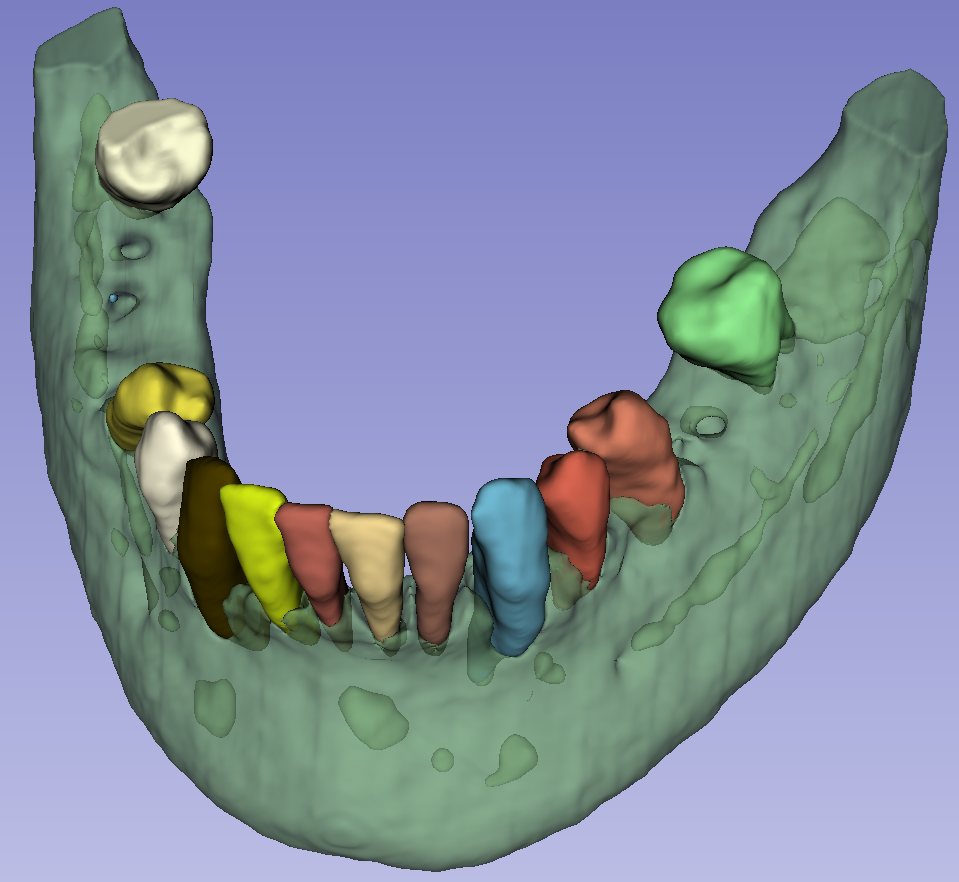
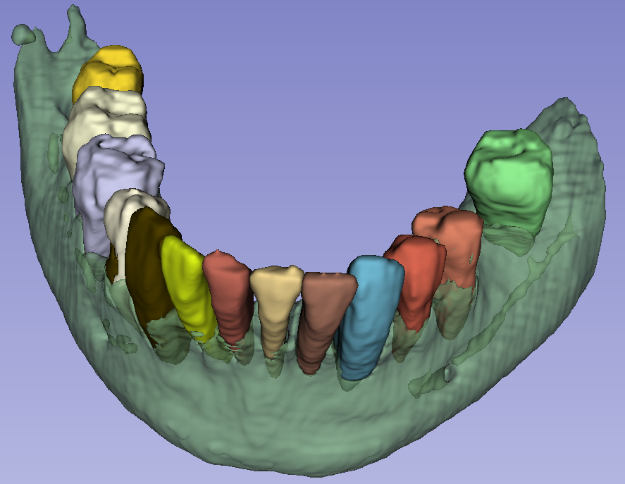
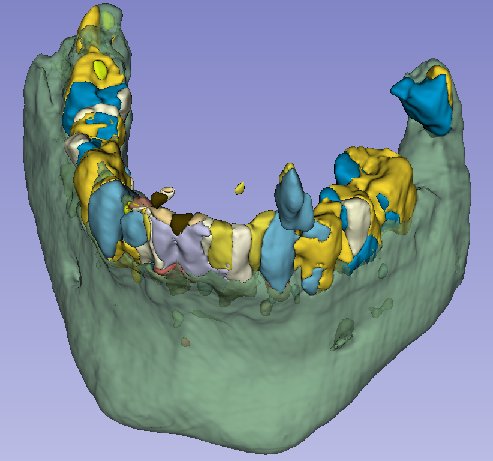
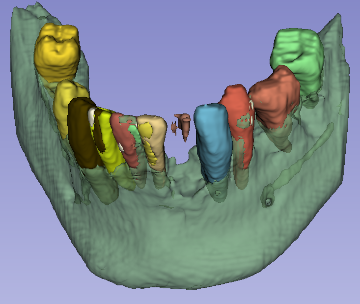

Back to [Projects List](../../README.md#ProjectsList)

# Multi-stage deep learning segmentation of teeth

## Key Investigators

- Daniel Palkovics (Semmelweis Medical University)
- Csaba Pinter (Ebatinca)
- David Garcia Mato (Ebatinca)
- Andres Diaz-Pinto (NVidia)

# Project Description

<!-- Add a short paragraph describing the project. -->

Segmenting and identifying the teeth in a mandible or maxilla is a difficult task, especially due to the high number of structures and their similarity. Recent results suggest that multi-stage segmentation may yield more accurate segmentation in these scenarios.

## Objective

<!-- Describe here WHAT you would like to achieve (what you will have as end result). -->

The idea is to create a simple two-stage approach in MONAILabel where the first stage detects the teeth centre and the second stage accurately segments the teeth themselves.

## Approach and Plan

<!-- Describe here HOW you would like to achieve the objectives stated above. -->

1. Discuss with Andrés the details about multi-stage segmentation in MONAILabel
1. Design the changes to be made

## Progress and Next Steps

<!-- Update this section as you make progress, describing of what you have ACTUALLY DONE. If there are specific steps that you could not complete then you can describe them here, too. -->

1. Discussion with Andrés about multi-stage deep learning approach
    - Multistage approach is more robust because the complexity is separated (robustness is the main advantage)
        - Paper (see below) has several models: ROI, Centroid/Skeleton (numbers OR images), Multi-task tooth segmentation, Tooth ID classification, Cascaded bone segmentation
        - Baseline data for centroid model are just the centroids, that can be calculated from the baseline segmentation. Same with the centerline one
        - Implementing generic multi-stage approach in MONAILabel is a bit of a work
            - In MONAI core this is easier to set up
    - Why one model? Having one upper and one lower is OK for us
        - Even lower + upper + bone + implant/tooth separation is a possibility
        - Advantage of one multi-stage model is that we have only one system
        - If we have both upper and lower then we need more data
        - Clinically we'll only have either upper or lower
    - How do we connect the stages?
        - Centroid/skeleton using numbers (not images) is regression (not segmentation)
        - Concatenate input numbers on the "bottom of the UNet" where we have a huge array of numbers after downsampling
    - MONAI files
        - .pt: model (need to define network first etc.)
        - .ts: torch script that contains preprocessing and the inference too
2. Proposal
    - Simple multi-stage model implementation using MONAI
    - Initial: ROI definition -> Centroids -> Tooth segmentation
    - Later still possible to add for example tooth identification, centerline, implant segmentation, etc.

# Illustrations

There are some promising preliminary results

but there is room for improvement!

# Background and References

<!-- If you developed any software, include link to the source code repository. If possible, also add links to sample data, and to any relevant publications. -->

- [PW36 project](https://github.com/NA-MIC/ProjectWeek/tree/master/PW36_2022_Virtual/Projects/AutomaticSegmentationofTeethandAlveolarBone)
- [Cui2022 paper](https://www.nature.com/articles/s41467-022-29637-2)
