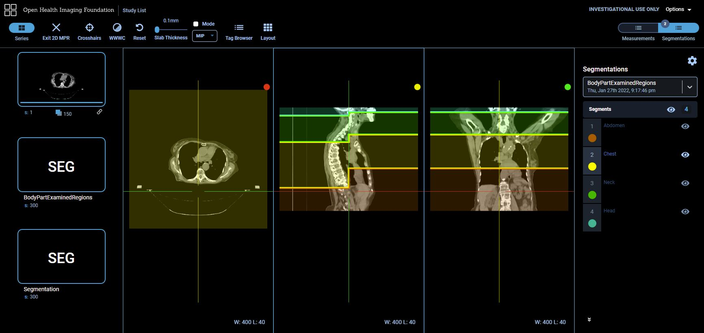

Back to [Projects List](../../README.md#ProjectsList)

# View slice level annotations in OHIF using Structured Reports

## Key Investigators

- Deepa Krishnaswamy (Brigham and Women's Hospital)
- Davide Punzo (Radical Imaging)
- Markus Herrmann (MGH)
- Chris Bridge (MGH)
- Andrey Fedorov (Brigham and Women's Hospital)

# Project Description

In the last project week, we worked on an [approach](https://projectweek.na-mic.org/PW36_2022_Virtual/Projects/IDCBodyPartRegression/) for enriching the DICOM metadata, specifically the body part examined. 
We showed that we could classify each CT axial slice in a volume as a particular body region -- head, neck, chest, abdomen, pelvis and legs. (using [this approach](https://arxiv.org/abs/2110.09148))
In order to visualize the results of body region per slice, we used DICOM SEG objects. Though good for visualization, this is not exactly a good use of the DICOM SEG. 
A better approach would be to use Structured Reports (SR), and view an annotation for each slice as you scroll. This functionality has been made available in the latest release of OHIF, and we would like to adapt our body part regression results to this format.

## Objective

<!-- Describe here WHAT you would like to achieve (what you will have as end result). -->

1. Objective A. View slice level annotations using a Structured Report in the OHIF viewer. 
1. Objective B. Visualize the body part regression results using the above approach 

## Approach and Plan

<!-- Describe here HOW you would like to achieve the objectives stated above. -->

1. A colab notebook has been written by Andrey using [highdicom](https://github.com/herrmannlab/highdicom) library to create instances of DICOM Structured Reports that instantiate [TID 1500 reporting template](https://dicom.nema.org/medical/dicom/current/output/chtml/part16/chapter_A.html#sect_TID_1500) and include slice-level qualitative (key:value) evaluations. 
2. OHIF Viewer v2 was extended by Davide to enable visualization of slice-level annotations (see [https://github.com/OHIF/Viewers/issues/2797](https://github.com/OHIF/Viewers/issues/2797))
3. Deepa will adapt this notebook to create the appropriate SR for the body part regression task. 

## Progress and Next Steps

<!-- Update this section as you make progress, describing of what you have ACTUALLY DONE. If there are specific steps that you could not complete then you can describe them here, too. -->

1. 

# Illustrations

<!-- Add pictures and links to videos that demonstrate what has been accomplished.

-->

# Background and References

<!-- If you developed any software, include link to the source code repository. If possible, also add links to sample data, and to any relevant publications. -->
