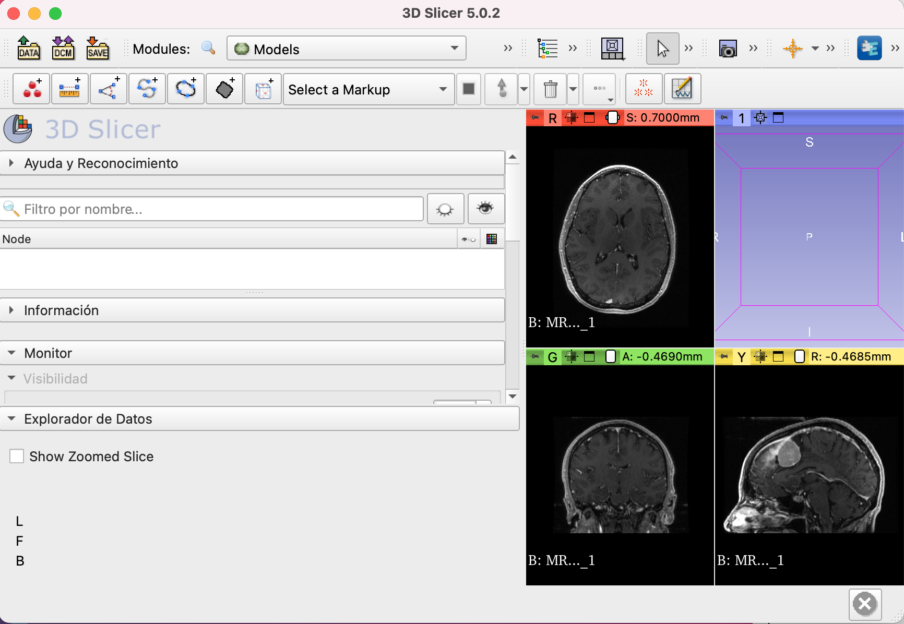

Back to [Projects List](../../README.md#ProjectsList)

# Streamlined Outlier Detection for Large Scale Mammogram Data

## Key Investigators

- Pablo Bendiksen (University of Massachusetts Boston)
- Neha Goyal (University of Massachusetts Boston)
- Ryan Zurrin (University of Massachusetts Boston)
- Kendrick Kheav (University of Masachusetts Boston)
- Daniel Haehn (University of Massachusetts Boston)

# Project Description
Modern deep learning systems can detect breast cancer early when trained with large amounts of data. As part of our mission to create the world's largest publicly-available annotated mammography dataset with ground truth labels, we care to curate a final collection of 70,000 breast cancer scans (from a dataset of > 190,000 images)comprised of both 3D Digital Breast Tomosynthesis (DBT) and 2D Digital Mammography (DM) studies. To this end we must automate the effective detection of atypical scans across approximately 250,000 images.

## Objective

To contribute translations of the user'interface of 3D Slicer and its corresponding tutorials

## Approach and Plan

1. Become familiarized with the 3D Slicer Language Tools Module and Weblate's Glossary/String Search Functionality.

## Progress and Next Steps

1. Continue to provide translation aid of 3D Slicer GUI components (all strings from the Python source code), and corresponding tutorials, from English to Spanish on a module-by-module basis.

# Illustrations

  

# Background and References
See Weblate 3D Slicer and Glossary components [here](https://hosted.weblate.org/projects/3d-slicer/)
3D Slicer extension for translation incorporation [here](https://github.com/Slicer/SlicerLanguagePacks)
