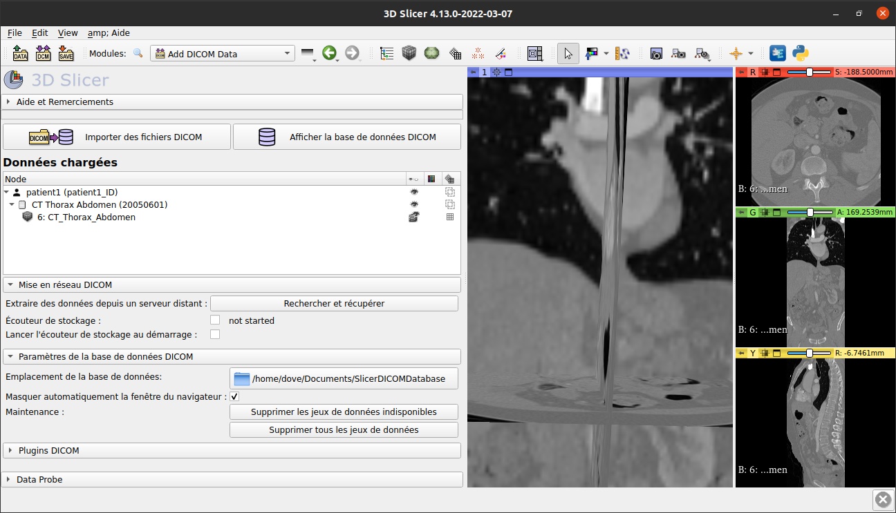
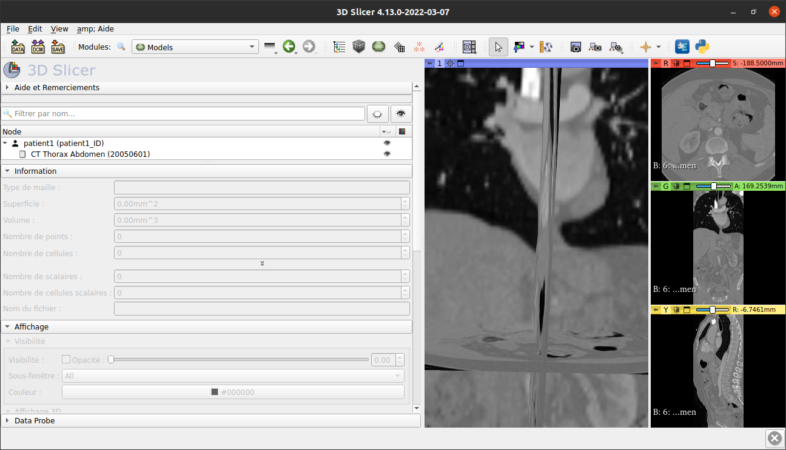
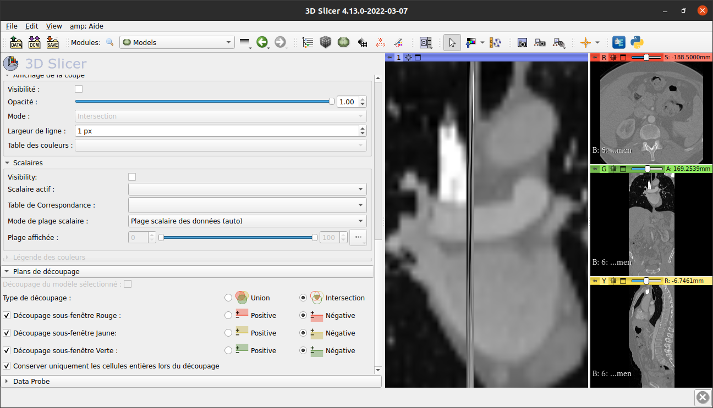
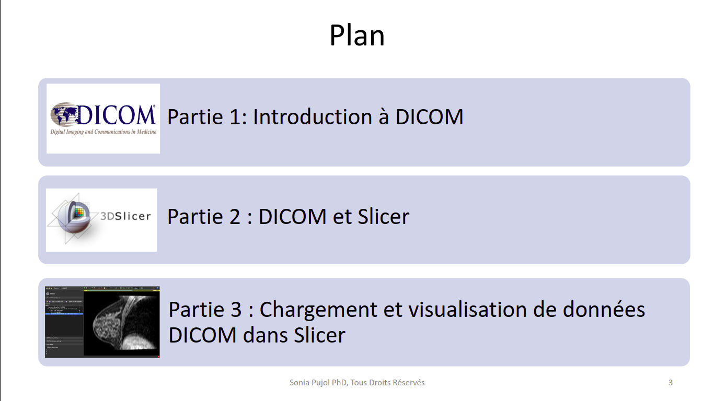

Back to [Projects List](../../README.md#ProjectsList)

# Slicer Internationalization

## Key Investigators

- Sonia Pujol, (Brigham and Women's Hospital, Harvard Medical School, Boston, MA, USA)
- Steve Pieper (Isomics Inc., Cambridge, MA, USA)
- Andras Lasso (Queen's University, Kingston, Canada)
- Mamadou Camara (Cheikh Anta Diop University, Dakar, Senegal)
- Adama Wade (Cheikh Anta Diop University, Dakar, Senegal)
- Luiz Otavio Murta Junior (University of Sao Paulo, Ribeirao Preto, Brazil)
- Vinicius Pavanelli Vianna (University of Sao Paulo, Ribeirao Preto, Brazil)
- Oumar Sy (Cheikh Anta Diop University, Dakar, Senegal)
- Mohamed Alalli BILAL (Ecole Supérieure polytechnique, Senegal)
- Adriana H. Vilchis González (Universidad Autónoma del Estado de México, Mexico)
- Mouhamed DIOP (Cheikh Anta Diop University, Dakar, Senegal)

# Project Description

The goal of the project is to develop a novel software infrastructure to enable the localization of 3D Slicer to multiple languages. The project is funded through an Essential Open Source Software for Science grant of the Chan Zuckerberg Initiative.

## Objective

<!-- Describe here WHAT you would like to achieve (what you will have as end result). -->

1. Objective A. To identify members of the Slicer community interested in contributing translations in their native language.
1. Objective B. To connect Slicer Weblate to ReadTheDocs internationalization infrastructure

## Approach and Plan

<!-- Describe here HOW you would like to achieve the objectives stated above. -->

1. Daily translation hackathons at 12 pm EST (Boston time) with members of the Slicer community
1. Use case of Weblate project translation

## Progress and Next Steps

<!-- Update this section as you make progress, describing of what you have ACTUALLY DONE. If there are specific steps that you could not complete then you can describe them here, too. -->

Describe specific steps you **have actually done**.
1. We have made lots of progress on the translation of the DICOM, Models, Segmentation, and Volumes modules as well as the DICOM tutorial in french
2. Some progress has been made with the extraction of the translatable strings in the Python code
3. We set up test projects (main and translations) on ReadTheDocs to try out configurations and tools in order to determine the best fit for the documentation translation infrastructure, before applying those to the official Slicer documentation
4. We are experimenting with a file structure of one file per documentation section to ensure coherence in the order in which the sections are translated on Weblate
5. An infrastructure is being set up to automatically mark translatable strings in the source code
6. Tests are being made to come up with the best way to manage translations over different versions of Slicer

# Illustrations

<!-- Add pictures and links to videos that demonstrate what has been accomplished.

-->

# Background and References

<!-- If you developed any software, include link to the source code repository. If possible, also add links to sample data, and to any relevant publications. -->
