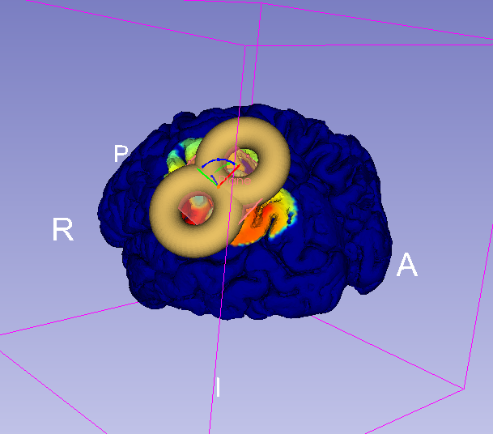
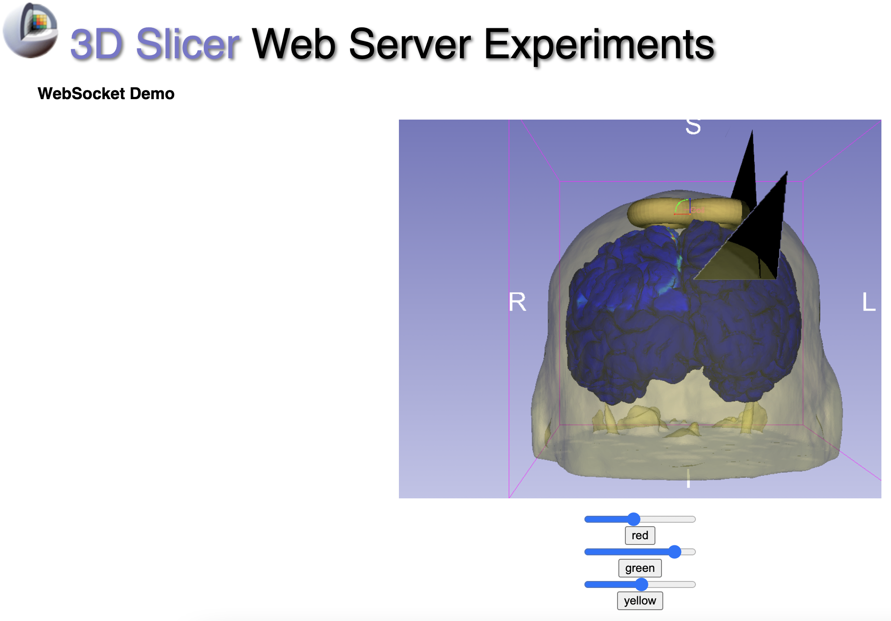
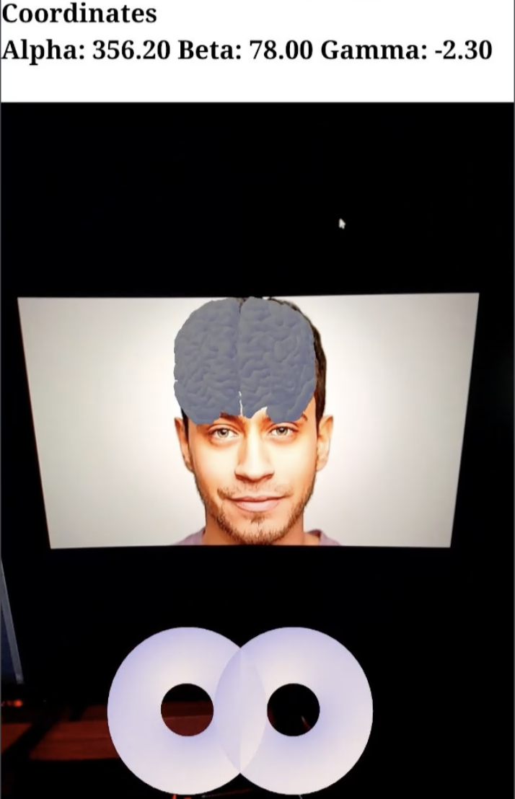
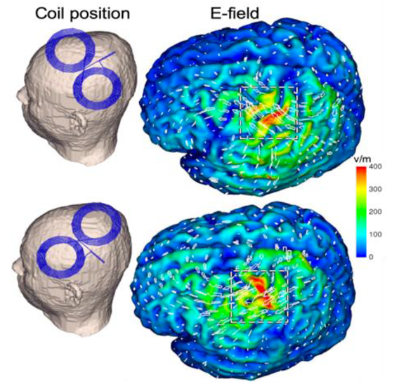

Back to [Projects List](../../README.md#ProjectsList)

# Real-time visualization for transcranial magnetic stimulation (TMS)

## Key Investigators

- Loraine Franke (University of Massachusetts Boston)
- Jax Luo (BWH & Harvard Medical School)
- Raymond Yang (University of Massachusetts Boston)
- Lipeng Ning (BWH & Harvard Medical School)
- Steve Pieper (Isomics, Inc.)
- Daniel Haehn (University of Massachusetts Boston)

# Project Description

Transcranial magnetic stimulation is a nonivasive procedure used for treating depression with magnetic and electric fields to stimulate nerve cells. 
A TMS coil is slowly moved over the subject's head suface to target certain areas in the brain. 
Our project aims to develop a deep-learning powered software for real-time E-Field prediction and a visualization of TMS within 3D Slicer.

## Objective

Real-time visualization of an electric field (E-field) for transcranial magnetic stimulation (TMS) on the brain surface, visualization through an AR app (over browser).

## Approach and Plan
- We created a TMS module in Slicer mapping NifTi file onto brain mesh with 3D TMS coil that can be moved by the user (done) -> TODO: create a bounding box for the Coil mesh to not turn it into brain, attach the coil to the skull/skin surface
- We use OpenIGTLinkIF used to transfer data (E-Field from TMS) into 3D Slicer (done)
- Next steps include connecting 3DSlicer to the web browser using our newly implemented WebSocket from https://github.com/liampaulhus/slicerWebWSS-WIP
- Connect a mobile device via WebXR: So far, we have started implementing face tracking for the TMS module with simple JavaScript. In the future, this might need to be implemented with WebXR to retrieve depth information for AR.

## Progress and Next Steps

1. Some bug fixes of observers in the TMS Module
2. Integration of deep learning model: Modified OpenIGTLink with pyigtl (https://github.com/lassoan/pyigtl) to send out transform message of the moving TMS coil (added nodes, enabled push on connect, modified python demon that accesses the outgoing data), in collaboration with the deep learning project [Slicer TMS Deep-Learning](https://github.com/NA-MIC/ProjectWeek/tree/master/PW37_2022_Virtual/Projects/SlicerTMS_E-field)
3. Tested our new secure websocket connection to the browser (https://github.com/liampaulhus/slicerWebWSS-WIP) using a self-signed certificate for https.

## Illustrations

####  Current Visualization of the TMS Module in 3DSlicer with Coil and mapping of E-field on brain:

<!--  -->

#### WebSocket Tests: we can interact with the red, green and yellow slices with the new websocket connection:

#### So far, we tested some simple Javascript Face-Tracking via mobile Phone and redered the brain:

<!--  -->

#### Visualization goal we want to achieve inside 3DSlicer (image from another software):

<!--  -->

# Background and References

This project is related to: https://github.com/NA-MIC/ProjectWeek/tree/master/PW37_2022_Virtual/Projects/SlicerTMS_E-field

## Infos for running WebXR:

Phones need a Depth sensor to run AR/VR. A list of supported devices can be found here: https://developers.google.com/ar/devices

On an Android Phone via USB: 
- PlayStore: Download Google VR Services and Google AR Services App
- Update Chrome/Camera apps etc.
- On the phone: Enable Developer tools (https://developer.android.com/studio/debug/dev-options) and USB debugging (description here: https://developer.chrome.com/docs/devtools/remote-debugging/)
- Run chrome://inspect#devices in the browser on your computer and it should detect USB connected devices

For iPhone: 
- Mozilla offers a WebXR Emulator that can be downloaded from the Apple Store for any iPhone and iPad: https://labs.mozilla.org/projects/webxr-viewer/

## For Slicer TMS Module (see previous project week [PW 36](https://github.com/NA-MIC/ProjectWeek/blob/master/PW36_2022_Virtual/Projects/SlicerTMS_Module/README.md)):

<!-- vtkProbeFilter: https://vtk.org/doc/nightly/html/classvtkProbeFilter.html
Moving fiducials with CPYY: https://gist.github.com/pieper/f9da3e0a73c70981b48d0747132526d5

Measure rendering time in 3D Slicer:
1. Getting renderer: https://slicer.readthedocs.io/en/latest/developer_guide/script_repository.html#access-vtk-views-renderers-and-cameras
2. Then applying renderer.GetLastRenderTimeInSeconds()
