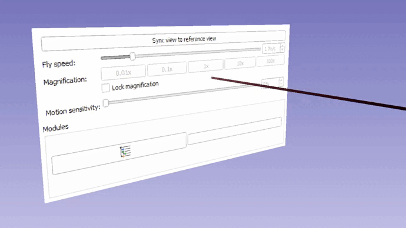

Back to [Projects List](../../README.md#ProjectsList)

# SlicerVR infrastructure maintenance

## Key Investigators

- Csaba Pinter (EBATINCA)
- Sankhesh Jhaveri (Kitware)
- David Garcia Mato (EBATINCA)
- Adam Rankin (Robarts Research)
- Jean-Christophe Fillion-Robin (Kitware)

# Project Description

<!-- Add a short paragraph describing the project. -->

SlicerVR has many great features that allow an efficient visualization of medical 3D data. However, recent updates in the infrastructure (mainly that of VTK) broke certain key features, which make SlicerVR basically unusable in its current form.

Recently there was also progress with the in-VR widget and its usage with the laser pointer that forms an integral part of the final SlicerVR infrastructure. The basic pieces are there, but need to be finalized and also see if the reimplemented widget in VTK works in VR (which before it did not).

At the same time, a new project (Kitware/Robarts) has started to upgrade the rendering backend of SlicerVR from OpenVR to OpenXR and making the XR features available via the SlicerVR extensions.

Since this project needs a fully functioning SlicerVR including the widgets, this Slicer week project we can unite forces and make a push towards this goal.

## Objective

<!-- Describe here WHAT you would like to achieve (what you will have as end result). -->

The goal of the project is, with coordination with Kitware/Robarts, to reach the previous usability state of the SlicerVR extension, as well as make progress with the in-VR widget.

## Approach and Plan

<!-- Describe here HOW you would like to achieve the objectives stated above. -->

1. The OpenXR integration into SlicerVR seems to advance well, so
    1. Test SlicerVR OpenXR the branch
    2. Fix controller events with HP controller that seem to happen with XR as well, and the errors that bog down the application while rendering
1. Fix volume rendering display in the virtual reality view. This may not be OpenVR-related, because the same thing happens using the Looking Glass extension, so would be a first candidate.
1. Try out the latest [branch for the in-VR widget](https://github.com/dgmato/SlicerVirtualReality/tree/gui-widgets-interactions)
    1. Try the reimplemented vtkQWidgetWidget class that now does not use the unstable shared context
    2. Make progress with the laser pointer
    3. Fix the texture update in the VR view (the update happens in regular 3D view, i.e. the checkbox is checked visibly, but not in the VR view)

## Progress and Next Steps

<!-- Update this section as you make progress, describing of what you have ACTUALLY DONE. If there are specific steps that you could not complete then you can describe them here, too. -->

1. Describe specific steps you **have actually done**.
1. ...
1. ...

# Illustrations

<!-- Add pictures and links to videos that demonstrate what has been accomplished.

-->

# Background and References

<!-- If you developed any software, include link to the source code repository. If possible, also add links to sample data, and to any relevant publications. -->

Branches
* [GUI widgets interactions branch](https://github.com/dgmato/SlicerVirtualReality/tree/gui-widgets-interactions)
* SlicerVR OpenXR branch comes here

Issues
* [SlicerVR ticket #91](https://github.com/KitwareMedical/SlicerVirtualReality/issues/91)
* [SlicerVR ticket #80](https://github.com/KitwareMedical/SlicerVirtualReality/issues/80)
* [SlicerVR ticket #88](https://github.com/KitwareMedical/SlicerVirtualReality/issues/88)
* [SlicerVR ticket #43](https://github.com/KitwareMedical/SlicerVirtualReality/issues/43)

Past project week pages
* [Project week #35 page](https://projectweek.na-mic.org/PW35_2021_Virtual/Projects/SlicerVR/)
* [Project week #34 page](https://projectweek.na-mic.org/PW34_2020_Virtual/Projects/SlicerVR/)
