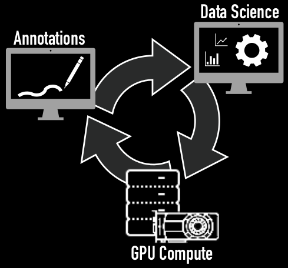
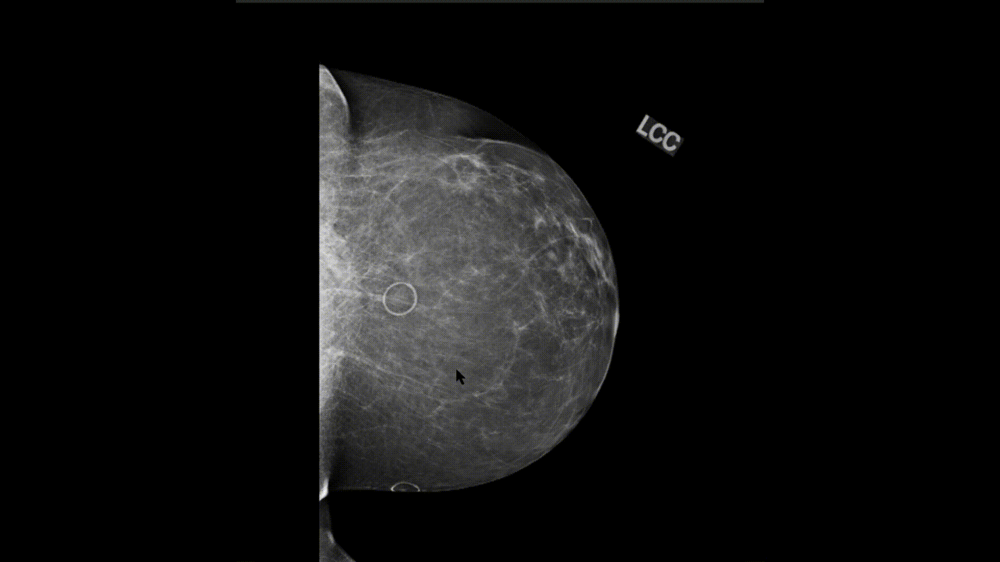

Back to [Projects List](../../README.md#ProjectsList)

# Streamlined ROI annotation using Cornerstone.js for Mammograms

## Key Investigators

- Ryan Zurrin (University of Massachusetts Boston)
- Neha Goyal (University of Massachusetts Boston)
- Pablo Bendiksen (University of Massachusetts Boston)
- Kendrick Kheav (University of Massachusetts Boston)
- Daniel Haehn (University of Massachusetts Boston)

# Project Description

Fast and efficient means of loading mammogram's from server into a web based
viewer. Viewer is equipped with an ROI tool for generating bounding boxes (BB)
as simply as possible. It will allow users to create the BB, as well as
give it a score of likelihood that region is indeed cancer. Then, with the
press of a button, the roi and image id along with user info are saved back to
the server for later use. After being saved a new mammogram will then be served
up from the server into the viewer for them to again annotate. The saved
annotations from professionals will then be used later on in our research for
comparing classifier generated ROIs against professionally labeled ones.

## Objective

This tool is a subset of a much larger project, Oregon-Massachusetts Mammography
Database (OMAMA-DB), and has the sole purpose of giving professional labelers an
efficient way to label a massive amount of mammograms as fast and as simply
as possible.

## Approach and Plan

<!-- Describe here HOW you would like to achieve the objectives stated above. -->

1. Learn and understand how to use Cornerstone.js which is a key component
   in making this tool possible. (done)
2. Use Tornado webserver for backend because of its ability to make
   asynchronous web requests, which will allow for multiple annotators to be working
   simultaneously with our data. (done)
3. Using Tornado and Cornerstone, build a simple and fast method to serve up
   mammograms from our dataset on server. (done)
4. Add ROI functionality. (done)
5. Add scoring functionality.
6. Add a method for users to mark if an image is defective.
7. Add a method to clear Previously added ROIs
8. Add a simple way to save data back to server. (done)

## Progress

1. Have been able to use Cornerstone.js and Tornado webserver to load
   mammograms from server into the web based viewer.
2. Have been able to add the ROI functionality to viewer.
3. Have added the ability to press either *enter* or *space* key to save ROI
   and image information back to server.

## Next Steps

1. Need to add scoring functionality (DONE)
2. Need to add way to mark image as defective (DONE)
3. Need to add way to clear Previously added ROIs (DONE w/help from erikz)
4. Change the format of the tooltip to make it look nicer and have it include the current image id (DONE)
5. Add means to Zoom, Pan, and adjust Window/Level (DONE)
6. Add a Help section at bottom, to let users know what buttons and actions do what (DONE)
7. optimize performance, if time is permitting.

# Illustrations

  

Demo video from start of project:

Demo video from end of project:

# Background and References

<!-- If you developed any software, include link to the source code repository. If possible, also add links to sample data, and to any relevant publications. -->
[Massachusetts Life Sciences Center, Press Release](https://www.masslifesciences.com/news/two-umass-boston-researchers-awarded-mass-life-sciences-grants/) 
[Cornerstone.js](https://cornerstonejs.org/) 
[Tornado webserver](https://www.tornadoweb.org/) 
