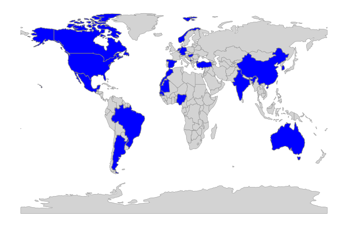
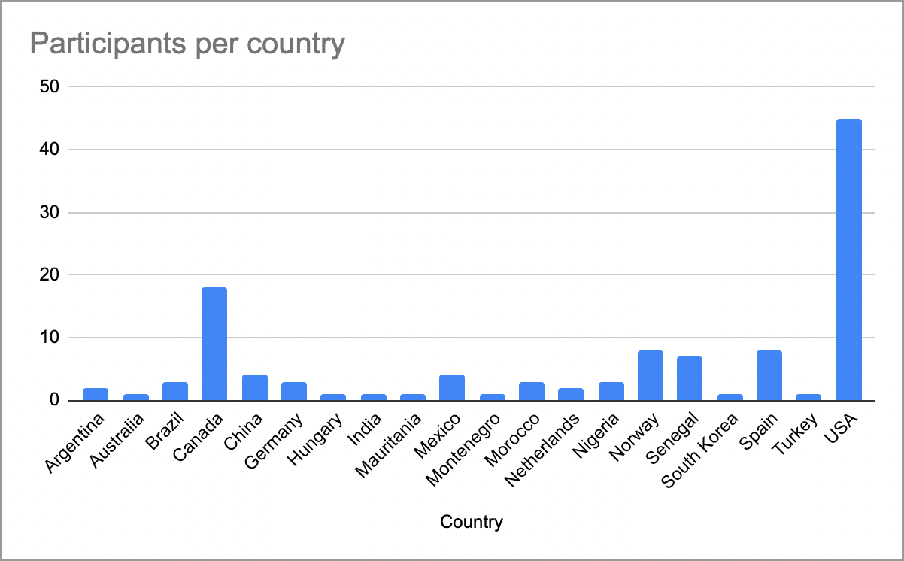
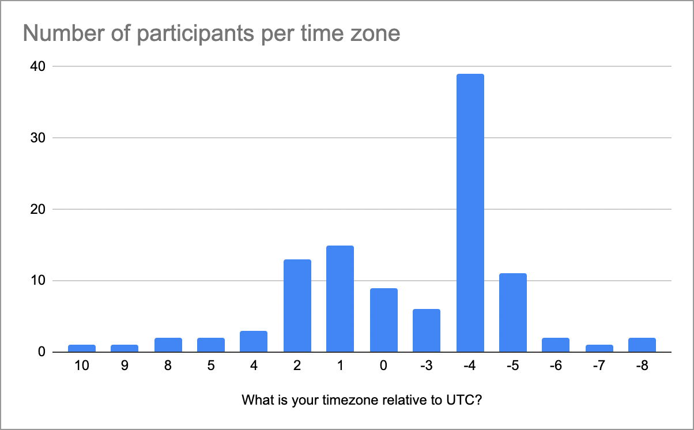

## Welcome to the web page for the 37th Project Week!

[This event](https://projectweek.na-mic.org/PW37_2022_Virtual/) took place from June 27 to July 1, 2022.

If you have any questions, you can contact the [organizers](../README.md#who-to-contact).

Please fill out the [post-Project Week](https://forms.gle/E4ETUPXkKt3iFxvJ7) survey to let us know what you thought of this edition. Hope to see you again for Project Week 38 in Las Palmas, Jan 30-Feb 3rd 2023!

## Screenshots, Illustrations & Photos Album

[Google Photos album](https://photos.app.goo.gl/PTJjQn5D33uShcLM9)

## Before Project Week
1. Participants met at preparation meetings to present projects they intended to work on at PW, seeking collaborators or to join one of the projects proposed by others.
1. Participants joined the [Discord server](https://discord.gg/yQsNVdVpS3) and used to communicate during Project Week. Go to [this page](../common/Discord.md) for more info on the use of Discord during PW.
2. A workshop on using MONAI Label with 3D Slicer was held June 22, 2022 from 9-11am EDT. See [this page](MONAILabel_Workshop.md) to for more information.

## During Project Week (All times US Eastern Daylight (Boston) Time)
* Initial **project presentations** started at **9am on Zoom**, on Zoom. Each team delegated a member to present their projects in no more than 2 minutes using no other visual support than the project page on GitHub (no time to switch screen sharing)
* Participants who did not have a project, could find a project they were interested in and contacted team members through their Discord channel.
* Breakout sessions start every day at **9am on Zoom** (links in the calendar below)
* Work in **project teams** happened throughout the week with communication between team members taking place on **Discord**. 
* The week ended with **project results presentation (9am on Friday)**. Again, each team delegated one member to present their results in a maximum of 2 minutes. The project page was used as a visual support for the presentation.

##  Agenda

<!--
Adapted from https://stackoverflow.com/questions/31821974/support-user-time-zone-in-embedded-google-calendar
-->

[How to add this calendar to your own?](../common/Calendar.md)

## Projects [(How to add a new project?)](Projects/README.md)

### VR/AR and Rendering

1. [PRISM Rendering](Projects/PRISMRendering/README.md) (Simon Drouin, Steve Pieper, Andrey Titov, Rafael Palomar)
1. [SlicerVR infrastructure](Projects/SlicerVRInfrastructure/README.md) (Csaba Pinter, Sankhesh Jhaveri, David Garcia Mato, Adam Rankin, Jean-Christophe Fillion-Robin)
)
1. [SlicerVR Tutorial](Projects/SlicerVRTutorial/README.md) (Monica Garcia-Sevilla, David Garcia-Mato, Csaba Pinter, ?)
1. [Slicer Photogrammetry](Projects/SlicerPhotoGram/README.md) (Chi Zhang, Murat Maga, Steve Pieper)
1. [Cinematic Rendering VTK PBR](Projects/CinematicRenderingVTK/README.md) (Shreeraj Jadhav, Jiayi Xu, Jean-Christophe Fillion-Robin)
1. [Slicer TMS Module](Projects/SlicerTMS/README.md) (Loraine Franke, Jax Luo, Raymond Yang, Steve Pieper, Lipeng Ning, Daniel Haehn)
1. [SlicerWGPU - WebGPU in Slicer](Projects/SlicerWGPU) (Steve Pieper)

### Image-guided therapy (IGT) and low-cost systems

1. [Slicer-Liver](Projects/SlicerLiver/README.md) (Rafael Palomar, Gabriella D'Albenzio, Ruoyan Meng, Ole V. Solberg, Geir A. Tangen, Javier Pérez de Frutos)
1. [Low-Cost Ultrasound Training](Projects/LowCostUltrasoundTraining/README.md) (David Garcia-Mato, Csaba Pinter, Rebecca Hisey, Matthew Holden,...)
1. [Virtual endoscopy](Projects/SlicerVirtualEndoscopy/README.md) (Yi Gao)
1. [SlicerTMS: Deep learning for E-field prediction](Projects/SlicerTMS_E-field/README.md)(Jax Luo, Loraine Franke, Raymond Yang, Steve Pieper, Daniel Haehn, Lipeng Ning)

### Segmentation/Classification

1. [Lung segmentation with MONAILabel](Projects/MONAILabelLung/README.md) (Rudolf Bumm, Andres Diaz-Pinto)
1. [Lumbar spine segmentation using MONAILabel](Projects/LumbarSpineSegmentation/README.md) (Nayra Pumar, María Rosa Rodriguez, David García Mato)
1. [Combined MONAI Label and MONAI Deploy SDK Applications](Projects/MONAILabelAndDeploy/README.md) (Erik Ziegler, Roya Khajavi, Steve Pieper, Ron Kikinis, Andres Diaz-Pinto)
1. [AMASSS CBCT](Projects/AMASSS_CBCT/README.md) (Maxime Gillot, Baptiste Baquero,Lucia Cevidanes, Juan Prieto)
1. [CT Lymph Node collection weakly annotated MONAI Label](Projects/LNQ/README.md) (Roya Khajavi, Erik Ziegler, Steve Pieper, Ron Kikinis)
1. [SlicerHeart polar maps](Projects/SlicerHeartPolarMaps/README.md) (Connor Haberl)
1. [IDC Prostate Segmentation](Projects/IDCProstateSegmentation/README.md) (Cosmin Ciausu, Andrey Fedorov)
1. [Outlier Detection of Large Scale Mammography Studies](Projects/OutlierDetectionLargeScaleMammograms/README.md) (Pablo Bendiksen, Ryan Zurrin, Neha Goyal, Daniel Haehn)
1. [Streamlined ROI Annotation Tool](Projects/StreamlinedROIAnnotationTool/README.md) (Ryan Zurrin, Neha Goyal, Pablo Bendiksen, Kendrick Kheav,  Daniel Haehn)
1. [Mass spectomatry imaging using Slicer](Projects/ViPRE/README.md) (Parvin Mousavi, Amoon Jamzad, Jessica Rodgers, Mackenzie Sharp, Hanad Elmi)
1. [Multi-stage dental segmentation](Projects/MultistageTeethSegmentation/README.md) (Daniel Palkovics, Csaba Pinter, David Garcia Mato, Andres Diaz-Pinto)
1. [Automatic Landmark Identification](Projects/AutomaticLandmarkIdentification/README.md) (Maxime Gillot, Baptiste Baquero,Lucia Cevidanes, Juan Prieto)

### Quantification

1. [AQ3DC](Projects/AutomaticQuantitative3DCephalometrics/README.md) (Baptiste Baquero, Maxime Gillot, Lucia Cevidanes)
1. [Multichannel image colocalization statistics](Projects/SlicerColoc-Z-Stats/README.md) (Xiang Chen, Oscar Meruvia-Pastor, Touati Benoukraf)
1. [Poisson Shape Analysis](Projects/SlicerPoissonShapeAnalysis/README.md) (Yi Gao)
1. [SlicerScope - whole slide histopathology](Projects/SlicerScope/README.md) (Yi Gao, Steve Pieper)

### Cloud

1. [Imaging Data Commons](Projects/ImagingDataCommons/README.md) (Andrey Fedorov, Deepa Krishnaswamy, Dennis Bontempi, Cosmin Ciausu, Steve Pieper, Ron Kikinis)
1. [mpReview](Projects/mpReview/README.md) (Deepa Krishnaswamy, Andrey Fedorov)
1. [Slice level annotations in OHIF](Projects/OHIFviewSR/README.md) (Deepa Krishnaswamy, Davide Punzo, Markus Herrmann, Chris Bridge, Andrey Fedorov)

### Infrastructure

1. [SystoleOS: ](Projects/SystoleOS/README.md) (Rafael Palomar, Andras Lasso, Steve Pieper, Jean-Christophe Fillion-Robin, Sam Horvath)
1. [MarkupConstraints](Projects/MarkupConstraints/README.md) (David Allemang, Jean-Christophe Fillion-Robin)
1. [SlicerInternationalization](Projects/SlicerInternationalization/README.md) (Sonia Pujol, Steve Pieper, Andras Lasso)
1. [Slicer Batch Annonymize](Projects/SlicerBatchAnonymize/README.md)(Hina Shah, Juan Carolos Prieto)
1. [Slicer 5++: ](Projects/Slicer5Plus/README.md) (Sam Horvath, Andras Lasso, Steve Pieper, Jean-Christophe Fillion-Robin)
1. [EquivalentRotationSliders: ](Projects/EquivalentRotationSliders/README.md) (Mauro Dominguez, ...)

## Registrants

List of registered participants:

1. Tina Kapur, Brigham and Women's Hospital and Harvard Medical School, USA
1. David Garcia-Mato, Ebatinca SL, Spain
1. Steve Pieper, Isomics, Inc., USA
1. Andrey Fedorov, Brigham and Women's Hospital, USA
1. Adama Rama WADE, Cheikh Anta Diop University, Senegal
1. Deepa Krishnaswamy, Brigham and Women's Hospital, USA
1. Simon Drouin, École de Technologie Supérieure, Canada
1. Roya Khajavibajestani, BWH, USA
1. RON KIKINIS, SPL, USA
1. Sonia Pujol, Brigham and Women's Hospital, Harvard Medical School, USA
1. Jax LUO, BWH, USA
1. Li Zhenzhu, Hwa Mei Hospital, China
1. Ole Vegard Solberg, SINTEF, Norway
1. Mauro Ignacio Dominguez, Independant, Argentina
1. Lucia Cevidanes, University of Michigan, USA
1. YAHYA TFEIL, UNIVERSITY NOUAKCHOTT ALAASRIYA, Mauritania
1. Rafael Palomar, Oslo University Hospital and NTNU, Norway
1. Pape Mady THIAO , École militaire de santé de Dakar, Senegal
1. Mónica García-Sevilla, Universidad de Las Palmas de Gran Canaria, Spain
1. Badiaa AIT AHMED , Universidad de Las Palmas de Gran Canaria, Spain
1. Cosmin Ciausu, Brigham and Women's Hospital, USA
1. Michael Dada, Federal University of Technology, Minna, Nigeria
1. Shiraz Yousif Abd Elsalam Yousif, University of Khartoum , Australia
1. Geir Arne Tangen, SINTEF, Norway
1. Marie NDIAYE, Université Assane Seck de Ziguinchor, Senegal
1. Ron Alkalay, Beth Israel Deaconess Medical Center, USA
1. Csaba Pintér, EBATINCA S.L., Spain
1. Samantha Horvath, Kitware, USA
1. Rebecca Hisey, Queen's University, Canada
1. Connor Haberl, University of Ottawa Heart Institute, Canada
1. Gang Fu, Amazon, USA
1. Shreeraj Jadhav, Kitware, Inc., USA
1. Eve LoCastro, Memorial Sloan Kettering, USA
1. Srivathsan Shanmuganathan, University of Alberta, Canada
1. David Allemang, Kitware Inc., USA
1. Michel David Raed, University of São Paulo, Brazil
1. Jiayi Xu, Kitware, USA
1. Gabriella d' Albezio, The Intervention Center (OUS), Norway
1. HINA SHAH, UNC Chapel Hill, USA
1. Sharanya Balachandran, University of Alberta, Canada
1. Muhammad zubair islam, Sejong University, Seoul, South Korea, South Korea
1. Daniel Haehn, University of Massachusetts Boston, USA
1. Sankhesh Jhaveri, Kitware, Inc., USA
1. li, hospital, China
1. Nayra Pumar, Ebatinca, Spain
1. Ruoyan Meng, Norwegian University of Science and Technology, Norway
1. Loraine Franke, University of Massachusetts Boston, USA
1. Javier, SINTEF, Norway
1. Chi Zhang, Seattle Children's Research Institute, USA
1. Nadya Shusharina, Massachusetts General Hospital, USA
1. Ahmedou Moulaye Idriss, Faculty of Medicine / University of Nouakchott Al Asriya , USA
1. Ryan Zurrin, University of Massachusetts Boston, USA
1. NANTENAINA Tina, ETS Montreal, Canada
1. Daniel Palkovics, Semmelweis University, Hungary
1. Matthew Holden, Carleton University, Canada
1. Pedro Moreira, Brigham and Women's Hospital, USA
1. Oumaima Saoud, ENIM, Morocco
1. Neha Goyal, University of Massachusetts Boston , USA
1. Ibtissam MEDARHRI, ENSMR, Morocco
1. Andras Lasso, PerkLab, Queen's University, Canada
1. Maxime Gillot, University of Michigan, USA
1. Baptiste Baquero , University of Michigan, USA
1. Gurnish Sidora, University of Toronto, Canada
1. Pablo Bendiksen, University of Massachusetts Boston, USA
1. Mariana Costa Bernardes Matias, Brigham and Women's Hospital, USA
1. Oumar SY, Cheikh Anta Diop University , Senegal
1. said, ENSMR, Morocco
1. Luiz Murta, University of São Paulo, Brazil
1. Mamadou Camara, Cheikh Anta Diop University of Dakar, Senegal
1. Mohamed Alalli BILAL, Ecole Supérieure polytechnique  , Senegal
1. Patrick Remerscheid, Technical University of Munich, Germany
1. Khaled Younis, Philips, USA
1. Nicolas Yanez, Philips, USA
1. Renjie He, MDACC, USA
1. Hanad Elmi, Queen's University, Canada
1. Lukas Riedersberger, dev-threads, Germany
1. Johannes Pieger, dev-threads, Germany
1. Luca Boretto, University of Oslo, Norway
1. jiazeyu, None, China
1. Jean-Christophe Fillion-Robin, Kitware, USA
1. Yi Gao, Shenzhen University, China
1. Adriana H. Vilchis González, Universidad Autónoma del Estado de México, Mexico
1. Tamas Ungi, Queen's University, Canada
1. Kendrick Kheav, University of Massachusetts Boston, USA
1. Juan Carlos Avila Vilchis, Universidad Autónoma del Estado de México, Mexico
1. Xiang Chen, Memorial University of Newfoundland, Canada
1. Leah Groves, Queen's University , Canada
1. Lipeng Ning, Brigham and Women's Hospital, USA
1. Vianney Muñoz-Jiménez, Universidad Autónoma del Estado de México, Mexico
1. Mariana Alvarez-Carvajal, Universidad Autonoma del Estado de Mexico, Mexico
1. Michael Dada, Federal University of Technology, Minna, Nigeria
1. Joaquin Olivares, University of Cordoba, Spain
1. Étienne Léger, Brigham and Women's Hospital, USA
1. Samuelle St-Onge, École de technologie supérieure (ÉTS), Canada
1. Kyle Sunderland, Queen's University, Canada
1. NIrav Patel, Indian Institute of Technology Madras, India
1. Inés, Universidad Carlos III de Madrid, Spain
1. Dženan Zukić, Kitware, USA
1. María Rosa, Universidad de Las Palmas de Gran Canaria, Spain
1. Davit Aghayan, Oslo University Hospital, Norway
1. Kristof Moga, Perklab, Canada
1. Theodore Aptekarev, Slicer Community, Montenegro
1. Garth Macey, University of Wisconsin - Platteville, USA
1. Erik Ziegler, Open Health Imaging Foundation, Netherlands
1. Mouhamed DIOP, Cheikh Anta Diop University of Dakar, Senegal
1. Felicia Miranda, School of Dentistry, University of Michigan, USA
1. Christian Herz, Children's Hospital of Philadelphia, USA
1. Laura Connolly, Queen's University, Canada
1. Richard Doerer, Michigan State Univ, Yale Univ, USA
1. Mauro I. Dominguez, -, Argentina
1. Vinicius Pavanelli Vianna, University of Sao Paulo - CSIM, Brazil
1. Fatih, inonu university, Turkey
1. Matt McCormick, Kitware, USA
1. Adam Rankin, Robarts Research Institute, Canada
1. Pranjal Sahu, Stony Brook University, USA
1. Dada Michael, Federal University of Technology, Minna, Nigeria
1. Jasper van der Zee, University of Twente, Netherlands

## Statistics
* 117 Registered attendees
  * 41% first time attendees
* 20 countries

## History
Please read about our experience in running these events since 2005: [Increasing the Impact of Medical Image Computing Using
Community-Based Open-Access Hackathons: the NA-MIC and 3D Slicer Experience](http://perk.cs.queensu.ca/sites/perkd7.cs.queensu.ca/files/Kapur2016.pdf).
