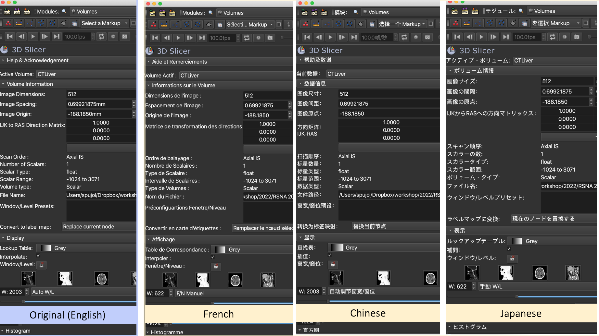

Back to [Projects List](../../README.md#ProjectsList)

# 3D Slicer Internationalization

## Key Investigators

- Sonia Pujol, (Brigham and Women's Hospital, Harvard Medical School, Boston, MA, USA) 
- Steve Pieper (Isomics Inc., Cambridge, MA, USA) 
- Andras Lasso (Queen's University, Kingston, Canada)
- Mamadou Camara (Cheikh Anta Diop University, Dakar, Senegal)
- Mouhamed DIOP (Cheikh Anta Diop University, Dakar, Senegal)
- Adama Wade (Cheikh Anta Diop University, Dakar, Senegal)
- Mohamed Alalli Bilal (Cheikh Anta Diop University, Dakar, Senegal)
- Ahmedou Moulaye Idriss (Faculty of Medicine of Nouakchott, Mauritania)
- Yahya Tfeil (Faculty of Medicine of Nouakchott, Mauritania)
- Adriana H. Vilchis González (Universidad Autónoma del Estado de México, Mexico)
- Luiz Otavio Murta Junior (University of Sao Paulo, Ribeirao Preto, Brazil)

# Project Description

The goal of the project is to facilitate access to 3D Slicer in non-English speaking countries and foster global community engagement. 
The project is funded through two Essential Open Source Software for Science awards of the Chan Zuckerberg Initiative. 

## Objective

<!-- Describe here WHAT you would like to achieve (what you will have as end result). -->

1. To identify members of the global Slicer community interested in new Slicer activities in their language 
2. To run daily translation hackathons in the languages represented at PW38
3. To implement an infrastructure for the internationalization of CTK-based code in 3D Slicer
4. To automate Qt download in Slicer Language Packs Extension

## Approach and Plan

<!-- Describe here HOW you would like to achieve the objectives stated above. -->

 Daily Slicer internationalization session from 10 am to 11 am EST with members of the Slicer community
 
 Anyone is welcome to join the session that will be held on Google Meet and on Zoom:
 
 * Tuesday, Jan.31: https://meet.google.com/umd-avcb-xom
 * Wednesday, Feb.1st: same Zoom link as for the preparation meetings and breakout sessions
 * Thursday, Feb. 2nd: same Zoom link as for the preparation meetings and breakout sessions
 
 New international members, please fill in the [PW38 Slicer internationalization form](https://forms.gle/iinkdKvN4ZG2vv2o6) prior to joining the session.

## Progress and Next Steps

<!-- Update this section as you make progress, describing of what you have ACTUALLY DONE. If there are specific steps that you could not complete then you can describe them here, too. -->

# Illustrations

<!-- Add pictures and links to videos that demonstrate what has been accomplished.

-->

# Background and References

<!-- If you developed any software, include link to the source code repository. If possible, also add links to sample data, and to any relevant publications. -->
