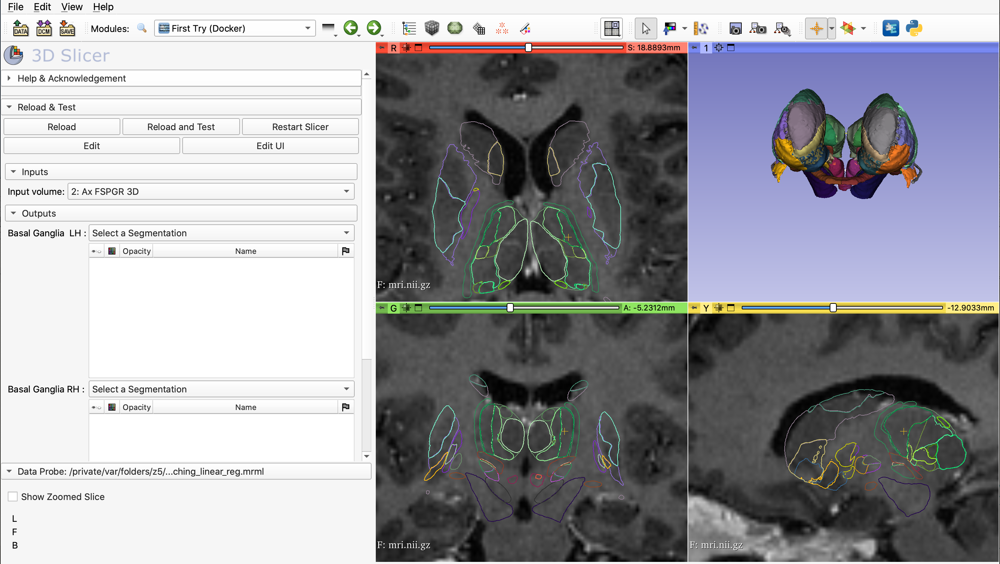
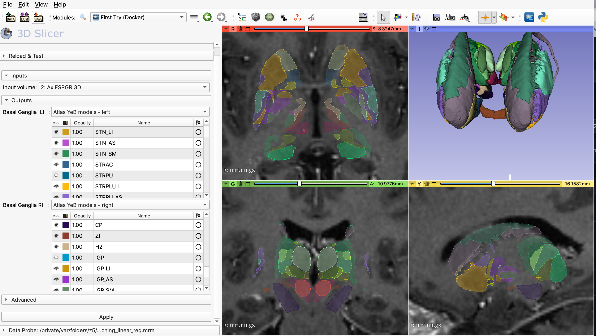

Back to [Projects List](../../README.md#ProjectsList)

# New 3D Slicer extension for the YEB Atlas.

## Key Investigators

- Sara Fernandez Vidal (ICM, Paris Brain Institut. Stereotaxy Platform, https://institutducerveau-icm.org/en/cenir-stim/)
- Eric Bardinet (ICM, Paris Brain Institut. CENIR Platform. )
- Severine Chandelier  (ICM, Paris Brain Institut. Scientific Computing. IT Departement.)

# Project Description

The YEB Atlas is a Basal Ganglia atlas used in routine clinical practice at the Pitié Salpêtrière Hospital in DBS-related procedures, both preoperatively (planning/targeting) and postoperatively.  
It is also widely used in multicenter research studies. We cannot share the atlas as a fully open free atlas because it is bound to Medtronic by a strict license agreement.  That's why in 2021, we set up a web service for the YEB atlas that allows to get deformed atlas regions on the uploaded anatomical MRI in NIFTI format. [WEB PAGE](https://yeb-cenir.icm-institute.org/).

Currently we are setting up a REST API on the same server.
The main idea is that this new extension will connect with the API to get a set of regions (we will give some choices) of the atlas in a anatomical brain MRI. 
One of the advantages using 3D Slicer is that the user will be using other formats than nifti that is actually the only allowed on the web server platform. 
A second advantage is to use the segmentation module of 3D Slicer.
Another utility should be to launch the process for a group of subjects.
This extension will also be used in a new module dedicated to assist the DBS targeting stage.

## Objective

<!-- Describe here WHAT you would like to achieve (what you will have as end result). -->

1. The first objective is to create an initial prototype of the Extension with a curl request to de API and the import of the YEB segmentation to the Slicer Scene
2. 

## Approach and Plan

<!-- Describe here HOW you would like to achieve the objectives stated above. -->

1. To exchange with the 3D Slicer community about differents points lookup tables/ontologies and segmentations, requests, ...

## Progress and Next Steps

<!-- Update this section as you make progress, describing of what you have ACTUALLY DONE. If there are specific steps that you could not complete then you can describe them here, too. -->

1. Firt prototype Module
2. Launch Atlats Yeb Registration from Docker Image (and not from API)
1. to be continued

# Illustrations

<!-- Add pictures and links to videos that demonstrate what has been accomplished.

-->
!

# Background and References

<!-- If you developed any software, include link to the source code repository. If possible, also add links to sample data, and to any relevant publications. -->
