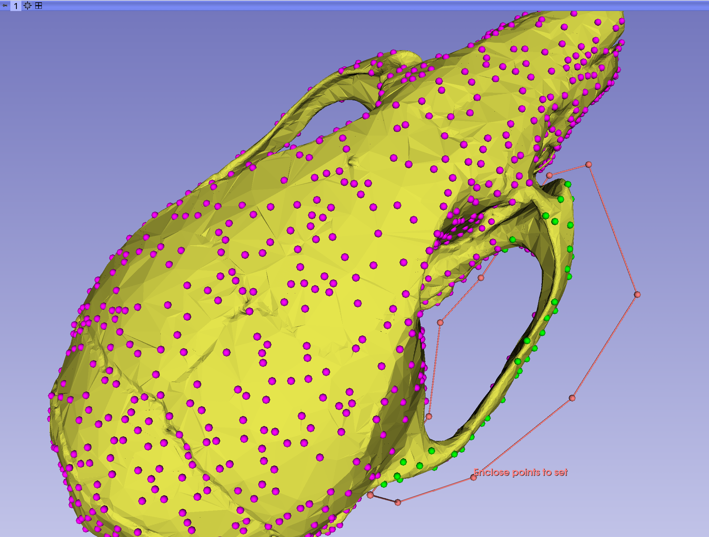
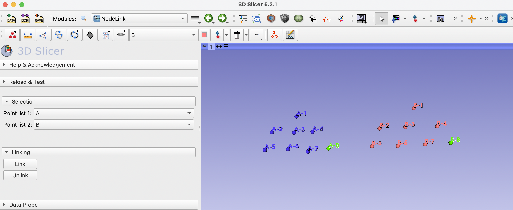

Back to [Projects List](../../README.md#ProjectsList)

# Automated Landmarking Support

## Key Investigators

- Sara Rolfe (SCRI)
- Chi Zhang (SCRI)
- Murat Maga (SCRI)
- Steve Pieper (Isomics)
- Andras Lasso (Perk Labs)

# Project Description
We are developing features to support the use of large-scale landmark sets generated automaticallly by SlicerMorph modules. The key functions 
needed by the SlicerMorph workflows are:
1. Linking two or more landmark sets with identical landmark definitions and operating on them jointly
2. Flexibly selecting and editing point sets in the 3D scene.
3. Placing a grid of landmarks, constraining to a surface, and adjusting the point poisitions by dragging the grid across the surface.
4. Improve performance when setting state of a large number of points (around 1000)

The first function has not yet been attempted and we would like to develop a working prototype. Our second objective is implemented in the 
[Markup Editor](https://github.com/SlicerMorph/Tutorials/tree/main/MarkupsEditor), a module in the SlicerMorph extension developed by Steve Pieper. Recently, this module has been failing for some cases. We would like to identify 
when and why these bugs are occuring and come up with a plan to update the module. The third objective is partially implemented by the Surface Markups 
extension.  We would like to discuss future plans for the Surface Markups extensions and whether SlicerMorph user needs may be covered by the ongoing development.

## Objective

<!-- Describe here WHAT you would like to achieve (what you will have as end result). -->

1. Objective A. Prototype joint operations on linked landmark sets
2. Objective B. Troubleshoot the Markup Editor and identify fixes
3. Objective C. Identify overlap between Surface Markups development and SlicerMorph user needs.
4. Objective D. Document plan to improve Markups module to improve performance when working with large number of points. 

## Approach and Plan

<!-- Describe here HOW you would like to achieve the objectives stated above. -->

1. Meet with other heavy users and developers of Markups infrastructure (Csaba, Rafael, Davide...) :white_check_mark:
2. Debug MarkupEditor (Sara and Steve) :white_check_mark:
3. Many discussions about the future of Markups and integration with machine learning

## Progress and Next Steps

<!-- Update this section as you make progress, describing of what you have ACTUALLY DONE. If there are specific steps that you could not complete then you can describe them here, too. -->

1. Baseline prototype of python module for landmark linking complete.
2. Markup Editor fixes and updates committed to the SlicerMorph repository.
3. Follow up with SlicerHeart team regarding SurfaceMarkup prototype
4. Further develop plans based on productive work and conversations this week :wrench:

# Illustrations

<!-- Add pictures and links to videos that demonstrate what has been accomplished.

-->

# Background and References

<!-- If you developed any software, include link to the source code repository. If possible, also add links to sample data, and to any relevant publications. -->
