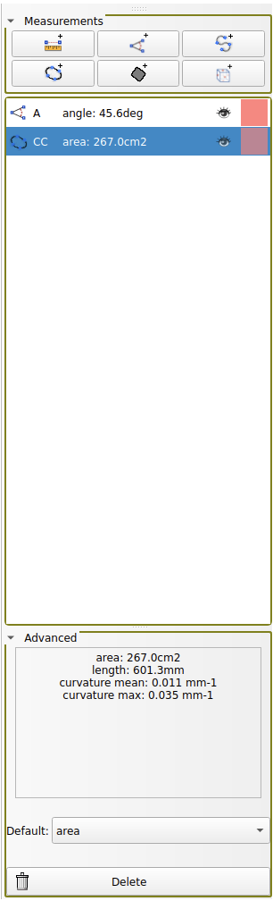

Back to [Projects List](../../README.md#ProjectsList)

# Measurement Panel

## Key Investigators

- Davide Punzo (Freelancer, France) 
- Andras Lasso (Perk Labs, Canada)
- Anyone is welcome to join

# Project Description

Add a custom simple widget for visualization and control of measurements (markups)

## Objective

Integrate the [PR](https://github.com/Slicer/Slicer/pull/6662) in Slicer core

## Approach and Plan

1) Finish the PR review

2) Get feedback on the result

## Progress and Next Steps

# Illustrations

# Background and References
[Pull Request](https://github.com/Slicer/Slicer/pull/6662)
