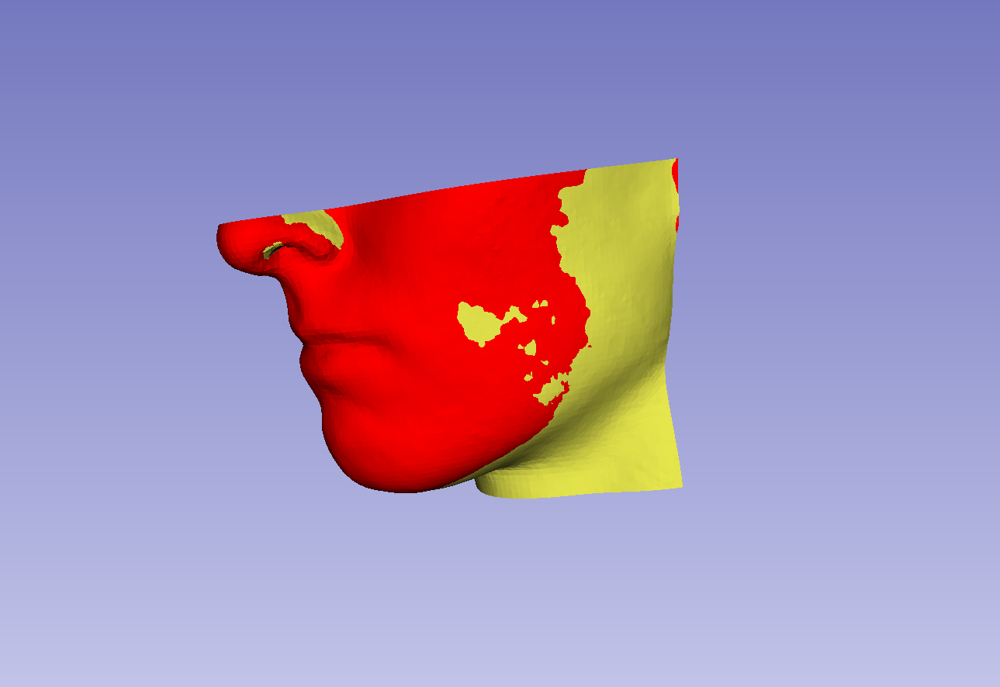
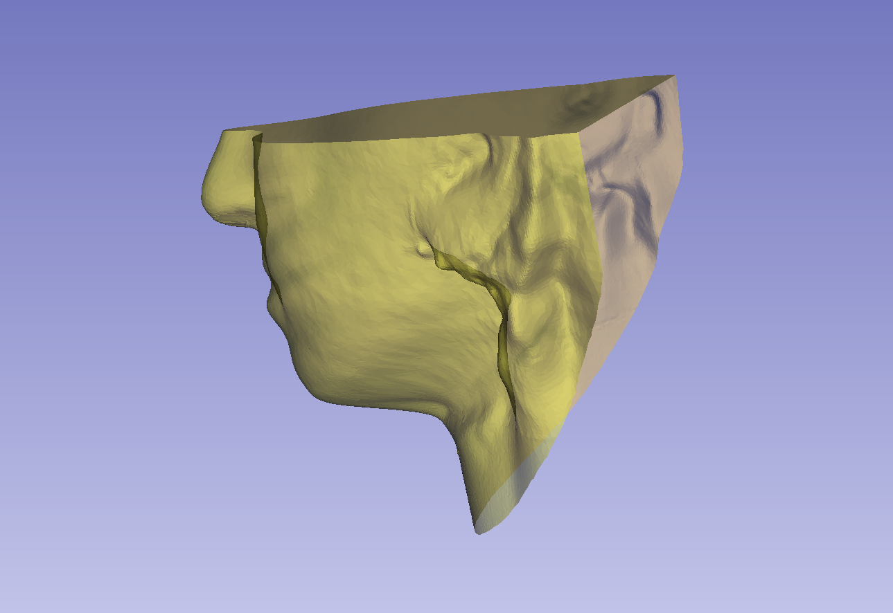
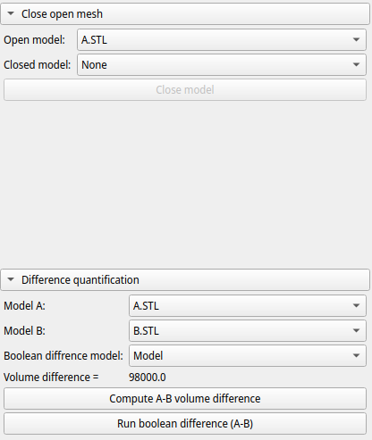
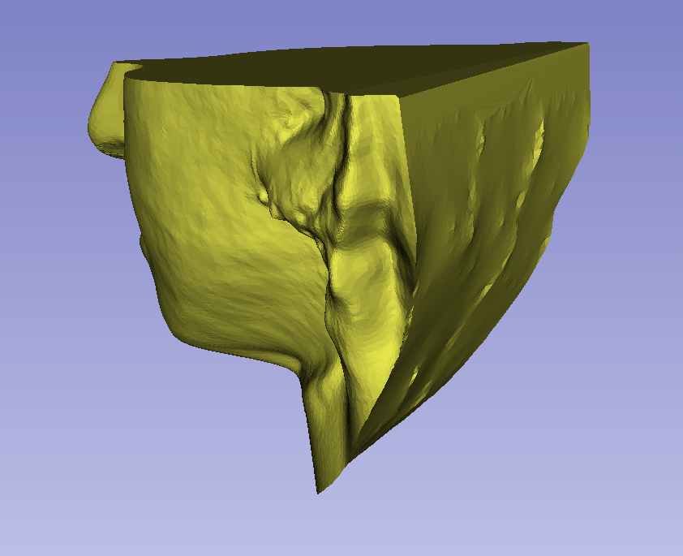
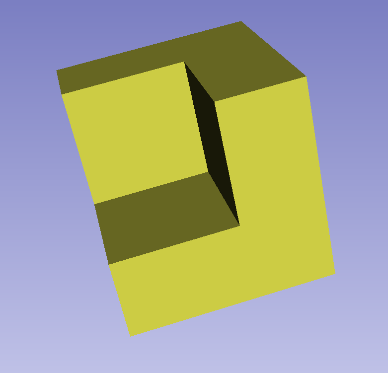

Back to [Projects List](../../README.md#ProjectsList)

# Mesh Comparison

## Key Investigators

- Paolo Zaffino (Magna Graecia University of Catanzaro, Italy)
- Maria Francesca Spadea (Institute of Biomedical Engineering, KIT - Karlsruher Institut für Technologie, Germany)
- Michela Destito (Magna Graecia University of Catanzaro, Italy)
- Amerigo Giudice, the clinical mind behind the idea (Magna Graecia University of Catanzaro, Italy)
- Anyone who wants to join (bring a coffee!) 

# Project Description

<!-- Add a short paragraph describing the project. -->

In the oral surgery field, it is important quantifying the level of swelling after a surgical procedure. Several centers can easily acquire volumetric scans of the patient, both before and after the intervention. Slicer already offers several modules for dealing with surfaces (including difference quantification), but lacks a tool for computing the volume between two meshes. Our aim is to provide such a tool.

## Objective

<!-- Describe here WHAT you would like to achieve (what you will have as end result). -->

1. Write a module for computing the volume between two meshes.
1. Propose to integrate the developed module into a larger project (Slicer CMF?)

## Approach and Plan

<!-- Describe here HOW you would like to achieve the objectives stated above. -->

1. Write a module for computing volume between two meshes (they can be also "open-mesh")
1. Use pyvista library for tasks involving mesh
1. Deal with open meshes

## Progress and Next Steps

<!-- Update this section as you make progress, describing of what you have ACTUALLY DONE. If there are specific steps that you could not complete then you can describe them here, too. -->

1. Created a proptype [extension](https://github.com/pzaffino/SlicerMeshVolumeComparison). This can be improved a lot, it is just a starting point. 
1. The module is able to close open models (by using pymeshfix library)
1. The module is able to compute volume difference and boolean difference (be careful, it could fail in some cases)
1. Ask our clinical partner to test it on clinical scenario (feedbacks are more than welcome!) 

# Illustrations
At the beginning of project week
<!-- Add pictures and links to videos that demonstrate what has been accomplished.

-->

-------------------------------------------------------------------------
At the end of project week

# Background and References

https://github.com/PerkLab/BreastReconstruction

https://github.com/pzaffino/SlicerMeshVolumeComparison

<!-- If you developed any software, include link to the source code repository. If possible, also add links to sample data, and to any relevant publications. -->
