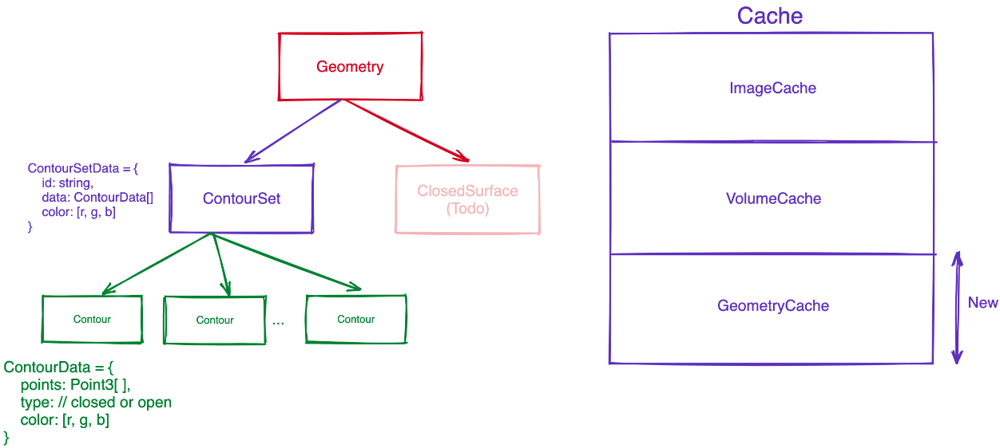
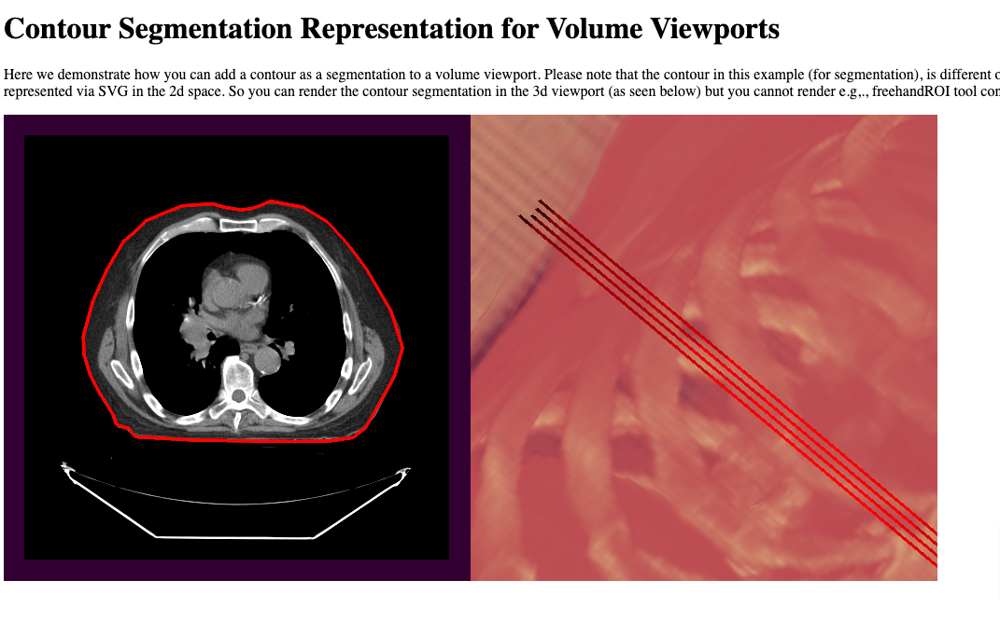
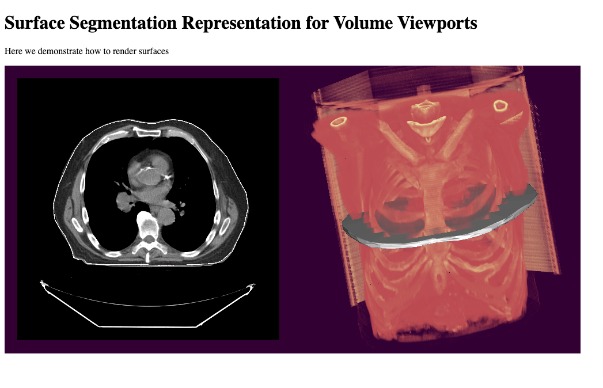

Back to [Projects List](../../README.md#ProjectsList)

# PolySeg representations for OHIF Viewer

## Key Investigators

- Alireza Sedghi (OHIF, Accolade Imaging)

# Project Description

The aim of the project is to continue on the effort of adding polySeg representations for segmentation in OHIF Viewer. This will be a continuation of the work done in the previous [project week](../../../PW31_2019_Boston/Projects/PolySeg4Web/README.md)

## Objective

1. Try to implement the polySeg representation in OHIF Viewer
2. Use the WASM version of the polySeg library

## Approach and Plan

1. Start from a simple example with contour representation
2. Add the polySeg library to the project
3. Implement the polySeg representation in OHIF Viewer

## Progress and Next Steps

### Added new geometry loader to Cornerstone3D

Aiming towards polySeg representations require support for loading a geometry. As part of this task a geometry loader were added to the cornerstone3D which can support loading and caching two geometries:

- ContourSet: A set of 3D contours (list of contours each with a list of points)
- Surface: A 3D surface (points and polygons)

### Implemented the contour segmentation representation in Cornerstone3D

The contour representation is the simplest representation of a polySEG segmentation. It is a set of 3D contours (list of contours each with a list of points). The representation
utilizes the geometry loader to load the contours and render them in the cornerstone3D viewport using the vtkActors

Try it out in our contour demo [here](https://www.cornerstonejs.org/live-examples/contoursegmentationrepresentation)

### Implemented the surface segmentation in Cornerstone3D

The surface representation is a 3D surface (points and polygons). The representation utilizes the geometry loader to load the surface and render them in the cornerstone3D viewport using the vtkActors

Try it out in our contour demo [here](https://deploy-preview-418--cornerstone-3d-docs.netlify.app/live-examples/surfacesegmentationrepresentation)

### Debugged the build for the WASM file to make it smaller

The WASM file was too big to be used in the browser. The build was debugged to make it smaller. Tried the following with no success:

- Making the biuld optimize for size instead of speed

## Next Steps

- Implement the OHIF side of the polySeg representation
- Make the WASM file smaller to be used in the browser

# Background and References

[ICRPolySeg-WASM](https://bitbucket.org/icrimaginginformatics/polyseg-wasm/src/master/), a wrapper package that implements PolySeg for the Web written by ICR team. This work is sponsored by NCITA, a flagship multi-institutional collaboration between leading UK universities, funded by Cancer Research UK - ncita.org.uk. The functionality has now been integrated into the XNAT OHIF Viewer v3.5.0-RC1.

https://github.com/SlicerRt/SlicerRT/tree/master/DicomRtImportExport/ConversionRules
