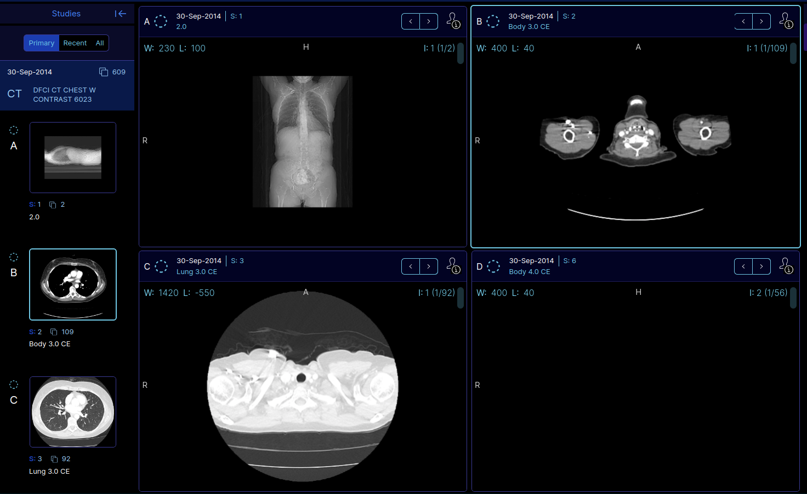

Back to [Projects List](../../README.md#ProjectsList)

# Active Viewport

## Key Investigators

- Davide Punzo (Freelancer, France) 
- Andras Lasso (Perk Labs, Canada)
- Anyone is welcome to join

# Project Description

Add the concept of active viewport in 3DSlicer

## Objective

1) Track the currently manipulated viewport by the user in a parameter in the Slicer logic

2) Add a colored border to the view (2D, 3D, Plot, Table, etc...)

## Approach and Plan

1) Design the solution: discuss the potential use cases (i.e. keyboard/mouse focus) and then use it for example in show/hide node in the selected view (similarly to Paraview).

2) Implement it: add implementation in CTK (e.g. QFrame around views with method to set color, thickness, style, etc... ), and the uid parameter of the selected view (shall we save it in the scene? or just in the slicer logic?).

3) Get feedback

## Progress and Next Steps

1) We (Sam, Steve, Andras, Davide) discussed this and the outlook of the solution design is:
  - we should implement the active viewport only for mouse focus (user clicks). Although it would be nice to activate the viewport with the tab action with the keyboard focus, the user may also want to write in a dialog without losing the focus of the viewport. Therefore we would go with a solution where the viewport activation/focus is persistent.
  - we should implement then in the data module an icon to activate the volume only in the active viewport (2D or 3D). Currently the visibility icon activates with propagate volume method in the slice logic in all the slices (and for example, not in the 3D). Should we do the same for markups visibility?
  - for the UI painting, we can go with the idea to use a QtFrame around the view widgets (the QFrame should contain both the vtk rendering view widget and the controller widget). NOTE: Sam is working on applying QSS styles (including material ones). However at the moment there are some issues with qSlicerWidgets (it looks like the style does not get propagated for those). She plans to fix it, so we can revaluate this at any time.
  - The active viewport should be stored in the scene and restored at scene loading (this avoids to redo clicks, i.e. the viewport in which the user was interacting/doing analysis would be ready at scene loading). We should save the active viewport parameter in the Layout Manager. This for several reasons: you could have a desktop and VR/AR screens with layout managers and the active viewport should be independent in those two (one for each). Already some other parameters and logic regarding to views are in the layout manager (e.g. the maximize a view to the full view layout widget).  The selection node could be another option where saving the parameter, but the selection node refers more to the global status of the Application.

2) This will be implemented later on, after the project week.

# Illustrations

# Background and References

