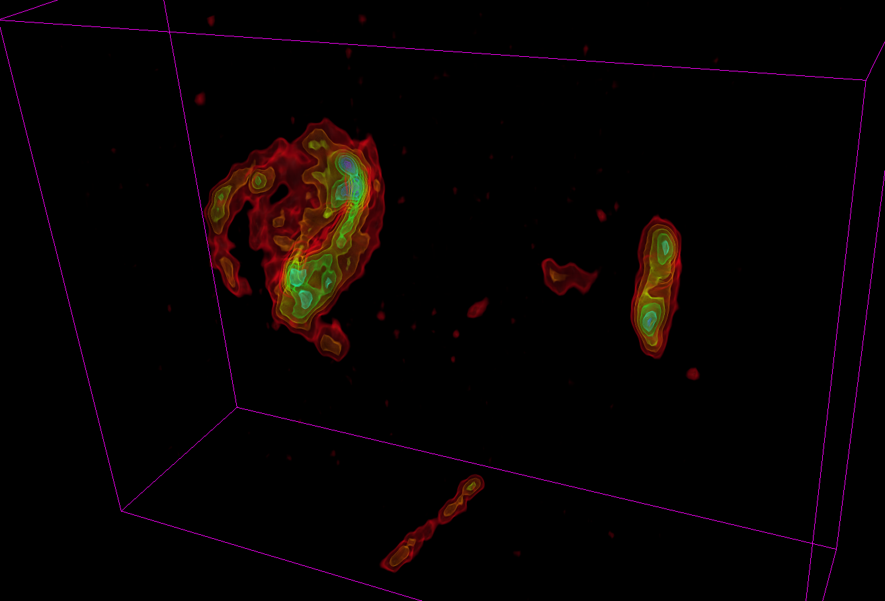

Back to [Projects List](../../README.md#ProjectsList)

# SlicerAstro Update

## Key Investigators

- Davide Punzo (Freelancer, France)
- Thijs van der Hulst (Kapteyn Astronomical Institute, Netherlands)
- Anyone is welcome to join

# Project Description
SlicerAstro is an extension of 3D Slicer that aims to provide astronomers with a powerful and interactive visualization environment. In this environment, astronomers can analyze complex sources that automated pipelines find. These sources include interacting galaxies, tidal tails, HI filaments, and stripped galaxies.

## Objective

Update SlicerAstro to Slicer 5

## Approach and Plan

1) Fix compilation with Slicer 5

2) Test under Slicer 5 and find issues (some already listed in [issues](https://github.com/Punzo/SlicerAstroApp/issues/4))

## Progress and Next Steps

1) Done!

2) Although the code now compile, many parts are broken and testing is not even possible. The main issues found are:
 - The Astro sample data were hosted on the kitware server, which has been closed. Thijs has collected again the sample data, but we need to host them in github and update the links.
 - the slice view factory (to customize slice view widget, astronomical WCS coordinates, etc...) seems not working or the code has to be updated. Other methods from base classes changed and needs to be updated:
    - qMRMLSliceAstroControllerWidgetPrivate::init
 - SlicerAstro uses in many places the old box annotation node (AnnotationROI), we need to migrate it to the new box markups node. Many methods are broken ans several features will not work: 
   - qSlicerAstroVolumeModuleWidget::onCalculateRMS
   - all the methos in the analysis modules that uses the ROIbox to get the boundaries for the computations (statistics, masking, etc...)
 - PV Diagram and PV Slice tools hangs and then crashes. This is related to modifications to the markups infrastructure from Slicer4 to Slicer5.
 - 3DBarolo (galaxy modelling tool) should be updated to version 1.6 (currently there is a custom wrapped version forked from version 1.4)
 - The SlicerAstroApp (SlicerCustomAppTemplate for customized binaries with SlicerAstro style) was not yet tested.

~2 dev weeks would be necessary to fix all the issues and it will be done later on after the project week.

# Illustrations

# Background and References
[Slides](https://docs.google.com/presentation/d/1nfBQul_XENvYHQvPe2c_DCJmSOk13eX0GEoBoHz8MFU/edit#slide=id.p1)

[SlicerAstro](https://github.com/Punzo/SlicerAstro)

[SlicerAstroApp](https://github.com/Punzo/SlicerAstroApp)

[issues](https://github.com/Punzo/SlicerAstroApp/issues/4)
