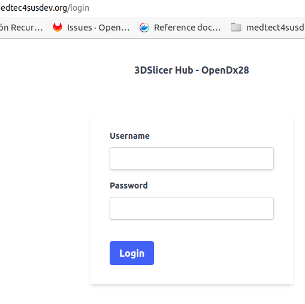

Back to [Projects List](../../README.md#ProjectsList)

# 3DSlicerHub

## Key Investigators

- Rafael Nebot (ITC - Instituto Tecnológico de Canarias)
- Paula Moreno (ITC)
- Juan Ruiz (ULPGC)
- Idafen Santana (ULPGC)

# Project Description

Multiuser approach to Slicer in a browser, based on [Slicer Docker](https://github.com/pieper/SlicerDockers)

### Main Features

- Browser based 3D Slicer using [Slicer Docker](https://github.com/pieper/SlicerDockers), similar to AWS AppStream.
- Per-user workspace, with persistent data and configuration.
- Session control, including quick URL sharing convenience, for educational and collaborative purposes.
- Authentication using OpenLDAP.

## Objective

<!-- Describe here WHAT you would like to achieve (what you will have as end result). -->

1. Use private clouds with GPU virtual machines.
2. Make the software configuration persistent after deleting the container.
3. Migrate from Docker+DockerCompose to Kubernetes+podman.
4. Set the size of 3DSlicer web window to fit the size of the user's screen and other novnc settings.
5. USB over IP + OpenIGTLink + Slicer in Docker.

## Approach and Plan

<!-- Describe here HOW you would like to achieve the objectives stated above. -->

1. (o.1) GPU in Slicer Image: modify Slicer image to add nVidia drivers.
2. (o.1) GPU using separate MONAI Label images: analyze and design how to improve session manager to allow users to launch "pod-sets" (e.g. Slicer+MONAI, Slicer, Slicer+Orthanc, ...). 
3. (o.2) Share current status of the feataure with people knowing about Slicer to fix the issue "saving config in laptop works, in VM it does not".
4. (o.3) Play with "kubernetes" package to familiariaze ourselves with the capabilities.
5. (o.3) Rewrite parts of 3d slicer hub accessing to containers to be able to work with "kubernetes" Python package.
6. (o.3) Start testing
7. (o.4) Gather information with participants knowing about websockify. 
8. (o.5) Compile information about IGT protocol with participants in NAMIC.
9. (o.5) Modify design of 3dslicerhub architecture to enable IGT capabilities for Slicer containers

## Progress and Next Steps

<!-- Up[Readme.md](..%2FReadme.md)date this section as you make progress, describing of what you have ACTUALLY DONE. If there are specific steps that you could not complete then you can describe them here, too. -->

1. Describe specific steps you **have actually done**.
1. ...
1. ...

# Illustrations

## Screenshots

# Background and References

<!-- If you developed any software, include link to the source code repository. If possible, also add links to sample data, and to any relevant publications. -->
