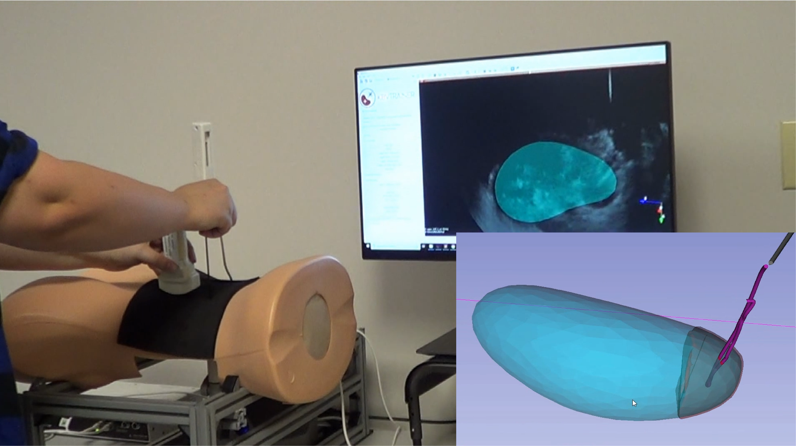

Back to [Projects List](../../README.md#ProjectsList)

# Slicer + IMSTK for low cost training setups

## Key Investigators

- Sam Horvath (Kitware)
- Kevin Cleay (CNMC)
- Karun SHarma (CNMC)

# Project Description

<!-- Add a short paragraph describing the project. -->

This is an on-going project to develop a kidney biopsy trainer based on 3D Slicer.  The trainer uses the iMSTK library to simulate force interactions between the 3D models in Slicer and the physical trainer hardware.

## Objective

<!-- Describe here WHAT you would like to achieve (what you will have as end result). -->

1. Upgrade the existing demo to newest 3D Slicer
1. Upgrade the existing demo to newest iMSTK (simulation library)

## Approach and Plan

<!-- Describe here HOW you would like to achieve the objectives stated above. -->

1. Rewrite the main UI using the new ParameterNode infrastructure.

## Progress and Next Steps

<!-- Update this section as you make progress, describing of what you have ACTUALLY DONE. If there are specific steps that you could not complete then you can describe them here, too. -->

1. Describe specific steps you **have actually done**.
1. ...
1. ...

# Illustrations

<!-- Add pictures and links to videos that demonstrate what has been accomplished.

-->
## Demo version of trainer

# Background and References

<!-- If you developed any software, include link to the source code repository. If possible, also add links to sample data, and to any relevant publications. -->
