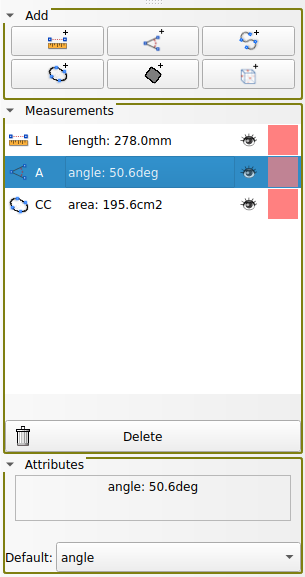

Back to [Projects List](../../README.md#ProjectsList)

# Measurement Panel

## Key Investigators

- Davide Punzo (Freelancer, France) 
- Andras Lasso (Perk Labs, Canada)
- Anyone is welcome to join

# Project Description

Add a custom simple widget for visualization and control of measurements (markups)

## Objective

Integrate the [PR](https://github.com/Slicer/Slicer/pull/6662) in Slicer core

## Approach and Plan

1) Get feedback

2) Finish the PR review

## Progress and Next Steps

1) Done. UI modifications based on Sara, Steve and Sam feedback have been applied

2) in progress

# Illustrations

# Background and References
[Pull Request](https://github.com/Slicer/Slicer/pull/6662)
