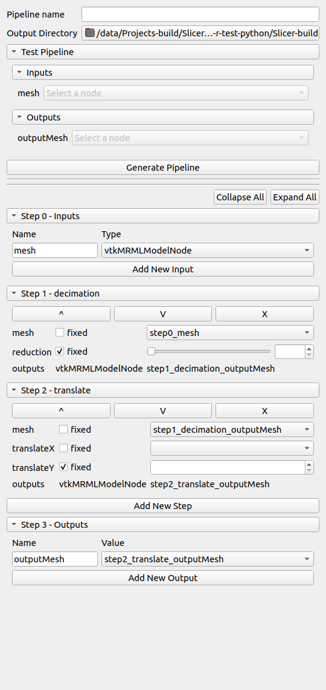
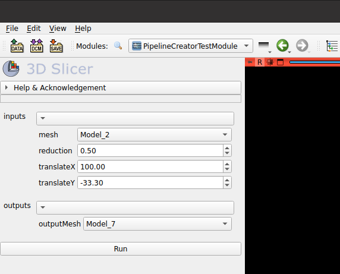

Back to [Projects List](../../README.md#ProjectsList)

# SlicerPipelines

## Key Investigators

- Connor Bowley (Kitware, USA)
- Sam Horvath (Kitware, USA)

# Project Description

Back in Project week 36, the SlicerPipelines extension was developed to allow GUI creation of simple modules, known as pipelines, in 3D Slicer. An initial set of pipelines were added which could be composed to make new functionality.

This implementation had a number of limitations, most prominent being a pipeline could only have a single MRML node as input and a single MRML node as output.

This project aims to address the limitations of the current PipelineCreator module by allowing multiple input, multiple output of pipelines, as well allowing cross step connections.

## Objective

<!-- Describe here WHAT you would like to achieve (what you will have as end result). -->

1. Allow multiple inputs to a pipeline (MRML node or other objects).
1. Allow multiple outputs from a pipeline.
1. Make current non-pipeline modules easier to put into the pipeline system.

## Approach and Plan

<!-- Describe here HOW you would like to achieve the objectives stated above. -->

1. Refactor the current way pipelines are described to be simpler.
1. Use pieces from the `parameterNodeWrapper` to simplify implementation.
    1. The `parameterPack`s can be used to allow structured output of a pipeline (which is analogous to multiple output)
1. Make a minimum usable GUI for creation of new pipelines via composition of existing pipelines.

## Progress and Next Steps

<!-- Update this section as you make progress, describing of what you have ACTUALLY DONE. If there are specific steps that you could not complete then you can describe them here, too. -->

1. Collaborate on user interfaces.
2. Impelement PipelineCreator logic for making a new pipeline with multiple input nodes.
3. Work on user interface implementation.

# Illustrations

Notional pipeline creator UI

Autogenerated pipeline UI for test pipeline

# Background and References

- [Previous Project page](https://projectweek.na-mic.org/PW36_2022_Virtual/Projects/SlicerPipelines/)
- [Discourse post on SlicerPipelines](https://discourse.slicer.org/t/pipelines-in-3d-slicer/20107)
- [Main Github Repository](https://github.com/KitwareMedical/SlicerPipelines)
- [Github fork actively being developed](https://github.com/Connor-Bowley/SlicerPipelines)
