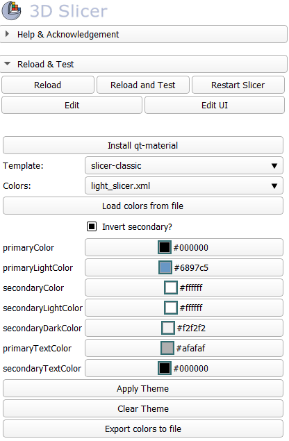
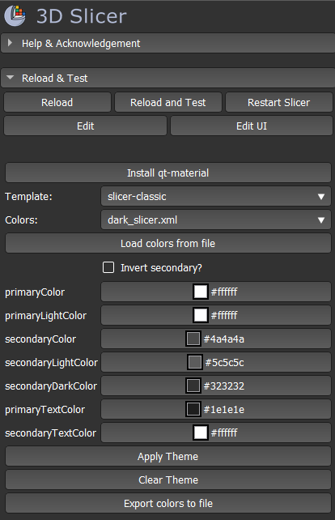
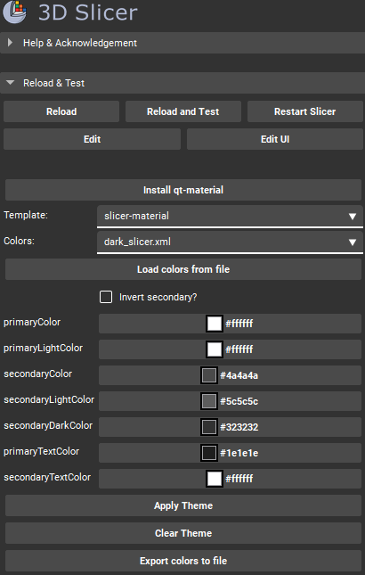
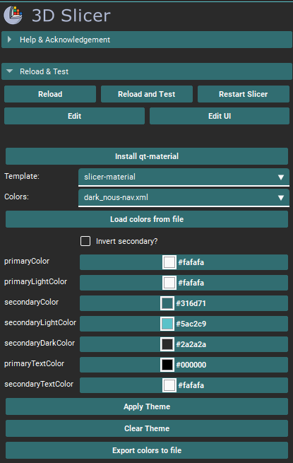

Back to [Projects List](../../README.md#ProjectsList)

# Transitioning 3D Slicer to QSS Styling

## Key Investigators

- Sam Horvath (Kitware)
- J-Christophe Fillion-Robin (Kitware)
- Connor Bowley (Kitware)
- Andras Lasso (Queens)
- Steve Pieper (Isomics)
- Thibault Pelletier

# Project Description

<!-- Add a short paragraph describing the project. -->
Currently 3D Slicer support both QStyle based styling and QtStylesheets.  To improve  custom apps and user experience, we woud like to move all styling to QSS.

## Objective

<!-- Describe here WHAT you would like to achieve (what you will have as end result). -->

1. Allow users to modify theme colors / add new themes
1. Support the existing Slicer Dark / Light themes through QSS

## Approach and Plan

<!-- Describe here HOW you would like to achieve the objectives stated above. -->

1. Create QSS files for the existing Slicer Dark / Light themes
1. Integrate qt-material package to support Material styles through python
1. Create a SlicerThemes (?) extension which pulls in qt-material and add glue code 

## Progress and Next Steps

<!-- Update this section as you make progress, describing of what you have ACTUALLY DONE. If there are specific steps that you could not complete then you can describe them here, too. -->

1. [Forked qt-material](https://github.com/sjh26/qt-material/tree/slicer-compat) to address Slicer specific Python interface.
1. Created [SlicerThemes](https://github.com/sjh26/SlicerThemes) extension
    1. Manages installation of Slicer-specific version of qt-material
    1. Allows for saving and loading of custom color theme files
    1. Provides QSS templates for styles
1. Created QSS templates for "Classic" and "Material" Slicer themes
    1. These are still WIP
1. Next steps
    1. Allowing for loading of user provided templates in the extension
    1. Compile list of changes to core code (ctk and Slicer) to allow styles to be set correctly from QSS

### Core code changes TBD
1. ctkConsole needs tweaks to respect QSS property settings for console colors
1. Slice controllers needs work to prevent icons from disappearing
1. Icon sets should be updated to a Material style

# Illustrations

<!-- Add pictures and links to videos that demonstrate what has been accomplished.

-->

## Initial work

### qt-material package out of the box w / light blue theme

### qt-material package with some manual tweaks to theme file

## Project week results

   
  

# Background and References

<!-- If you developed any software, include link to the source code repository. If possible, also add links to sample data, and to any relevant publications. -->
1. [Discourse post](https://discourse.slicer.org/t/buttons-need-color/27181/11)
2. [qt-material](https://github.com/UN-GCPDS/qt-material)
