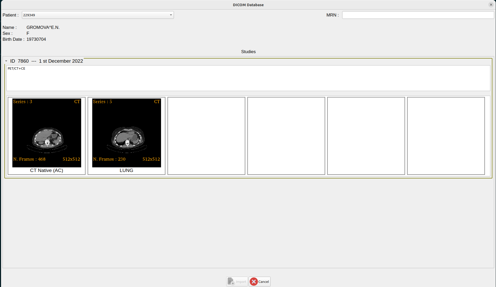

Back to [Projects List](../../README.md#ProjectsList)

# Visual DICOM browser

## Key Investigators

- Davide Punzo (Freelancer, France) 
- Andras Lasso (Perk Labs, Canada)
- Gabriel Kwiecinski Antunes (WebKriativa, Brazil)
- Ralf Floca (German Cancer Research Center, Germany; remote)
- Anyone is welcome to join

# Project Description

Implement a visual DICOM browser with thumbnails and query/retrieve/store capabilities for DICOM databases.

## Objective

Have a simple user-friendly interface to query/retrieve/store from a DICOM server.
The user interface would render series thumbnails so the users can easily navigate the DICOM database
(see illustrations for a first UI Design prototype).
Moreover, perfomance needs to be boosted as much as possible: 

1) fetch metadata only when strictly required (e.g. get series metadata only when the user clicks and opens a study item of the list)

2) the fetch should be performed in async with Qthreads/workers and parallelized.

## Approach and Plan

1) Get feedback: ask feedback on the UI prototype (e.g., Osirix, MITK, Weasis, cloud UIs)

2) Design the solution

3) Start implementation

## Progress and Next Steps

1) Meeting done on Tuesday (31/01/2023)

2) Design: We will proceed with the pure C++ CTK implementation.
   - (A) we will implement the logic and UI in the self-contained CTK components:
     - UI: display list of studies per patient with thumbnails. Show server and local content together
       - for avoing any bottleneck, we will optimize the fecthing of metadata and data only when strictly required. 
         - we will get only few attributes at study level (StudyID, Study Description, Patient Birth Date and Patient Sex) when querying with a Patient Name or MRN
         - once a Patient is selected, and the user has the list of the studies 
         - for each study item, we will download only few attributes from the series metadata and instances that we need for the thumbnails (Series Descriptin, Modality, Rows, Columns, and the "middle" instance Data fro the thumbnail rendering) 
     - improvement of the networking API:
        - methods to retrieve instances metadata and DICOM files
        - allow to query study and series metadata separately
   - (B) we will implement the async query/retrieve/store capabilities. This should be implemented with QThreads and workers with a pool manager where the tasks have a priority (similar to the cornerstoneWADOLoader). We will start donwloading Metadata and Data as soon as the user select a Patient in background. However, users clicks on the UI will give high priority to tasks (e.g. opening a studyItem), while background tasks will have lower priority. This will enhache greatly the user experience since we will have a response-like UI on the style of Web applications like OHIF.
   - (C) we will design/implement how to stream/load data into Slicer (into the volumeNode) in an asynch way from the localDICOMDatabase.
   - NOTE: experiment with websocket from Marco https://github.com/nolden/CTK/commit/16ee8d0773ce37290636000d836ad107b4526085
   - NOTE: web project from Stefan ([link](https://projectweek.na-mic.org/PW38_2023_GranCanaria/Projects/KaapanaFastViewingAndTaggingOfDICOMImages/)). This is very nice and we could use this and comunicate between javascript/C++. However the project uses cornerstone -> dicomwebclient and our requirement is that the solution has to work for any server (not only dicomweb servers).
   - NOTE: the logic to define which is the instance to use for rendering the series thumbnail is still unclear. In the prototype we are sorting the instances using the frame number and using the "middle" one. However this is not reliable. We asked David Clunie and the only way it is to compute the order from the Image Position Patient and Orientation and for 4D datasets we need to use also the time informations.

3) Progress:
  - I have started adding the missing features in CTK: querying/retrieving at instances level, separating the query of attributes at the level of studies and series. 
  - Next stesps are:
    - redo the UI designed in Python for the prototype in C++
    - implement async/parallel pool manager for query/retrieve/store from/to localDICOMDatabase and server
    - stream the the data from the localDICOMDatabase to 3DSlicer into volumeNodes

# Illustrations
Prototype:

Current CTK Query Retrieve Panel:

# Background and References
[CTK class](https://github.com/commontk/CTK/blob/master/Libs/DICOM/Widgets/ctkDICOMQueryRetrieveWidget.cpp)
