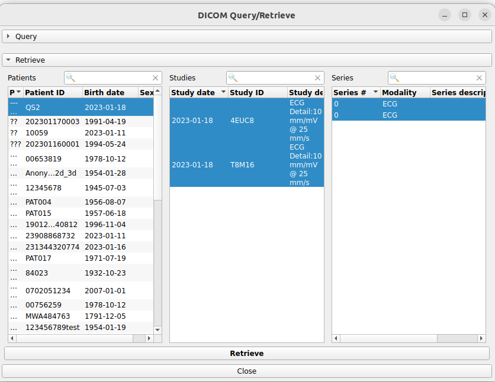

Back to [Projects List](../../README.md#ProjectsList)

# Visual DICOM browser

## Key Investigators

- Davide Punzo (Freelancer, France) 
- Andras Lasso (Perk Labs, Canada)
- Gabriel (webkriativa.gabriel@gmail.com) , Brazil
- Anyone is welcome to join

# Project Description

Implement a visual DICOM browser with thumbnails and query/retrieve/store capabilities for DICOM databases.

## Objective

Have a simple user-friendly interface to query/retrieve/store from a DICOM server.
The user interface would render series thumbnails so the users can easily navigate the DICOM database
(see illustrations for a first UI Design prototype).
Moreover, perfomance needs to be boosted as much as possible: 

1) fetch metadata only when strictly required (e.g. get series metadata only when the user clicks and opens a study item of the list)

2) the fetch should be performed in async with Qthreads/workers and parallelized.

## Approach and Plan

1) Get feedback: ask feedback on the UI prototype (e.g., Osirix, MITK, Weasis, cloud UIs)

2) Design the solution: 
   we implement in CTK:
   - UI: display list of studies per patient with thumbnails. Show server and local content together
   - improvement of the networking API:
      - methods to retrieve instances metadata and DICOM files
      - allow to query study and series metadata separately
   - async query/retrieve/store

3) Start implementation

## Progress and Next Steps

# Illustrations

# Background and References
[CTK class](https://github.com/commontk/CTK/blob/master/Libs/DICOM/Widgets/ctkDICOMQueryRetrieveWidget.cpp)
