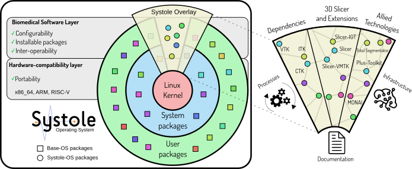
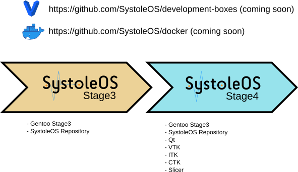

Back to [Projects List](../../README.md#ProjectsList)

# Systole OS: an operating system for development/deployment of medical devices.

## Key Investigators

- Rafael Palomar (Oslo University Hospital and NTNU, Norway)
- Steve Pieper (Isomics Inc., Cambridge, MA, USA)

# Project Description

<!-- Add a short paragraph describing the project. -->

For more than a decade, 3D Slicer has been enabling world-class biomedical
research. The great success of 3D Slicer is now pushing the boundaries of
research, making some research groups and companies regard 3D Slicer as a viable
software for building medical devices that not only could support regular
clinical workflows but also become commercial products. While the development of
3D Slicer has been tailored towards research, its modular architecture makes the 
development of industrial prototypes possible.

The vision of Systole OS is the integration of 3D Slicer and related software (e.g,
Plus Toolkit, MONAI Label and more!) in a free and open-source operating system
based on GNU/Linux, with the aim to support the development and deployment of
medical devices. 



Here are some of the features that we would like to leverage in
Systole OS:

### Cutting-edge software
  
Systole OS is based on Gentoo Linux, which follows a rolling-release model
providing up-to-date support out of box.

### Installable Slicer...

Slicer, together with all the required dependencies will be installable with a simple
command (e.g., `emerge sci-medical/slicer`). No SuperBuild! No Slicer-Launcher!

### ...and Modular Slicer

The base installation of 3D Slicer will include only the components needed to
run the application (e.g., `emerge slicer-modules/models` can be done
separately).

### Source-based

Systole OS is a **source-based** distribution, which means that all packages
will be built from source. Having the flexibility to make decisions on
compile-time allows:

   - Tighter hardware integration
   - Highly configurable packages (e.g., `flaggie sci-medical/slicer -python +opencl; emerge sci-libs/slicer` will install Slicer without python support and with opencl support)
   - Portability to hardware architectures other than amd64 (e.g., arm, risc-v).

### Extensible

Systole OS works on the Gentoo overlay system which allows you to extend the
system with your own ovelay or override packages provided by Systole.

## Objectives

The main objective for PW38 is the consolidation of the development achieved in [PW37](https://github.com/NA-MIC/ProjectWeek/tree/master/PW37_2022_Virtual/Projects/SystoleOS) in Virtual Machines and Containers; this will enable researchers and developers to test the system and contribute to its development. This objective includes the generation of documentation to get started with the project.

As secondary objectives we aim to continue advancing on the integration of 3D Slicer:
 
 - Enabling Python support
 - Porting scripted modules
 
as well as the integration of allied technologies:

 - Plus Toolkit
 - MONAI Label
 - Total Segmentator

## Approach and Plan

1. Project discussion
2. Release of the SystoleOS development VMs and Containers
2. Documentation on how to get started with SystoleOS (gentoo-overlay, containers, VMs)

## Progress and Next Steps

### Systole Overlay progress PW38

```txt
Systole Overlay
├── dev-libs
│   └── qRestAPI                  #OK
├── dev-python
│   └── PythonQt_CTK              #Needs update
├── metadata
├── profiles
├── sci-libs
│   ├── itk                       #OK
│   ├── SimpleITK                 #Needs update
│   ├── vtk                       #OK
│   └── vtkAddon                  #OK
├── sci-medical
│   ├── ctk                       #OK
│   ├── CTKAppLauncherLib         #OK
│   ├── elastix                   #Needs update
│   ├── gdcm                      #OK
│   ├── Slicer                    #Work-in-progress
│   ├── teem                      #OK
│   └── vmtk                      #Needs update
├── Slicer-CLI                    #Needs update
│   ├── ACPCTransform              |
│   ├── AddScalarVolumes           |
│   ├── ExtractSkeleton            |
│   ├── ModelMaker                 |
│   └── SlicerExecutionModel       | 
├── Slicer-Loadable                
│   ├── Annotations                #Remove
│   ├── Cameras                    #Needs update 
│   ├── Colors                     |
│   ├── Data                       |
│   ├── DoubleArrays               |
│   ├── Markups                    |
│   ├── Models                     |
│   ├── Plots                      |
│   ├── Reformat                   |
│   ├── SceneViews                 |
│   ├── Segmentations              |
│   ├── SlicerWelcome              |
│   ├── SubjectHierarchy           #Work-in-progress
│   ├── Tables                     |
│   ├── Terminologies              #OK
│   ├── Texts                      #Needs update
│   ├── Transforms                 |
│   ├── Units                      |
│   ├── ViewControllers            |
│   ├── VolumeRendering            |
│   └── Volumes                    |
├── Slicer-Scripted                #Needs update
│   ├── DataProbe                  |
│   ├── Editor                     |
│   ├── EditorLib                  |
│   ├── Endoscopy                  |
│   ├── LabelStatistics            |
│   ├── PerformanceTests           |
│   ├── SampleData                 |
│   ├── ScreenCapture              |
│   └── SegmentEditor              |
└── x11-libs                       #OK
    └── gdk-pixbuf
```

### Development environments



### Contributing back to Slicer

Some of the work done for SystoleOS can be used to improve the Slicer code base and help on the future modularization of Slicer. We will coordinate with the Slicer core developers to include as much as possible in Slicer.

```txt
baea9d1dc3 * origin/Systole-patches/Slicer ENH: Provide an install version ov vtkSlicerConfigure.h
11e3802dcc * ENH: Fix qt-loadable-modules installation dirs
016d426ec2 * ENH: Enable installation of SLicerBase header files
f242cb635c * ENH: Update SlicerInstallConfig
138aaed6e3 * ENH: Add templates infrastructure
de7ff279d1 * ENH: Installation and setup qSlicerExport.h.in
2dca449c7b * ENH: Remove extension/launcher cmake code from UseSlicer.cmake
97ba113555 * ENH: Add vtkAddon as a requirement in UseSlicer.cmake
27be7571e8 * ENH: Add CTK as requirement in UseSlicer.cmake
3e8d0cbaf6 * ENH: Make installed CMake files available
c49f8f1dff * ENH: Generate and Install SlicerConfig (install tree)
3781a3682c * ENH: Add variable install dirs for Libs dev files
01f68e9856 * ENH: Use slicer installation dirs for base dev components
ec5d1bc8e3 * ENH: Use CMake GNUInstallDirs in Slicer directories
63ff5e26b9 * ENH: Remove the 'App-real' suffix from Slicer executable
feb34841e8 * ENH: Install testing data only with testing support
5d8961c414 * ENH: Limit CPack on non-superbuild mode
e0cebde590 * ENH: Remove conditional code for old VTK
fc6ff2f72f * ENH: Make optional the use of Slicer ITK
cb2a0161ce * COMP: Adapt to new qRestAPI cmake
ae6e0617bd * COMP: Find Eigen (required)
70dc2afdb2 * COMP: Add vtk CommonSystem component as requirement
```

For reference, here is a discussion where this support can be used for the generation of a GNU/Linux Flatpak: https://discourse.slicer.org/t/interest-to-create-flatpak-for-3d-slicer-have-issue-with-guisupportqtopengl-not-found/16532

## Future work

Our most pressing issue right now is to integrate all the core modules and release testing virtual machines and containers. After this, more software packages like MONAI Label, Plus Toolkit, TotalSegmentator, VMTK and Elastix will be integrated. Contributions welcome!!

# Background and References
1. [SystoleOS project in PW37](https://github.com/NA-MIC/ProjectWeek/tree/master/PW37_2022_Virtual/Projects/SystoleOS)

<!-- If you developed any software, include link to the source code repository. If possible, also add links to sample data, and to any relevant publications. -->

