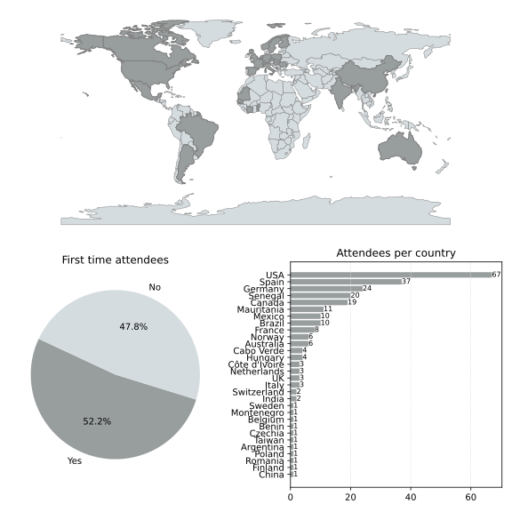

## Welcome to the web page for the 38th Project Week!

[This event](https://projectweek.na-mic.org/PW38_2023_GranCanaria/) will take place from January 30 to February 3rd, 2023 in Gran Canaria, Spain.

* Project Week 38 will be a hybrid event with a strong in-person component for the first time since 2020.
* The venue for in-person events is Hotel Cristina, Las Palmas, Gran Canaria (Spain).
* A block of rooms at [Hotel Cristina](https://www.dreamplacehotels.com/en/hotel-cristina/) is being held for PW attendees
  * To make reservations use code NAMIC23 in email to grupos.mice@dreamplacehotels.com
  * 40 rooms are being held for us at the rate of 108€ (single) and 135€ (double) until the end of November
* Please [register](https://forms.gle/sh9jGJLJdBm4us3E7) as early as possible, indicating whether you plan on participating in person. It will greatly help the organizing committee to estimate the number of participants we need to accommodate in Las Palmas. Registration fees for in-person attendees will be determined and collected later using a separate form by the local organizing team.
* **For those attending virtually**: there will be no registration fee, and zoom/discord links will be provided during preparation meetings.
* **For those attending in person**: a registration fee of 400 Euros will be charged to cover for the workshop venue, lunch and coffee breaks. Use [this form](https://www.fulp.es/inscripcion-namic) to register your payment. Please do so by Tuesday, Jan 17th 2023, as we need to estimate the number of participants to finalize the booking of the room.

If you have any questions, you can contact the [organizers](#organizers).

<!-- to be added at the end of PW
## Screenshots, Illustrations & Photos Album

[Google Photos album from PW37](https://photos.app.goo.gl/PTJjQn5D33uShcLM9)
-->

## Before Project Week
1. Register [here](https://forms.gle/sh9jGJLJdBm4us3E7), it is free!
2. **If you plan to attend in person**, register you workshop fee of 400 Euros [here](https://www.fulp.es/inscripcion-namic).
3. Attend one or more [preparation meetings](#preparation-meetings) to present a project you intend to work on at PW, for which you are seeking collaborators or to join one of the projects proposed by others.
4. Join the [Discord server](https://discord.gg/yQsNVdVpS3) that will be used to communicate with your team during Project Week. Go to [this page](../common/Discord.md) for more info on the use of Discord during PW.
5. Consider joining the [MONAI Label Workshop](MONAILabel_Workshop.md) that will take place January 25th (the week before Project Week).

## Preparation meetings
We hold weekly preparation meetings at 10am on Tuesdays, starting November 29, 2022. Please join at [this link](https://etsmtl.zoom.us/j/86211702920?pwd=TEl0ZTFDam90WVN5bjZhR05kNVRVZz09) if you have a project that you would like to present or work on during project week or to find out about projects you can join.

## During PW

* **Monday Jan 30th**
  * In person attendees can start setting up their computers and material, meeting with their teams and doing a last pass at the project pages from 9am (Las Palmas time) in the Working area. 
  * Remote attendees are encouraged to do the same on Discord if in a time zone that makes it possible.
* **Project presentations**
  * Start at 9am, EST (2pm in Las Palmas). 
  * Takes place in the main hall for in person attendees and is streamed on Zoom for remote attendees (same zoom link as for preparation meetings).
  * Each team delegates a member to present their project in no more than 90 seconds using no other visual support than the project page on GitHub (no time to switch screen sharing).
* **Breakout sessions**
  * Start every day at 11am EST (4pm in Las Palmas) 
  * Streamed on Zoom (same link as for project presentation and preparation meetings)
* **Work in project teams**
  * Starts at 4am EST (9am in Las Palmas) on Monday
  * Takes place in the Working area
  * Extends throughout the week before and after breakout sessions (see calendar on the PW webpage)
  * Communication between team members takes place on Discord, in the work area, or both depending on where the team members are located
  * The CreateEvent function on Discord can be used to plan a meeting (and inform other PW attendees about it)
* **Project results presentation**
  * Friday 9am EST, 2pm in Las Palmas. 
  * Same format as for project presentation

##  Agenda

<!--
Adapted from https://stackoverflow.com/questions/31821974/support-user-time-zone-in-embedded-google-calendar
-->

[How to add this calendar to your own?](../common/Calendar.md)

## Travel guide

[Gran Canaria travel guide](GranCanaria_TravelGuide.md)

## Breakout sessions
[Panel: clinical uses of 3D Slicer](Projects/ClinicalPanel-BreakoutSession.md) (Rudolf Bumm)

## Projects [(How to add a new project?)](Projects/Readme.md)
Categories based on project list of PW37, will be updated as we populate the list of projects.

Presenter (assumed based on order + confirmed status) in **bold**

### VR/AR and Rendering
1. [SlicerVR - Restore Interactions](Projects/SlicerVRInteractions/README.md) (**Csaba Pintér**, Simon Drouin, Andrey Titov, Lucas Gandel, Jean-Christophe Fillion-Robin) *[On site]*

1. [SlicerTMS](Projects/SlicerTMS/README.md) (**Loraine Franke**, Jax Luo, Yogesh Rathi, Lipeng Ning, Steve Pieper, Daniel Haehn) *[Remote]*

1. [ARinSlicer](Projects/ARinSlicer/README.md) (**Alicia Pose**, Javier Pascau, Gabor Fichtinger, Andras Lasso...) *[On site]*

1. [Map texture when importing OBJ file into Slicer](Projects/TextureModelImport/README.md) (**Chi Zhang**, Steve Pieper, A. Murat Maga, Andras Lasso, Sara Rolfe) *[Remote]*

### IGT and Training
5. [Training system for US-guided lung interventions](Projects/US-guided_TrainingSystem/README.md) (**Natalia Arteaga**, David García, Javier González) *[On site]*

1. [Fetal Ultrasound Simulation for Delivery Training](Projects/FetalUltrasoundSimulation/README.md) (**Felix von Haxthausen**, David García, Tolga-Can Çallar, José Carlos Mateo) *[On site]*

1. [Slicer Liver](Projects/SlicerLiver/README.md) (Gabriella D'Albenzio, **Ruoyan Meng**, Geir A. Tangen, Ole V. Solberg, Rafael Palomar) *[On site]*

1. [Slicer Maxillofacial Surgery](Projects/Slicer4MaxillofacialSurgery/README.md) (Miguel Ángel Rodriguez-Florido, Christian Buritica, Mauro Dominguez) *[On site]*

1. [Slicer + IMSTK for low cost training setups](Projects/SlicerIMSTK/README.md) (**Sam Horvath**, Kevin Cleary, Karun Sharma) *[On site]*

1. [Open Source Technologies for the Development of Clinical Simulation Centers](Projects/OpenSourceSimulationCenter/README.md) (**Juan Ruiz**, Idafen Santana, Mario Monzón) *[On site]*

1. [Setting up medical imaging courses](Projects/CoursesMedicalImaging/README.md) (**Juan Ruiz**, Idafen Santana, Mario Monzon) *[On site]*

1. [Development of Anatomy Atlases and Training Tools with 3D Slicer](Projects/TTTAtlas/README.md) (**Juan Ruiz**, Idafen Santana, Mario Monzón) *[On site]*

1. [Integration of infrared, ultraviolet and hyperspectral sensors in Slicer via Plus Toolkit  and OpenIGTLink.](Projects/MultiSpectralSensorIntegration/README.md) (**Francisco J. Marcano Serrano**) *[??]*

### Segmentation / Classification / Landmarking
14. [Lung CT Segmentation and Analysis](Projects/LungSegmentation/Readme.md) (**Rudolf Bumm**, Ron Kikinis, Raúl San José Estépar, Steve Pieper, Eserval Rocha jr., Andras Lasso, Curtis Lisle) *[On site]*

1. [MONAI Label to MONAI bundle conversion](Projects/MONAILabel2bundle/README.md) (**Deepa Krishnaswamy**, Cosmin Ciausu, Nazim Haouchine, Andres Diaz-Pinto, Jesse Tetreault, Roya Hajavi, Stephen Aylward, Steve Pieper, Andrey Fedorov) *[On site]*

1. [Multi-stage dental segmentation using MONAI Label](Projects/TeethSegmentation/README.md) (**David García**, Yucheng Tang, Andres Diaz, Daniel Palkovics, Csaba Pinter, Attila Nagy, Brianna Burton) *[On site]*

1. [Real-time ultrasound AI segmentation using Tensorflow and PyTorch models](Projects/RealTimeUltrasoundSegmentationAI/README.md) (**María Rosa Rodríguez**, Tamas Ungi, David García, Chris Yeung) *[On site]*

1. [AtlasYEB_Plugin_WEB_API](Projects/AtlasYEB_Plugin_WEB_API/README.md) (**Sara Fdez Vidal,ICM**) *[On site]*

1. [Automatic multi-anatomical skull structure segmentation of cone-beam computed tomography scans using 3D UNETR](Projects/AMASSS_CBCT/README.md)(**Luc Anchling** et al) *[Remote]*

1. [Automated Standardized Orientation for Cone-Beam Computed Tomography (CBCT)](Projects/ASO_CBCT/README.md)(**Luc Anchling**, Nathan Hutin, Maxime Gillot, Baptiste Baquero, Jonas Bianchi, Antonio Ruellas, Felicia Miranda, Selene Barone, Marcela Gurgel, Marilia Yatabe, Najla Al Turkestani, Hina Joshi, Lucia Cevidanes, Juan Prieto) *[Remote]*

1. [Automatic Standardize Orientation IOS](Projects/AutomaticStandardizeOrientation_IOS/README.md) (**Nathan Hutin**, Luc Anchling, Marcela Gruge, Felicia Miranda, Najla Al Turkestani, Selene Barone, Lucia Cevidanes, Juan Prieto) *[Remote]*

1. [Automatic Landmark Identification in Cranio-Facial CBCT](Projects/ALI_CBCT/README.md) (**Luc Anchling**, Nathan Hutin, Maxime Gillot, Baptiste Baquero, Jonas Bianchi, Marcela Gurgel, Najla Al Turkestani, Marilia Yatabe, Lucia Cevidanes, Juan Prieto) *[Remote]*

1. [Automated Landmarking Support](Projects/AutomatedLandmarkingSupport/README.md) (Sara Rolfe, Chi Zang, Murat Maga, Steve Pieper, Andras Lasso) *[??]*

### Quantification and Computation

24. [Automatic Quantification 3D Components](Projects/AutomaticQuantitative3DCephalometrics/README.md) (**Nathan Hutin**, Luc Anchling, Baptiste Baquero, Maxime Gillot, Lucia Cevidanes, David Allemang, Jean-Christophe Fillion-Robin) *[Remote]*

1. [MeshComparison](Projects/MeshComparison/README.md) (**Paolo Zaffino**, Maria Francesca Spadea, Michela Destito, Amerigo Giudice) *[On site]*

1. [Electrophysiological biosignals in 3D Slicer](https://github.com/NA-MIC/ProjectWeek/tree/master/PW38_2023_GranCanaria/Projects/Electrophysiological%20biosignals%20in%203D%20Slicer) (**Jordan Ortega Rodríguez**) *[On site]*

1. [Surface Nets](Projects/SurfaceNets/README.md) (**Andy Huynh**, Gerry Gralton, Benjamin Zwick) *[On site]*

1. [Analytic Registration Verification](Projects/AnalyticRegistrationVerification/README.md) (**Gerry Gralton**, Andy Huynh, Benjamin Zwick) *[On site]*

### Cloud / Web
29. [How-to setup and run 3D Slicer on an AWS server instance step by step](Projects/SlicerCloud/Readme.md) (**Rudolf Bumm**, Steve Pieper, Gang Fu, Qing Liu) *[On site]*

1. [MHub Integration](Projects/MHub_Integration/README.md) (**Leonard Nürnberg**, Dennis Bontempi, Andrey Fedorov) *[On site]*

1. [3DSlicerHub](Projects/SlicerHub/README.md) (**Rafael Nebot**, Paula Moreno, Juan Ruiz, Idafen Santana) *[On site]*

1. [HOWTO: Using MONAI zoo bundle for prostate MRI cancer detection in IDC data](Projects/MONAI_IDC_PCa_detection/README.md) (**Cosmin Ciausu**, Deepa Krishnaswamy, Patrick Remerscheid, Tina Kapur, Sandy Wells, Andrey Fedorov, Khaled Younis) *[On site]*

1. [Kaapana related experiments/discussions/collaboratons](Projects/Kaapana_overall/README.md) (**Andrey Fedorov**, Marco Nolden, Hans Meine, Klaus Kades) *[On site]*

1. [Connecting/Using Kaapana to Google Cloud/Google Health/Google FHIR](Projects/KaapanaConnectingKaapanaToGoogleCloudAndHealthAndFHIR/README.md) (**Jonas Scherer**, Andrey Fedorov) *[Remote]*

1. [Kaapana: Data and model exchange across different sources](Projects/KaapanaDataAndModelExchangeAcrossDifferentSources/README.md) (**Benjamin Hamm**, Ünal Akünal, Markus Bujotzek, Klaus Kades, Andrey Fedorov) *[On site]*

1. [Kaapana: Fast viewing and tagging of DICOM Images](Projects/KaapanaFastViewingAndTaggingOfDICOMImages/README.md) (**Stefan Denner**, Klaus Kades, Andrey Fedorov) *[On site]*

1. [Kaapana: Integration of desktop apps](Projects/KaapanaIntegrationOfDesktopApps/README.md) (**Hanno Gao**, Klaus Kades, Andrey Fedorov) *[On site]*

1. [Integration of clinical data into medical imaging pipelines](Projects/KaapanaClinicalData/README.md) (**Philipp Schader**, Andrey Fedorov) *[On site]*

1. [FAIRification of medical imaging data and analysis tools](Projects/Metadata_IDC_HMC/README.md) (**Marco Nolden**, Andrey Fedorov) *[On site]*

1. [Using VolView with images in Google Storage / IDC buckets](Projects/IDC_with_VolView/README.md) (**Andrey Fedorov**, Forrest Li, Stephen Aylward) *[On site]*

1. [IDC Introduction and Tutorial](Projects/IDC_Tutorial/README.md) (**Andrey Fedorov**, Deepa Krishnaswamy, Cosmin Ciausu, Vamsi Thiriveedhi, Dennis Bontempi, Leonard Nuerenberg) *[On site]*

1. [IDC DICOM WSI workflow](Projects/IDC_DICOM_WSI_workflow/README.md) (**Maximilian Fischer**, Andrey Fedorov, Marco Nolden, Philipp Schader, David Clunie, Daniela Schacherer, André Homeyer, Curtis Lisle) *[On site]*

1. [DATSCAN Viewer implementation in OHIF](Projects/OHIF_DATSCAN/README.md) (Salim Kanou, Alireza Sedghi, Celian Abadie, Sofien Sellamo) *[??]*

1. [Cross study sychronizer for OHIF Crosshair](Projects/OHIF_SyncCrosshair/README.md) (Salim Kanou, Alireza Sedghi, Celian Abadie, Sofien Sellamo) *[??]*

### Infrastructure
46. [ParameterNodeWrapper](Projects/ParameterNodeWrapper/README.md) (**Connor Bowley**, Sam Horvath, David Allemang) *[On site]*

1. [SlicerPipelines](Projects/SlicerPipelines/README.md)(**Connor Bowley**, Sam Horvath) *[On site]*

1. [Transitioning 3D Slicer to QSS Styling](Projects/SlicerQSS/README.md) (**Sam Horvath**, J-Christophe Fillion-Robin, Andras Lasso, Steve Pieper) *[On site]*

1. [SystoleOS](Projects/SystoleOS/README.md) (**Rafael Palomar**, Steve Pieper) *[On site]*

1. [3D Slicer Internationalization](Projects/3DSlicerInternationalization/README.md) (**Sonia Pujol**, Steve Pieper, Andras Lasso, Mamadou Camara, Mouhamed DIOP, Adama Wade, Mohamed Alalli Bilal, Adriana H. Vilchis González, Luiz Otavio Murta Junior) *[On site and online]*

1. [Active Viewport](Projects/SlicerActiveViewport/README.md) (**Davide Punzo**, Andras Lasso) *[On site]*

1. [Visual DICOM browser](Projects/SlicerVisualDICOMbrowser/README.md) (**Davide Punzo**, Andras Lasso) *[On site]*

1. [Measurement Panel](Projects/SlicerMeasurementPanel/README.md) (**Davide Punzo**, Andras Lasso) *[On site]*

1. [SlicerAstro Update](Projects/SlicerAstroUpdate/README.md) (**Davide Punzo**, Thijs van der Hulst) *[On site]*

1. [DICOM Segmentation Optimization](Projects/DICOMSEG/README.md) (**Steve Pieper**, Andrey Fedorov, Andras Lasso, Marco Nolden, Hans Meine, Alireza Sedghi, Erik Ziegler, Markus Hermann, Chris Bridge, David Clunie) *[On site]*

1. [Updating Batch Anonymizer](Project/SlicerBatchAnonymize/README.md) (**Hina Shah**, Juan Carlos Prieto, Lucia Cevidanes) [Remote]

## Registrants

Do not add your name to this list below. It is maintained by the organizers based on your registration. Register [here](https://forms.gle/sh9jGJLJdBm4us3E7)

List of registered participants so far (names will be added here after processing registrations):

<!-- Participants list is updated programmatically, please don't remove the comments -->
<!-- Participants list start -->

1. Rafael Palomar, Norway, (In-person, Confirmed)
1. Csaba Pinter, Spain, (In-person, Confirmed)
1. Simon Drouin, Canada, (In-person, Confirmed)
1. Tina Kapur, USA, (Online)
1. Karol Miller, Australia, (In-person, Confirmed)
1. Andy Huynh, Australia, (In-person, Confirmed)
1. Sen Li, Canada, (Undecided)
1. Paolo Zaffino, Italy, (In-person, Confirmed)
1. Andrey Fedorov, USA, (In-person, Confirmed)
1. Steve Pieper, USA, (In-person, Confirmed)
1. hans knutsson, Sweden, (In-person, Confirmed)
1. Sonia Pujol, USA, (Online)
1. JUAN RUIZ-ALZOLA, Spain, (In-person, Confirmed)
1. Ron Kikinis, USA, (In-person, Confirmed)
1. Carl-Fredrik Westin, USA, (In-person, Confirmed)
1. Katie Mastrogiacomo, USA, (In-person, Confirmed)
1. Mamadou Samba CAMARA, Senegal, (In-person, Confirmed)
1. Pape Mady THIAO, Senegal, (In-person)
1. Alexandra Golby, USA, (In-person)
1. yahya tfeil tfeil, Mauritania, (In-person)
1. Javier Pascau, Spain, (In-person, Confirmed)
1. Idafen Santana Perezz, Spain, (In-person, Confirmed)
1. David García Mato, Spain, (In-person, Confirmed)
1. Alicia Pose Díez de la Lastra, Spain, (In-person, Confirmed)
1. Miguel Angel Rodriguez-Florido, Spain, (In-person, Confirmed)
1. Gabor FICHTINGER, Canada, (In-person, Confirmed)
1. Luděk Hynčík, Czechia, (Online)
1. Souleymane Diao, Senegal, (Online)
1. Mouhamed DIOP, Senegal, (In-person, Confirmed)
1. Gabriella d' Albenzio, Norway, (In-person, Confirmed)
1. Dwijkumar Mistry, India, (Online)
1. Ruoyan Meng, Norway, (In-person, Confirmed)
1. Ahmedou Moulaye IDRISS, Mauritania, (In-person)
1. Francesca Spadea, Germany, (In-person, Confirmed)
1. Rudolf Bumm, Switzerland, (In-person, Confirmed)
1. Raul San Jose, USA, (In-person, Confirmed)
1. Kanoun Salim, France, (Undecided)
1. Abadie Celian, France, (Undecided)
1. Simon Oxenford, Germany, (In-person, Confirmed)
1. Andre , Brazil, (Online)
1. Felix von Haxthausen, Germany, (In-person, Confirmed)
1. Tamas Ungi, Canada, (Online)
1. Andres Diaz-Pinto, UK, (Online)
1. Michela Destito, Italy, (In-person, Confirmed)
1. Attila Nagy, Hungary, (In-person, Confirmed)
1. Zachary Baum, UK, (Undecided)
1. Jordan Ortega Rodríguez, Spain, (In-person, Confirmed)
1. Pablo Rubén, Spain, (In-person, Confirmed)
1. Yamilet Rivero López, Spain, (In-person, Confirmed)
1. Joshua García Montagut, Spain, (In-person, Confirmed)
1. Mario Monzón, Spain, (In-person, Confirmed)
1. Rubén Paz, Spain, (In-person, Confirmed)
1. Ben Zwick, Australia, (In-person, Confirmed)
1. Gara Ramos, Spain, (In-person, Confirmed)
1. Davide Punzo, France, (In-person, Confirmed)
1. Michael Halle, USA, (In-person, Confirmed)
1. Gerry Gralton, Australia, (In-person, Confirmed)
1. Natalia Arteaga-Marrero, Spain, (In-person, Confirmed)
1. Davide Punzo, France, (In-person, Confirmed)
1. Vamsi Krishna Thiriveedhi, USA, (Online)
1. Lucia Cevidanes, USA, (Online)
1. Luc Anchling, USA, (Online)
1. Nathan Hutin, USA, (Online)
1. Sam Horvath, USA, (In-person, Confirmed)
1. Andrey Titov, Canada, (In-person, Confirmed)
1. Kizzy Scott, USA, (In-person, Confirmed)
1. Rafael Nebot Medina, Spain, (In-person, Confirmed)
1. Paula Victoria, Spain, (In-person, Confirmed)
1. Alireza Sedghi, Canada, (Online)
1. Andrey Titov, Canada, (In-person, Confirmed)
1. Sara Rolfe, USA, (Undecided)
1. Geir Arne Tangen, Norway, (In-person, Confirmed)
1. Yaying Shi, USA, (Online)
1. Haythem Guermazi, Mauritania, (In-person)
1. Étienne Léger, Canada, (In-person, Confirmed)
1. Theodore Aptekarev, Montenegro, (In-person, Confirmed)
1. Gang Fu, USA, (Online)
1. Roya Khajavibajestani, USA, (Undecided)
1. Ole Vegard Solberg, Norway, (In-person, Confirmed)
1. Santhosh Parampottupadam, Germany, (In-person)
1. Brianna Burton, Belgium, (Undecided)
1. Cosmin Ciausu, USA, (In-person, Confirmed)
1. Charles DeLorey, USA, (Online)
1. Marco Nolden, Germany, (In-person, Confirmed)
1. Fernandez Vidal, France, (In-person, Confirmed)
1. Maria Sofia Sappia, Netherlands, (Online)
1. Yucheng Tang, USA, (Online)
1. Chris Yeung, Canada, (Online)
1. Prodipta Guha, Australia, (Online)
1. Daniel Haehn, USA, (Online)
1. Dennis Bontempi, USA, (In-person, Confirmed)
1. Leonard Nürnberg, USA, (In-person, Confirmed)
1. Loraine Franke, USA, (Online)
1. Ami Hashemi, USA, (Online)
1. Piotr Woznicki, Germany, (Online)
1. Andras Lasso, Canada, (In-person, Confirmed)
1. Connor Bowley, USA, (In-person, Confirmed)
1. Rafe McBeth, USA, (Undecided)
1. Linmin Pei, USA, (Online)
1. William Wells, USA, (In-person, Confirmed)
1. Sara Fernandez Vidal, France, (In-person, Confirmed)
1. Sara Fernandez Vidal, France, (In-person, Confirmed)
1. Zora Kikinis, USA, (In-person, Confirmed)
1. Fidèle AGOSSOU, Benin, (Online)
1. Jeremiah Richard, UK, (Online)
1. Deepa Krishnaswamy, USA, (In-person, Confirmed)
1. Hans Meine, Germany, (In-person, Confirmed)
1. MARTA LATORRE MIGUEZ, Spain, (In-person, Confirmed)
1. Attila Tanács, Hungary, (In-person, Confirmed)
1. Pablo Sergio Castellano Rodríguez, Spain, (In-person, Confirmed)
1. Andrea Mihaly, Spain, (In-person, Confirmed)
1. María Rosa Rodríguez Luque, Spain, (In-person, Confirmed)
1. Jose Carlos Mateo Pérez, Spain, (In-person, Confirmed)
1. Nikolaos Makris, USA, (In-person)
1. Aday Melián Carrillo, Spain, (In-person, Confirmed)
1. Marta Kersten, Canada, (In-person, Confirmed)
1. Connor Bowley, USA, (In-person, Confirmed)
1. Nicole Delgado, USA, (Online)
1. Brandon Konkel, USA, (Online)
1. Hanno Gao, Germany, (In-person, Confirmed)
1. Robabeh Salehiozoumchelouei, Spain, (Online)
1. Nayra Pumar, Spain, (Undecided)
1. Stefan Denner, Germany, (In-person, Confirmed)
1. Ünal Akünal, Germany, (In-person, Confirmed)
1. Benjamin Hamm, Germany, (In-person, Confirmed)
1. Klaus Kades, Germany, (In-person, Confirmed)
1. Umang Pandey, Spain, (In-person, Confirmed)
1. Yogesh Rathi, USA, (In-person)
1. Trinity Urban, USA, (Online)
1. Francisco J. Marcano Serrano, Spain, (In-person, Confirmed)
1. Philipp Schader, Germany, (In-person, Confirmed)
1. Ralf Floca, Germany, (Online)
1. Carlo Rondinoni, Brazil, (Online)
1. Adriana H. Vilchis González, Mexico, (Online)
1. Juan Carlos Avila Vilchis, Mexico, (Online)
1. Carley Tillett, Australia, (Online)
1. Rebeca Villarroel Ramírez, Spain, (In-person, Confirmed)
1. Luiz Murta, Brazil, (Online)
1. Alberto Cuadrado Hernández, Spain, (In-person, Confirmed)
1. Álvaro Navarro González , Spain, (In-person, Confirmed)
1. Markus Bujotzek, Germany, (In-person, Confirmed)
1. Gauthier DOT, France, (Online)
1. Elanchezhian Somasundaram, USA, (Online)
1. Chi Zhang, USA, (Online)
1. RODRIGO BASILIO, Brazil, (Online)
1. Saeed Arbabi, Netherlands, (Undecided)
1. Maximilian Fischer, Germany, (Undecided)
1. Kyle Sunderland, Canada, (Online)
1. Ghulam Rasool, USA, (Online)
1. Suraj Pai, USA, (Online)
1. Ibrahim Hadzic, USA, (Online)
1. Diana Alejandra Mendoza Mora , Mexico, (Online)
1. Li-Wei Yang, Taiwan, (Online)
1. Maica Fernández, Spain, (In-person, Confirmed)
1. Allen Tannenbaum, USA, (Online)
1. Marina Elistratova Elistratova, Spain, (In-person, Confirmed)
1. Nadya Shusharina, USA, (Online)
1. Tamas Heffter , Hungary, (Online)
1. Khaled Younis, USA, (Online)
1. Rebecca Hisey, Canada, (Online)
1. Pedro Moreira, USA, (Online)
1. Jakob Wasserthal, Switzerland, (In-person)
1. Glauco Caurin, Brazil, (Online)
1. Eserval Rocha Junior, Brazil, (Online)
1. Djennifer Madzia-Madzou , Netherlands, (Online)
1. Rahul Kumar, Norway, (Online)
1. Mohamed Alalli BILAL, Senegal, (Online)
1. Fryderyk Kögl, Germany, (Online)
1. Carine Cindy Nguefack Tonleu, Canada, (Online)
1. Tamas Ungi, Canada, (Online)
1. Javier González-Fernández, Spain, (In-person, Confirmed)
1. Maximilian Fischer, Germany, (In-person, Confirmed)
1. Daniela Schacherer, Germany, (Online)
1. Jenna Kim, USA, (Online)
1. Kiran Sandilya , USA, (Online)
1. Kunal Jain, USA, (Online)
1. Mahsa Geshvadi, USA, (Online)
1. Daniel Palkovics, Hungary, (Online)
1. Keno Bressem, USA, (Online)
1. Nielsen , Brazil, (Online)
1. VIANNEY MUNOZ-JIMENEZ, Mexico, (Online)
1. Papa Alioune Cisse , Senegal, (In-person, Confirmed)
1. Youssou Faye, Senegal, (In-person, Confirmed)
1. Ousmane Dia , Senegal, (In-person, Confirmed)
1. Ablaye Tacko Diop , Senegal, (In-person, Confirmed)
1. Oumar Kane , Senegal, (In-person, Confirmed)
1. Idy Diop, Senegal, (In-person, Confirmed)
1. Adama Faye , Senegal, (In-person, Confirmed)
1. Christine Sokhna Thiandoum, Senegal, (In-person, Confirmed)
1. Babacar Diao , Senegal, (In-person, Confirmed)
1. Magatte Gaye , Senegal, (In-person, Confirmed)
1. Charles Dieme , Senegal, (In-person, Confirmed)
1. Sidi El Wafi Sid El Wavi, Mauritania, (In-person, Confirmed)
1. Mohamed Vadel Deida , Mauritania, (In-person, Confirmed)
1. Cheikh Sidi Ethmane Kane , Mauritania, (In-person, Confirmed)
1. Aliou Barry , Mauritania, (In-person, Confirmed)
1. Fatimetou Mohamed Saleck , Mauritania, (In-person, Confirmed)
1. Mouhamedi Bah, Mauritania, (In-person, Confirmed)
1. Ahmed Dhahara Kane , Mauritania, (In-person, Confirmed)
1. Joaquin Olivares, Spain, (Online)
1. Mauro Ignacio Dominguez, Argentina, (Online)
1. Jonas Scherer, Germany, (Online)
1. Curtis Lisle, USA, (Online)
1. Bartosz Włodarczyk, Poland, (Online)
1. Alexandru Dorobanțiu, Romania, (Online)
1. Zdravko Marinov, Germany, (Online)
1. Juan de León Luis, Spain, (In-person, Confirmed)
1. Houssem Gueziri, Canada, (Online)
1. Ulrike Wagner, USA, (Online)
1. Heather Selby, USA, (Online)
1. MARIANA ALVAREZ CARVAJAL, Mexico, (Online)
1. Osku Sundqvist, Finland, (Online)
1. Daniel Fernández, Mexico, (Online)
1. Artur Banach, USA, (In-person, Confirmed)
1. Valeria Gómez Valdes , Mexico, (Online)
1. Abigail Mercado Ponciano, Mexico, (Online)
1. B. Natterson-Horowitz, USA, (Online)
1. ENRIQUE HERNANDEZ LAREDO, Mexico, (Online)
1. Ron Alkalay, USA, (In-person, Confirmed)
1. Varun Agarwal, India, (Online)
1. Christopher Bridge, USA, (Online)
1. Marie Ndiaye, Senegal, (In-person)
1. Mame Diarra SY , Senegal, (In-person)
1. Mame Abdoulaye Gueye, Senegal, (In-person)
1. Ndeye Mareme Sougou, Senegal, (In-person)
1. Khedijetou Vilaly , Mauritania, (In-person)
1. Edmee Clemence Mansilla, Côte d'Ivoire, (In-person)
1. Estelle Tcheple Tuo, Côte d'Ivoire, (In-person)
1. Delphine Bella Epse Konan, Côte d'Ivoire, (In-person)

<!-- Participants list end -->

## Statistics

## Organizers
### Local organizing committee
Juan Ruiz-Alzola, PhD, Professor of Imaging Technologies, director of the Grupo de Tecnología Médica y Audiovisual (GTMA), [Instituto Universitario de Investigaciones Biomédicas y Sanitarias (IUIBS)](https://www.iuibs.ulpgc.es/), [Universidad de Las Palmas de Gran Canaria (ULPGC)](https://www.ulpgc.es/)

Idafen Santana-Pérez, PhD, Project Manager and Research Fellow at Grupo de Tecnología Médica y Audiovisual (GTMA), [Instituto Universitario de Investigaciones Biomédicas y Sanitarias (IUIBS)](https://www.iuibs.ulpgc.es/), [Universidad de Las Palmas de Gran Canaria (ULPGC)](https://www.ulpgc.es/)

### Global Project Week organizing committee
* [@tkapur](https://github.com/tkapur) ([Tina Kapur, PhD](http://www.spl.harvard.edu/pages/People/tkapur)),
* [@drouin-simon](https://github.com/drouin-simon) ([Simon Drouin, PhD](https://drouin-simon.github.io/ETS-web//))
* [@rafaelpalomar](https://github.com/rafaelpalomar) ([Rafael Palomar, PhD](https://www.ntnu.edu/employees/rafaelp))
* [@piiq](https://github.com/piiq) ([Theodore Aptekarev](https://discourse.slicer.org/u/pll_llq))
* [@sjh26](https://github.com/sjh26) Sam Horvath

## History
Please read about our experience in running these events since 2005: [Increasing the Impact of Medical Image Computing Using
Community-Based Open-Access Hackathons: the NA-MIC and 3D Slicer Experience](http://perk.cs.queensu.ca/sites/perkd7.cs.queensu.ca/files/Kapur2016.pdf).
