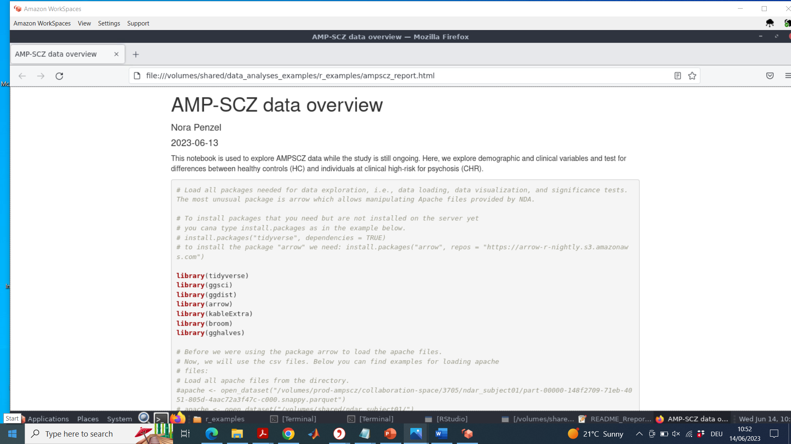
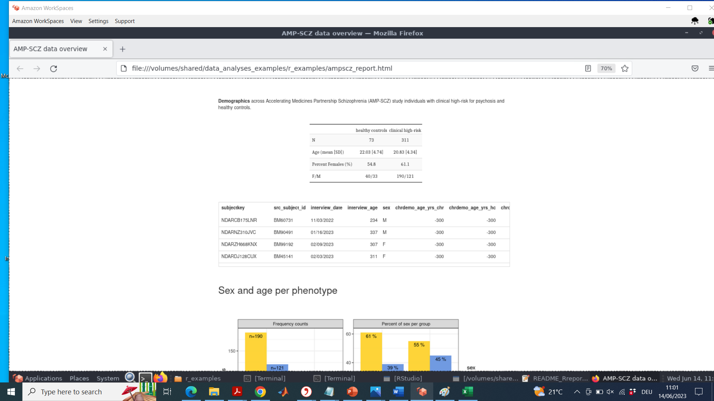
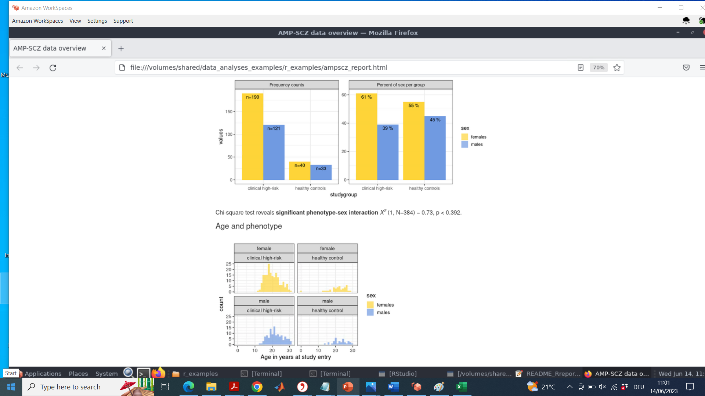

# Project Description

<!-- Add a short paragraph describing the project. -->

The AMPSCZ project allows consortium researchers to access an AWS workspaces virtual desktop with direct access to the AMPCZ data lake hosted at the NIMH data archive (NDA).
This project will consist of generating R and Python notebooks to illustrate how to access and analyze datasets using this collaboration space.

## Objective

<!-- Describe here WHAT you would like to achieve (what you will have as end result). -->

1.  Objective A. Build python and R notebooks showing how to access and interact with AMPSCZ data

## Approach and Plan

<!-- Describe here HOW you would like to achieve the objectives stated above. -->

1.  Build Python and R notebooks to access the data lake
2.  Build cross-instrument data analyses of tabular data
3.  Build example of loading and inspecting raw non-tabular data (e.g., MRI data with Slicer).

## Progress and Next Steps

<!-- Update this section as you make progress, describing of what you have ACTUALLY DONE.
     If there are specific steps that you could not complete then you can describe them here, too. -->

1.  Installed RStudio and all associated packages on AWS Linux.
2.  Installed Python and associated packages on AWS Linux.
3.  Installed Slicer on AWS Linux.
4.  Some issues with MesaGl version on AWS Linux prevented us from getting SlicerJupyter to work.
5.  Ran out of time installing FSL.

# Illustrations

<!-- Add pictures and links to videos that demonstrate what has been accomplished. -->

Refere
*No response*

# Background and References

<!-- If you developed any software, include link to the source code repository.
     If possible, also add links to sample data, and to any relevant publications. -->

*No response*
