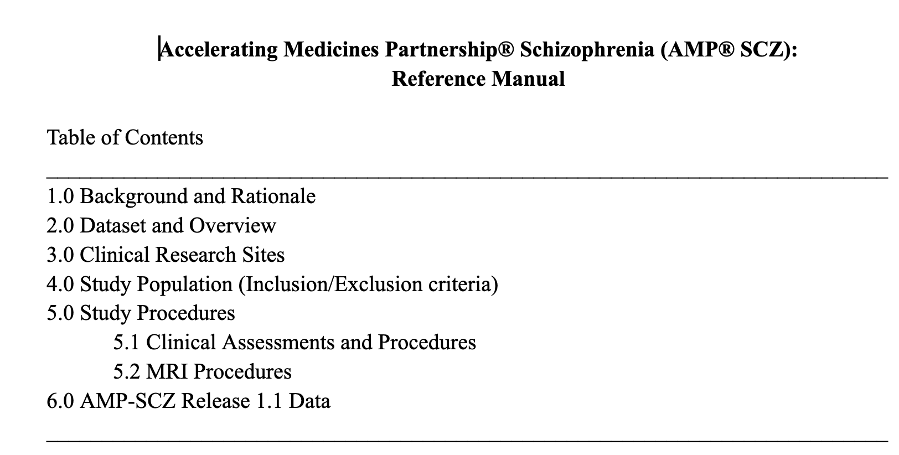
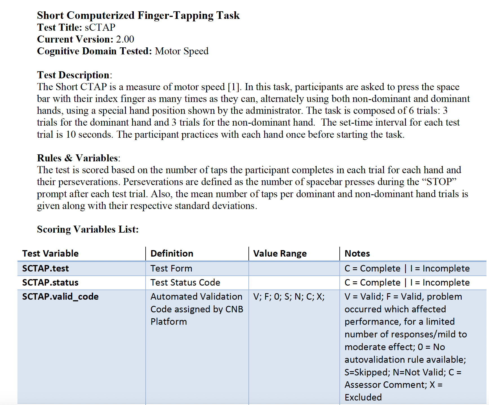

# Project Description

<!-- Add a short paragraph describing the project. -->
The Accelerating Medicines Partnership (AMP®) program is a public-private partnership between the National Institutes of Health, the U.S. Food and Drug Administration, the European Medicines Agency, pharmaceutical and life science companies, non-profit and other organizations. The AMP Schizophrenia (SCZ) program was launched in 2020 to address the critical need for more effective treatments for people with schizophrenia and related mental health conditions.
The project aims to recruit and test over 2,000 individuals at clinical high risk for psychosis using a longitudinal multi-modal protocol involving imaging, EEG and event-related potentials, fluid-based biomarkers, cognitive assessments, and speech sampling). The collection of these biomarkers over time will validate their use and efficacy in the CHR population to establish early indicators of pharmacologic treatment efficacy.

The AMPSCZ project will have its first public data release in July and we want to finalize documentations and "customer-facing" material.

## Objective

<!-- Describe here WHAT you would like to achieve (what you will have as end result). -->

1.  Objective A. Generate documentation for the AMPSCZ data release.

## Approach and Plan

<!-- Describe here HOW you would like to achieve the objectives stated above. -->

1.  Describe specific steps of **what you plan to do** to achieve the above described objectives.

## Progress and Next Steps

<!-- Update this section as you make progress, describing of what you have ACTUALLY DONE.
     If there are specific steps that you could not complete then you can describe them here, too. -->

1.  Drafted a first version of the description of the project.
2.  Collected documentation material for Smartphone Data and Penn Cognitive Battery.
3.  Reviewed NIMH Data Archives (NDA) webpages structure with Tina.
4.  Started description of clinical measures (Nora)
5.  TODO: provide wireframe for NDA site
6.  TODO: collect material for other data types (EEG, MRI, Clinical Tests, A/V recording)

# Illustrations

<!-- Add pictures and links to videos that demonstrate what has been accomplished. -->

# Background and References

<!-- If you developed any software, include link to the source code repository.
     If possible, also add links to sample data, and to any relevant publications. -->

*No response*
