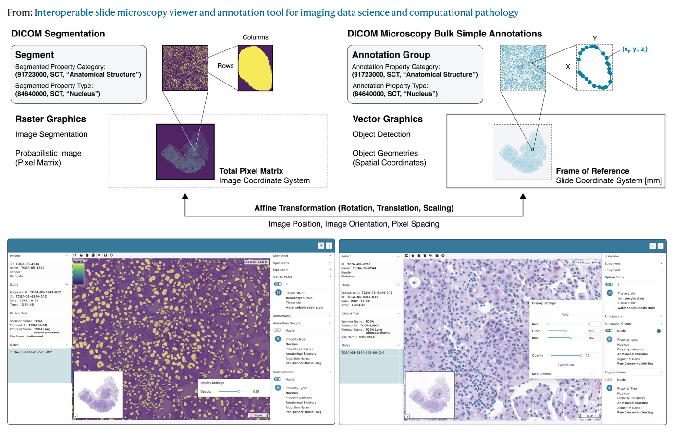

# Project Description

<!-- Add a short paragraph describing the project. -->

This project aims to create tutorials on how to work with DICOM annotations in pathology whole-slide images (WSIs).
At first, we will focus on nuclei annotations stored as DICOM Microscopy Bulk Simple Annotations and compute nuclei density (cellularity) on tile-level from them. The computed cellularity values are then stored as DICOM parametric maps.

## Objective

<!-- Describe here WHAT you would like to achieve (what you will have as end result). -->

1.  Objective A: Have a Colaboratory notebook ready that at least reads DICOM Microscopy Bulk Simple Annotation files (currently from a Google Storage bucket, ideally later from the IDC directly) and computes cellularity values.
2.  Objective B: Encode computed cellularity values as DICOM parametric map that can be stored back to the IDC.

## Approach and Plan

<!-- Describe here HOW you would like to achieve the objectives stated above. -->

1.  Testing and documentation of the current capabilities
    * Establish a repository of test samples that will contain standard-compliant examples of bulk annotations (different number of points, 2D vs 3DSCOORD), segmentations (binary and fractional) and parametric maps (floating point and integer).
    * Share code samples that were used to generate the examples above
    * Test different combinations of Slim viewer, DICOMweb backend (Google, dcm4chee, orthanc) and test samples to understand what is supported by various components (i.e., perhaps only 3DSCOORD is supported by Slim, there may be limits on maximum size of SQ in Google Healthcare)
2.  Investigate nuclei annotations for plausibility
3.  Read nuclei annotations
4.  Efficiently compute cellularity values
5.  Encode cellularity values as DICOM parametric maps

## Progress and Next Steps

1.  We re-used the Google Cloud platform (GCP) project idc-external-031
2.  We created different DICOM stores in Google: 
    * Single 2DSCOORD bulk annotation file and corresponding WSI: [DICOMweb endpoint](https://healthcare.googleapis.com/v1/projects/idc-external-031/locations/us-central1/datasets/single-dicom-annotation-test/dicomStores/single-dicom-annotation-test-store/dicomWeb)
    * 2D vs. 3D and point vs. polygon bulk annotation files and corresponding WSI: [DICOMweb endpoint](https://healthcare.googleapis.com/v1/projects/idc-external-031/locations/us-central1/datasets/2d_3d_point_polygon_annotation_test/dicomStores/2d_3d_point_polygon_annotation_test_store/dicomWeb)
    * Different sizes of DICOM bulk annotation files: [DICOMweb endpoint](https://healthcare.googleapis.com/v1/projects/idc-external-031/locations/us-central1/datasets/diff-sizes-dicom-annotations-test/dicomStores/diff-sizes-dicom-annotations-test-store/dicomWeb)
    * Single segmentation plus simple bulk annotation file: [DICOMweb endpoint](https://healthcare.googleapis.com/v1/projects/idc-external-031/locations/us-central1/datasets/segmentations-binary-test/dicomStores/segmentations-binary-test-store/dicomWeb)
    * Parametric maps: [DICOMweb endpoint](https://healthcare.googleapis.com/v1/projects/idc-external-031/locations/northamerica-northeast1/datasets/pw39-samples/dicomStores/parametric-maps/dicomWeb)

# Illustrations

<!-- Add pictures and links to videos that demonstrate what has been accomplished. -->

# Background and References

<!-- If you developed any software, include link to the source code repository.
     If possible, also add links to sample data, and to any relevant publications. -->

* Github page [Slim viewer](https://github.com/ImagingDataCommons/slim)
* [Slim deployment tutorial](https://docs.google.com/document/d/1857jb_wKHqyGOd49UirujDDrFE8fUPfimZPXJ19zSF4/edit?usp=sharing) - seek feedback from Max and Curt
* WIP repo under development by Chris Bridge to convert annotations from to DICOM ANN/SEG : [https://github.com/ImagingDataCommons/idc-pan-cancer-annotations-conversion/](https://github.com/ImagingDataCommons/idc-pan-cancer-annotations-conversion/)
* Some example [Parametric DICOM Map]([https://www.dropbox.com/scl/fo/yrbm7v2iyx6fh9jgsae1w/h?dl=0&rlkey=hxiagbbp486o3nj480skx0yw7](https://console.cloud.google.com/storage/browser/pw39-parametric-map;tab=objects?project=idc-external-031&prefix=&forceOnObjectsSortingFiltering=false)) and the [conversion code as Docker container](https://github.com/maxfscher/DICOMwsiWorkflow/tree/main) from Max Fischer.
