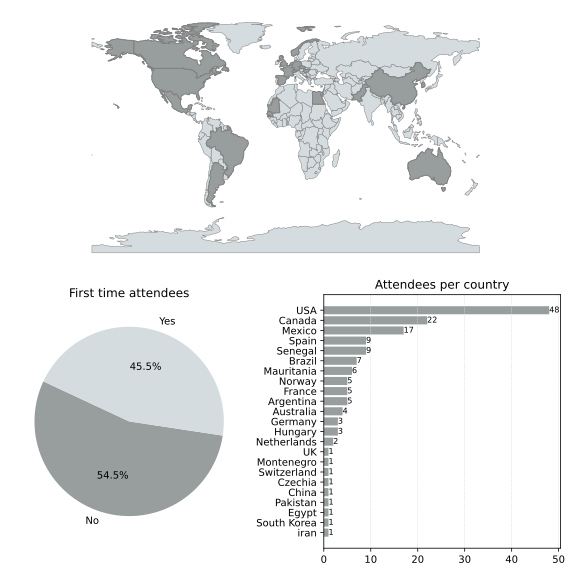

---
project_categories:
- VR/AR and Rendering
- IGT and Training
- Segmentation / Classification / Landmarking
- Quantification and Computation
- Cloud / Web
- Infrastructure
---

# Welcome to the web page for the 39th Project Week!

[This event](https://projectweek.na-mic.org/PW39_2023_Montreal/Readme.html) will take place June 12-16, 2023 in Montreal, Canada.

* Project Week 39 will be a hybrid event with a strong in-person component
* The venue for in-person events is [École de Technologie Supérieure](https://www.etsmtl.ca/), Montreal, Canada.

If you have any questions, you can contact the [organizers](#organizers).

## Registration
* All participants (both remote and in-person) have to register using the [this form](https://docs.google.com/forms/d/e/1FAIpQLSe9dyTCW8Y-RWHEvBUTUXTpbP8Nd9KvUUFpoItuy9_fYKYRfw/viewform).
* Registration for **remote** participants is free.
* Registration for **in person** participants is 350 $CAN (approx. 250 $US). You can register your fee [here](https://www.eventbrite.ca/e/na-mic-project-week-39-tickets-593226786287).

## Preparation meetings
We hold weekly preparation meetings at 10am (Eastern Time) on Tuesdays, starting May 2, 2023. Please join at [this link](https://etsmtl.zoom.us/j/88039770641?pwd=L3JnRFAvRjQ2OEk1UWt1N2VMWDZZZz09) if you have a project that you would like to present or work on during project week or to find out about projects you can join.

## Discord
The **Discord** application is used to communicate between team members and organize activities before and during Project Week. Please join the Project Week [Discord server](https://discord.gg/yQsNVdVpS3) as soon as possible and explore its functionality before the workshop. For more information on the use of Discord before and during Project Week, please visit [this page](../common/Discord.md).

## Venue
The images below show how to get to the PW39 conference room. If you Google "ETS", it will take you to the main building of the university (1). You need to walk about 200 meters to get to the building called "Maison des étudiants" (2). Enter the building and either climb the stairs or take the elevator on the right to reach the second floor(3). From there, you should easily find the registration desk. The conference room for PW39 is right beside.

##  Agenda



## Breakout sessions
1. [Future of rendering in VTK and Slicer](BreakoutSessions/RenderingBreakout/Readme.md)

## Projects

With the [Project Week GitHub Issue page](https://github.com/NA-MIC/ProjectWeek/issues/new/choose), you have three options to create your Project Page:

1.    [Create a Proposal](https://github.com/NA-MIC/ProjectWeek/issues/new?assignees=drouin-simon%2Cpiiq%2Crafaelpalomar%2Csjh26%2Ctkapur&labels=proposal%2Cevent%3APW39_2023_Montreal&projects=&template=proposal.yml&title=Proposal%3A+) issue: If you have an idea for a project page but are not quite ready to create it yet, you can create a “Proposal” issue.

2.    [Create a Project](https://github.com/NA-MIC/ProjectWeek/issues/new?assignees=drouin-simon%2Cpiiq%2Crafaelpalomar%2Csjh26%2Ctkapur&labels=project%2Cevent%3APW39_2023_Montreal&projects=&template=project.yml&title=Project%3A+) issue: If you are ready to create your page, you can simply create a “Project” issue. This issue will allow you to fill out a convenient form to provide the necessary details.

3.    [Create the project page yourself using the template](Projects/Readme.md): If you prefer to create the Project Page yourself, you can still do so by using the provided template and submitting a pull request.



## Registrants

Do not add your name to this list below. It is maintained by the organizers based on your registration. <!-- Register [here](https://forms.gle/sh9jGJLJdBm4us3E7) -->

List of registered participants so far (names will be added here after processing registrations):

<!-- Participants list is updated programmatically, please don't remove the comments -->
<!-- Participants list start -->

1. Rafael Palomar, Norway, (In-person, Confirmed)
1. Sam Horvath, USA, (In-person, Confirmed)
1. Simon Drouin, Canada, (In-person, Confirmed)
1. Steve Pieper, USA, (In-person, Confirmed)
1. David Clunie, USA, (In-person, Confirmed)
1. Ron Kikinis, M.D., USA, (In-person, Confirmed)
1. Étienne Léger, Canada, (In-person)
1. Curtis Lisle, USA, (In-person, Confirmed)
1. Kyle Sunderland, Canada, (In-person, Confirmed)
1. Andrey Titov, Canada, (In-person, Confirmed)
1. Stephen Aylward, USA, (Online)
1. Sara Rolfe, USA, (In-person, Confirmed)
1. Andrey Fedorov, USA, (In-person, Confirmed)
1. Juan Pablo GRAFFIGNA, Argentina, (Online)
1. Deepa Krishnaswamy, USA, (In-person, Confirmed)
1. Rebecca Hisey, Canada, (In-person, Confirmed)
1. Rudolf Bumm, Switzerland, (Online)
1. Beier Yao, USA, (Online)
1. Sylvain Bouix, Canada, (In-person, Confirmed)
1. Theodore Aptekarev, Montenegro, (Online)
1. Lucia Magdalena Bravo Cumpian, Argentina, (Online)
1. Mohamed Alalli BILAL, Senegal, (Online)
1. Chris Bridge, USA, (In-person, Confirmed)
1. Ofer Pasternak, USA, (In-person, Confirmed)
1. Shreyas Fadnavis, USA, (In-person)
1. Kevin Cho, USA, (In-person, Confirmed)
1. Jess Tate, USA, (Online)
1. Guillermo Cecchi, USA, (In-person, Confirmed)
1. Pablo Polosecki, USA, (In-person, Confirmed)
1. Eduardo Castro, USA, (In-person, Confirmed)
1. Amene Asgari, USA, (Online)
1. Nora Penzel, USA, (In-person, Confirmed)
1. Rodolfo Eduardo RODRÍGUEZ SCHMÄDKE, Argentina, (Online)
1. Luc Anchling, France, (In-person)
1. Colton Barr, Canada, (In-person, Confirmed)
1. Pablo Sergio Castellano Rodríguez, Spain, (In-person, Confirmed)
1. Jose Carlos Mateo Perez, Spain, (In-person, Confirmed)
1. Gabriella d'Albenzio, Norway, (In-person)
1. Konstantinos Ntatsis, Netherlands, (In-person, Confirmed)
1. Justin Kirby, USA, (Online)
1. Zhuopin Sun, Australia, (Online)
1. Gabor Fichtinger , Canada, (Online)
1. Pape Mady THIAO , Senegal, (Online)
1. Sarah Frisken, USA, (Online)
1. Mohamed Alalli BILAL, Mauritania, (Online)
1. João Pedro Alves Januário, Brazil, (Online)
1. Nathan Hutin, France, (In-person)
1. Adam Li, USA, (Online)
1. Roya Khajavibajestani, USA, (Undecided)
1. Jean-Christophe Fillion-Robin, USA, (Online)
1. Hassan, Canada, (Online)
1. Nima Masoumi, Canada, (Online)
1. Douglas Samuel Gonçalves, Brazil, (Online)
1. Lucas Sanchez Silva, Brazil, (Online)
1. Luiz Otávio Murta Junior , Brazil, (Online)
1. Tina Kapur, USA, (In-person, Confirmed)
1. Tamas Ungi, Canada, (In-person, Confirmed)
1. Junichi Tokuda, USA, (In-person, Confirmed)
1. Mike Jin, USA, (In-person)
1. Andras Lasso, Canada, (In-person, Confirmed)
1. Dennis Bontempi, USA, (In-person)
1. Cosmin Ciausu, USA, (In-person)
1. Enrique Hernandez Laredo, Mexico, (Online)
1. Diana Alejandra Mendoza Mora, Mexico, (Online)
1. Mariana Alvarez-Carvajal, Mexico, (Online)
1. Daniela Patricia Schacherer, germany / usa, (In-person)
1. Gael Garcia, Mexico, (Online)
1. Andy Huynh, Australia, (In-person)
1. Idrissa SECK, Senegal, (Online)
1. Papa ibra NDIAYE, Senegal, (Online)
1. Pape Malick GUEYE, Senegal, (Online)
1. Valeria Gómez Valdes , Mexico, (Online)
1. Abigail Mercado Ponciano, Mexico, (Online)
1. Nubia Sofía González Casanova, Mexico, (Online)
1. Victor Manuel Montaño Serrano, Mexico, (Online)
1. Vianney Muñoz Jiménez, Mexico, (Online)
1. Leonard, Netherlands, (In-person)
1. Adriana Herlinda Vilchis González, Mexico, (Online)
1. Juan Carlos Avila Vilchis, Mexico, (Online)

<!-- Participants list end -->

## Statistics

<!--  -->

## Organizers

### Global Project Week organizing committee
* [@tkapur](https://github.com/tkapur) ([Tina Kapur, PhD](http://www.spl.harvard.edu/pages/People/tkapur)),
* [@drouin-simon](https://github.com/drouin-simon) ([Simon Drouin, PhD](https://drouin-simon.github.io/ETS-web//))
* [@rafaelpalomar](https://github.com/rafaelpalomar) ([Rafael Palomar, PhD](https://www.ntnu.edu/employees/rafaelp))
* [@piiq](https://github.com/piiq) ([Theodore Aptekarev](https://discourse.slicer.org/u/pll_llq))
* [@sjh26](https://github.com/sjh26) Sam Horvath

## History
Please read about our experience in running these events since 2005: [Increasing the Impact of Medical Image Computing Using
Community-Based Open-Access Hackathons: the NA-MIC and 3D Slicer Experience](http://perk.cs.queensu.ca/sites/perkd7.cs.queensu.ca/files/Kapur2016.pdf).
