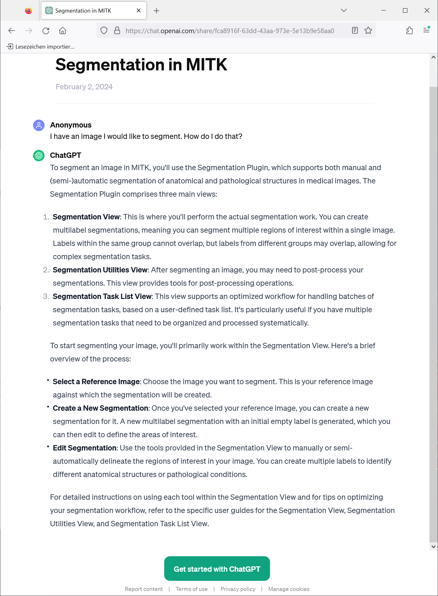
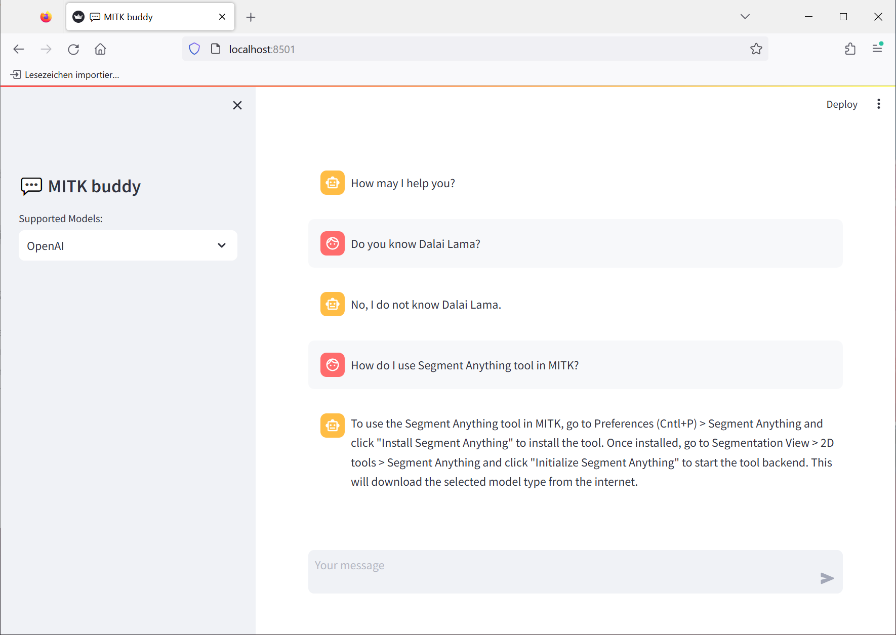

# Project Description

<!-- Add a short paragraph describing the project. -->

Development of a custom chat-based helper tailored specifically for the users & developers of the Medical Imaging Interaction Toolkit (MITK), utilizing recent LLM advancements. The objective is to create a conversational AI interface that assists MITK users in navigating the software, troubleshooting issues esp. for developers, and obtaining relevant information. Leveraging the advances in the field of AI, the custom assistant (e.g. MITK GPT) can provide personalized assistance adapting to individual preferences and workflows.
One of the easiest ways to materialize this proposal to use the OpenAI's custom GPT feature and expand on it.
<https://openai.com/blog/introducing-gpts>

Even though the proposal is currently pitched for MITK, it could benefit other tools eg. Slicer3D, as well.

## Objective

<!-- Describe here WHAT you would like to achieve (what you will have as end result). -->

Custom versions of ChatGPT for the users & developers of the Medical Imaging Interaction Toolkit (MITK)

## Approach and Plan

<!-- Describe here HOW you would like to achieve the objectives stated above. -->

* One of the easiest ways to materialize this proposal is to use the OpenAI's custom GPT feature and expand on it.
<https://openai.com/blog/introducing-gpts>
* Build deployable solutions outside ChatGPT for retrieval-augmented generation (RAG).
* Explore feasibility of chat LLM solutions out there for MITK users & dev.

## Progress and Next Steps

<!-- Update this section as you make progress, describing of what you have ACTUALLY DONE.
     If there are specific steps that you could not complete then you can describe them here, too. -->
1. We created a CustomGPT inside ChatGPT for MITK users. Introducing: *MITK Buddy* !
    * URL: https://chat.openai.com/g/g-E36xLFyf5-mitk-buddy
    * Only available for ChatGPT Plus users and, upper limit on data.
    * -> Promising results (see image below), showing feasibility of the basic idea. However, this solution is not suitable for access within the application.
2. We explored building our own (semi-)local solutions for retrieval-augmented generation.
    * Developed prototype web app based on Streamlit & Langchain (Python) libraries.
    * Code available here for adoption: https://github.com/ASHISRAVINDRAN/custom-chatbot-app
    * -> Does not reach the same level of quality as Custom GPT, but is completely under own control (regarding how it runs, but also what data is shared)
3. Explored other online LLM solutions out there which works nicely with MITK.
    * ChatGPT knowledge is only until Jan 2022.
    * Phind.com seems updated & catered more towards helping (MITK) developers.
    *  -> There are many tools out there already for developers. There is less need to incorporate custom information that is not already there.
      It seems unfeasible to achieve better results than e.g. Phind.com , so our focus laid more on getting a custom solution for our users

# Illustrations

<!-- Add pictures and links to videos that demonstrate what has been accomplished. -->
1. MITK Buddy
   

2. Locally deployable web-app solution based on OpenAI GPT4. Can be locked out of any external knowledge.
   

# Background and References

<!-- If you developed any software, include link to the source code repository.
     If possible, also add links to sample data, and to any relevant publications. -->

* Langchain: https://python.langchain.com/docs/get_started/introduction
