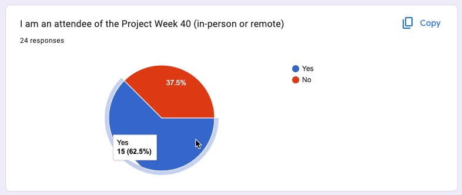

# Project Description

<!-- Add a short paragraph describing the project. -->

Public image data repositories and collections/datasets have been developed for some time now, and they clearly play a role in imaging research, but there has been no systematic investigation of what are the main uses of those repositories and datasets. The goal of this project is to collect experience of the members of the NA-MIC Project Week community in utilizing public datasets in their everyday work.

## Objective

<!-- Describe here WHAT you would like to achieve (what you will have as end result). -->

1.  Document the primary uses of public data by the NA-MIC PW community and sources of the data.
2.  Analyze the collected information to understand gaps and discuss prioritization of new features and data collection efforts based on that information.

## Approach and Plan

<!-- Describe here HOW you would like to achieve the objectives stated above. -->

1.  Design draft of a "survey" to collect the information.
2.  Discuss the draft with a small group of interested parties and refine its content.
3.  Conduct interviews with as many attendees as feasible to collect the information.
4.  Discuss and analyze the information.

## Progress and Next Steps

<!-- Update this section as you make progress, describing of what you have ACTUALLY DONE.
     If there are specific steps that you could not complete then you can describe them here, too. -->

1.  Created initial document for the discussion of the survey, shared with Key Investigators: <https://docs.google.com/document/d/1iVmWebEOv17RAU1FcUefVo2UiOmOc1SK80OUOKQZhtA/edit?usp=sharing>
2.  Distributed survey to the attendees: [http://tinyurl.com/public-data-survey](http://tinyurl.com/public-data-survey)
3.  Advertised on LinkedIn, reachhed out directly, printed out paper fliers!
4. Collected 31 responses so far (only 19 from PW40 attendees, out of 200+ registrants! PLEASE participate!)
5. Results will be released after the survey is closed to avoid influencing responses!

# Illustrations

<!-- Add pictures and links to videos that demonstrate what has been accomplished. -->

# Background and References

<!-- If you developed any software, include link to the source code repository.
     If possible, also add links to sample data, and to any relevant publications. -->

*No response*
