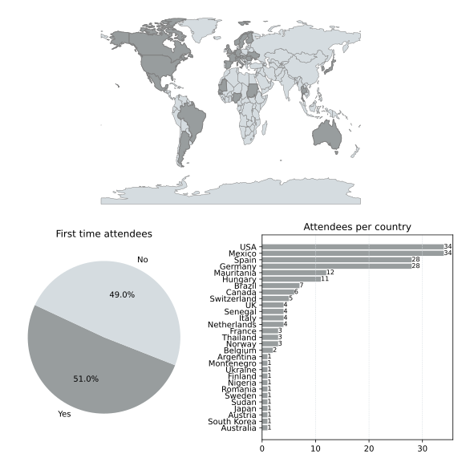

<!-- markdownlint-disable no-trailing-punctuation no-bare-urls no-inline-html -->

# Welcome to the web page for the 40th Project Week!

[This event](https://projectweek.na-mic.org/PW40_2024_GranCanaria/README.html) will take place January 29 - February 2, 2024 in Las Palmas, Gran Canaria, Spain. Project Week 40 will be a hybrid event with a strong in-person component. More details will be posted on this page as the event approaches. If you have any questions, you can contact the [organizers](#organizers).

## Preparation meetings

We hold weekly preparation meetings at 10am on Tuesdays on Zoom, starting November 21, 2023. The link will be posted here the week before.

December 12 meeting: [Zoom link](https://NTNU.zoom.us/j/92717925334?pwd=bGh0ajhzMzh0S1lJaDdTQ0dHaGV5dz09)

## Venue

| Hotel NH Imperial Playa |
| -----|
||

- **Recommended hotels (special rates) and maps**
  - NH Imperial Playa [Map](https://cutt.ly/twjO0PO)
    - Booking: [Discounted room block available](https://www.nh-hotels.com/es/event/namic-workshop)
  - NH Las Palmas Playa Las Canteras [Map](https://cutt.ly/vwkkTDE)
    - Booking: [Discounted room block available](https://www.nh-hotels.com/es/event/grupo-na-mic-workshop)

- **Transportation** from the airport to the city (Las Palmas de Gran Canaria):
  - Taxi (line at the airport)
  - [Bus line 60](https://guaguasglobal.com/lineas-horarios/linea/?id=60)
  - [Map: Airport - San Telmo bus station](https://www.google.com/maps/dir/Gran+Canaria+Airport,+GC-1,+s%2Fn,+35230+Las+Palmas+de+Gran+Canaria,+Las+Palmas/Estacion+De+Guaguas+SAN+TELMO,+35002+Las+Palmas+de+Gran+Canaria,+Las+Palmas/@28.0191886,-15.4859935,12z/data=!3m1!4b1!4m14!4m13!1m5!1m1!1s0xc40a266c3662d1d:0x824bcf7e159f85d4!2m2!1d-15.3874042!2d27.9289223!1m5!1m1!1s0xc40958500f0b3f5:0x3693fb0e3c418af2!2m2!1d-15.4158957!2d28.109201!3e3?entry=ttu)
- The city has good bus/taxi service and is also walkable.

## Registration

- All participants (both remote and in-person) have to register using the [this form](https://forms.gle/iToYPfiE1xa7pYnN9).
- Registration for **remote** participants is free.
- Registration fee for **in person** participants will be 450€ per person. **In-person registration is now closed.**

**Important: The deadline for registration and payment of the fee is Jan 15th**. If you have problems with the payment or registration, contact [namic@ebatinca.com](mailto:namic@ebatinca.com).

**Note:** EU regulations require 2FA for all payments. European banking standards and most credit cards support this by default. If your payment doesn't process due to 2FA issues, please reach out for a custom payment link at [namic@ebatinca.com](mailto:namic@ebatinca.com).

## Discord

The **Discord** application is used to communicate between team members and organize activities before and during Project Week. Please join the Project Week [Discord server](https://discord.gg/qq5pyACuhE) as soon as possible and explore its functionality before the workshop. For more information on the use of Discord before and during Project Week, please visit [this page](../common/Discord.md).

## Agenda



## Breakout sessions

1. Monday: [DICOM](https://docs.google.com/document/d/1Rd9MxRHypCM-JEemvCd59NQyLvE_-tsbbxYXnBkYkxg/edit#heading=h.9f3umithmdm)
1. Tuesday: 3D Slicer
1. Wednesday: [Imaging Data Commons](https://docs.google.com/document/d/1GfzaiUcqLSTmqlumyny1yjJjGEViADwzFllr-sKNgl8/edit?usp=sharing)
1. Thursday: [Future of Rendering in VTK, ITK and Slicer](BreakoutSessions/Rendering/README.md)

## Projects

To learn how to create or update project pages, please refer to the [contributing project pages](ContributingProjectPages.md) section.



## Registrants

Do not add your name to this list below. It is maintained by the organizers based on your registration.

List of registered participants so far (names will be added here after processing registrations):

<!-- Participants list is updated programmatically, please don't remove the comments -->
<!-- Participants list start -->

Updated on 2024-01-25.

1. Steve Pieper, Isomics, Inc., USA, (In-person, Confirmed)
1. Theodore Aptekarev, Slicer Community, Montenegro, (Online)
1. Csaba Pinter, EBATINCA, Spain, (In-person, Confirmed)
1. Attila Nagy, University of Szeged, Dept. of Medical Physics and Informatics, Hungary, (In-person)
1. Rafael Palomar, Oslo University Hospital, Norway, (In-person, Confirmed)
1. Hathaichanok Parakarn, Khon Kaen University, Thailand, (Online)
1. Tatpong Katanyukul, Khon Kaen University, Thailand, (Online)
1. Andrey Fedorov, BWH, USA, (In-person, Confirmed)
1. Hans Knutsson, Linkoping University, Sweden, (In-person, Confirmed)
1. Juan Ruiz-Alzola, University of Las Palmas de Gran Canaria, Spain, (In-person, Confirmed)
1. Lucas Sanchez Silva, USP, Brazil, (In-person, Confirmed)
1. Tina Kapur, Brigham and Women's Hospital, Harvard Medical Schools, USA, (In-person, Confirmed)
1. Simon Drouin, École de technologie supérieure, Canada, (Online)
1. Andras Lasso, PerkLab, Queen's University, Canada, (In-person, Confirmed)
1. Luiz Murta, University of  São Paulo, Brazil, (In-person, Confirmed)
1. Felix Hofmann, Department of General, Visceral and Transplantation Surgery, LMU University Hospital, Munich, Germany, (Undecided)
1. Mike Jin, Brigham and Women's Hospital, Harvard Medical School; Centaur Labs, USA, (In-person, Confirmed)
1. Erke Can Tellal, apoQlar GmbH, Germany, (Online)
1. Paolo Zaffino, Magna Graecia University of Catanzaro, Italy, (In-person, Confirmed)
1. Michela Destito, Magna Graecia University of Catanzaro, Italy, (In-person, Confirmed)
1. Roberto Veraldi, Magna Graecia University of Catanzaro, Italy, (In-person, Confirmed)
1. Ron Kikinis, Brigham and Women's Hospital and Harvard Medical School, USA, (In-person, Confirmed)
1. Ahmedou Moulaye IDRISS, Faculty of Medicine / Nouakchott University, Mauritania, (In-person)
1. Domonkos Tatár, University of Szeged, Albert Szent-Györgyi Medical School, Hungary, (Online)
1. Felix von Haxthausen, Image Guided Therapy Research Group, Universidad Carlos III de Madrid, Spain, (In-person, Confirmed)
1. Michael Onken, Open Connections GmbH, Germany, (In-person, Confirmed)
1. Zora Kikinis, Brigham and Women's Hospital and Harvard Medical School, USA, (In-person, Confirmed)
1. Constantin CONSTANTINESCU, Universidad de Las Palmas de Gran Canaria, Romania, (In-person, Confirmed)
1. Eszter Asztalos-Zsembery, University of Szeged, Hungary, (In-person, Confirmed)
1. Joël Spaltenstein, Agora Care SA, Switzerland, (In-person, Confirmed)
1. Laura Gui Levy, Agora Care, Switzerland, (In-person, Confirmed)
1. José Carlos Mateo Pérez, Universidad de Las Palmas de Gran Canaria, Spain, (In-person, Confirmed)
1. Pablo Sergio Castellano Rodríguez, University of Las Palmas de Gran Canaria, Spain, (In-person, Confirmed)
1. Davide Punzo, Freelancer, France, (In-person, Confirmed)
1. Attila Tanács, University of Szeged, Hungary, (In-person, Confirmed)
1. Brianna Burton, 3D Side SA, Belgium, (In-person, Confirmed)
1. Maria Monzon, ETH Zürich, Switzerland, (In-person, Confirmed)
1. Buddhathida Wangsrimongkol, Khon Kaen University, Thailand, (Online)
1. Francisco Carlos Felipe Rodríguez , Universidad de Las Palmas de Gran Canaria, Spain, (In-person)
1. Philipp Schader, German Cancer Research Center, Germany, (In-person, Confirmed)
1. Jeanne Claret, University of Michigan , USA, (Online)
1. Vitaliy Petrov, Lviv Medical University, Ukraine, (Online)
1. Kyle Sunderland, Queen's University, Canada, (In-person, Confirmed)
1. Hanno Gao, DKFZ, Germany, (Online)
1. Javier Pascau, Universidad Carlos III de Madrid, Spain, (In-person, Confirmed)
1. Alicia Pose Díez de la Lastra, Universidad Carlos III de Madrid, Spain, (In-person, Confirmed)
1. Monica Garcia Sevilla, Universidad Carlos III de Madrid, Spain, (In-person, Confirmed)
1. Dr. Daniel Palkovics, Semmelweis University, Hungary, (In-person, Confirmed)
1. Rafael Oddone Scatena, Universidade de São Paulo, Brazil, (Undecided)
1. Douglas Samuel Gonçalves, USP, Brazil, (Online)
1. Ida Granö, Aalto University, Finland, (In-person, Confirmed)
1. David Clunie, PixelMed (IDC), USA, (In-person, Confirmed)
1. Federico Gnesotto, ImFusion GmbH, Germany, (In-person, Confirmed)
1. Okeowo Adedoyin Esther , Lagos State University Teaching Hospital , Nigeria, (Online)
1. Niklas Wahl, German Cancer Research Center (DKFZ), Germany, (In-person, Confirmed)
1. Nora Penzel, Massachusetts General Hospital, Harvard Medical School, Boston, USA, (In-person, Confirmed)
1. Deepa Krishnaswamy, Brigham and Women's Hospital, USA, (In-person, Confirmed)
1. Martin Matilla, ImFusion GmbH, Germany, (In-person, Confirmed)
1. Mohamed Alalli Bilal, University Cheikh Anta diop of Dakar (Ecole superieure polytechnique), Mauritania, (Online)
1. Leonard Nürnberg, Harvard AIM / Maastricht University, Netherlands, (In-person, Confirmed)
1. Sam Horvath, Kitware, USA, (In-person, Confirmed)
1. Marie NDIAYE, Université Assane Seck de Ziguinchor, Senegal, (Online)
1. Fabian Hörst, Institute for Artificial Intelligence in Medicine (IKIM), University Hospital Essen, Germany, (In-person, Confirmed)
1. Jens Kleesiek, Institute for Artificial Intelligence in Medicine (IKIM), University Hospital Essen, Germany, (In-person, Confirmed)
1. Joost van Griethuysen, The Netherlands Cancer Institute, Netherlands, (In-person, Confirmed)
1. Daniel Caballero, Minimally Invasive Surgery Center Jesús Usón, Cáceres, Spain, (Online)
1. Juan A. Sánchez-Margallo, Jesús Usón Minimally Invasive Surgery Centre, Spain, (Online)
1. Lucia Salazar Carrasco, Minimally Invasive Surgery Center Jesús Usón, Cáceres, Spain, (Online)
1. Marco Nolden, German Cancer Research Center (DKFZ), Heidelberg, Germany, (In-person, Confirmed)
1. Christopher Bridge, Massachusetts General Hospital, USA, (In-person, Confirmed)
1. Pablo Polosecki, IBM Research, USA, (In-person, Confirmed)
1. Carl-Fredrik Westin, Harvard Medical School, USA, (In-person, Confirmed)
1. Idafen Santana, EBATINCA, Spain, (In-person, Confirmed)
1. Rudolf Bumm, Kantonsspital Graubünden, Switzerland, (In-person, Confirmed)
1. WBUZAR MUBARAK OMER OSMQN, Al fashir University, Sudan, (Online)
1. Igor Octaviano, Radical Imaging / OHIF, Brazil, (Online)
1. Chi Zhang, Texas A&M University School of Dentistry, USA, (Online)
1. Moon Kim, Institute for Artificial Intelligence in Medicine (IKIM), University Hospital Essen, Germany, (In-person)
1. Ciro Benito Raggio , Karlsruhe Institute of Technology, Germany, (In-person)
1. Domenico Riggio, Karlsruhe Institute of Technology, Germany, (In-person)
1. Takayoshi Suzuki, Hokkaido University, Japan, (Online)
1. Dong Jin Sung, Mass General Brigham (MGB), USA, (Online)
1. Amaia Iribar Zabala, Fundación Vicomtech, Spain, (In-person)
1. Rafeal Benito Herce, Funcación Vicomtech, Spain, (In-person)
1. Frida Hauler, No institution, UK, (In-person)
1. Maximilian Fischer, German Cancer Research Center (DKFZ) Heidelberg, Germany, (Undecided)
1. Diego Larriera Kiriakidis, Técnicas Competitivas SA, Spain, (In-person)
1. sara Fernandez Vidal, ICM, France, (Online)
1. Adela Moravova, University of Innsbruck, Austria, (Online)
1. Alireza Sedghi, open health imaging foundation - OHIF, Canada, (Online)
1. Bahnsen, Fin Hendrik, Institute for AI in Medicine (IKIM), Essen, Germany, (In-person)
1. Odile Elias, Deutsches Krebsforschungszentrum Heidelberg, Germany, (In-person)
1. Andres Diaz-Pinto, NVIDIA, UK, (Online)
1. Gabor Fichtinger, Queen's University, Canada, (In-person)
1. Fatimetou Mohamed-Saleck, University of Nouakchott and University of Las Palmas Gran Canaria, Mauritania, (In-person)
1. Patrick Remerscheid, BWH, Switzerland, (Online)
1. Lukas Heine, Institute for AI in medicine, University Medicine Essen, Germany, (In-person)
1. Vamsi Thiriveedhi, Brigham and Women's Hospital , USA, (In-person)
1. Rafael Nebot Medina, Instituto Tecnológico de Canarias, SA, Spain, (Online)
1. Pablo Cabrales Miró-Granada, Grupo de Física Nuclear, Dpto EMFTEL & IPARCOS, Facultad de Ciencias Físicas, Universidad Complutense de Madrid, Spain, (In-person)
1. Mamadou Samba CAMARA, Cheikh Anta Diop University of Dakar, Senegal, (Online)
1. Mohamed Abdellahi Sidi Mohamed Blal, Université de Nouakchott , Mauritania, (Online)
1. João Pedro Alves Januário, University os São Paulo, Brazil, (Online)
1. Professor Klaus Maier-Hein, German Cancer Research Center (DKFZ), Germany, (In-person)
1. Francesca Spadea, Karlsruhe Institute of Technology, Italy, (In-person)
1. Ashis Ravindran, DKFZ, Heidelberg, Germany, (Online)
1. Imre János Barabás, MD, Semmelweis University, Hungary, (In-person)
1. Mikael Brudfors , NVIDIA, UK, (In-person)
1. Badiaa AIT AHMED, Instituto de Astrofísica de Canarias, Spain, (Online)
1. Maximilian Fischer, German Cancer Research Center (DKFZ) Heidelberg, Germany, (In-person)
1. José Andrés Avellaneda González, Universidad Complutense de Madrid, Spain, (Online)
1. Simon Oxenford, Charité Berlin, Germany, (Online)
1. Nayra Pumar Carreras, EBATINCA, Spain, (In-person)
1. Moustapha Mohamed Saleck,  Faculté des Sciences et Techniques (FST) , Université de Nouakchott, Mauritania, (Online)
1. Baksic Paul, INRIA, France, (In-person)
1. Valeria Gómez Valdes , Universidad Autónoma del Estado de México , Mexico, (Online)
1. Jean-Christophe Fillion-Robin, Kitware, USA, (In-person)
1. Leroux, University of Michigan, USA, (Online)
1. Balint Kovacs, Division of Medical Image Computing - German Cancer Research Center (DKFZ), Germany, (In-person)
1. Daniela Schacherer, Fraunhofer MEVIS, Germany, (In-person)
1. Nikolaos Makris, Massachusetts General Hospital, USA, (In-person)
1. Poliana Hartung Toppa, Massachusetts General Hospital, USA, (In-person)
1. Kayley Haggerty, Massachusetts General Hospital, USA, (In-person)
1. Gabriella d'Albenzio, The Intervention Centre, Norway, (In-person)
1. Mohamed bamba, Faculté de médecine de Nouakchott , Mauritania, (Online)
1. Petros Koutsouvelis, Maastricht University, Netherlands, (In-person)
1. Mohamed El Moctar, FMPOS, Mauritania, (Online)
1. Hossein Rahmani, Maastricht University, Netherlands, (In-person)
1. Vianney Muñoz-Jiménez, Universiad Autónoma del Estado de México, Mexico, (Online)
1. Victor Manuel Montaño Serrano, Universidad Autónoma del Estado de México, Mexico, (Online)
1. André Homeyer, Fraunhofer MEVIS, Germany, (Online)
1. Monserrat Ríos Hernández, Universidad Autónoma del Estado de México, Mexico, (Online)
1. Ole Vegard Solberg, SINTEF, Norway, (Online)
1. Adriana H. Vilchis González, Facultad de Ingeniería UAEMex, Mexico, (Online)
1. Juan Carlos Avila Vilchis , Facultad de Ingeniería UAEMex, Mexico, (Online)
1. Enrique Hernandez Laredo, Universidad Autónoma del Estado de México, Mexico, (In-person)
1. Ofer Pasternak, Harvard Medical School, USA, (In-person)
1. Tae Young Park, KIST, South Korea, (Online)
1. Aída García Limas, UAEMéx, Mexico, (Online)
1. Mikhail Milchenko, Washington University in Saint Louis, USA, (Online)
1. Fatimetou Hademine , Faculty of science and technology university of Nouakchott , Mauritania, (Online)
1. Aichetou N’DIAYE, Université de Nouakchott, Mauritania, (Online)
1. Mohamed Boullah Mohamed , University of Nouakchott , Mauritania, (Online)
1. Abigail Mercado Ponciano, Universidad Autónoma del Estado de México , Mexico, (Online)
1. Paula, Instituto Tecnológico de Canarias, Spain, (Online)
1. David Garcia Mato, Apolo AI, Spain, (Online)
1. Mikulas Bankovic, DKFZ, Germany, (Online)
1. Khaled Younis, MedAiConsult, USA, (Online)
1. Jess Tate, University of Utah, USA, (Online)
1. Juan Carlos Prieto, University of North Carolina, USA, (Online)
1. Stephen Schaumann, DKFZ Heidelberg, Germany, (Online)
1. Kevin Guan, New York University, USA, (Online)
1. Umang Pandey, Universidad Carlos III de Madrid, Spain, Spain, (Online)
1. Felicia Alfano, Universidad Politécnica de Madrid, Spain, (Online)
1. Mo Al Sa’d, Imperial College London, UK, (Online)

<!-- Participants list end -->

## Statistics

## Organizers

### Local organizing committee

- Juan Ruiz-Alzola, PhD, Professor of Imaging Technologies, director of the Grupo de Tecnología Médica y Audiovisual (GTMA), [Instituto Universitario de Investigaciones Biomédicas y Sanitarias (IUIBS)](https://www.iuibs.ulpgc.es/), [Universidad de Las Palmas de Gran Canaria (ULPGC)](https://www.ulpgc.es/)
- Idafen Santana-Pérez, PhD, Information Systems and Technology Consulting Director, [EBATINCA, S.L.](https://ebatinca.com/equipo)
- Csaba Pintér, PhD, CTO, [EBATINCA, S.L.](https://ebatinca.com/equipo)
- Javier Pascau, PhD, Professor of Bioengineering, [Universidad Carlos III de Madrid](https://igt.uc3m.es/jpascau)

### Global Project Week organizing committee

- [@tkapur](https://github.com/tkapur) ([Tina Kapur, PhD](http://www.spl.harvard.edu/pages/People/tkapur)),
- [@rkikinis](https://github.com/rkikinis) ([Ron Kikinis, MD](http://www.spl.harvard.edu/pages/People/kikinis)),
- [@drouin-simon](https://github.com/drouin-simon) ([Simon Drouin, PhD](https://drouin-simon.github.io/ETS-web//))
- [@rafaelpalomar](https://github.com/rafaelpalomar) ([Rafael Palomar, PhD](https://www.ntnu.edu/employees/rafaelp))
- [@piiq](https://github.com/piiq) ([Theodore Aptekarev](https://discourse.slicer.org/u/pll_llq))
- [@sjh26](https://github.com/sjh26) ([Sam Horvath, PhD](https://www.kitware.com/samantha-horvath/))

## History

Please read about our experience in running these events since 2005: [Increasing the Impact of Medical Image Computing Using
Community-Based Open-Access Hackathons: the NA-MIC and 3D Slicer Experience](http://perk.cs.queensu.ca/sites/perkd7.cs.queensu.ca/files/Kapur2016.pdf).
