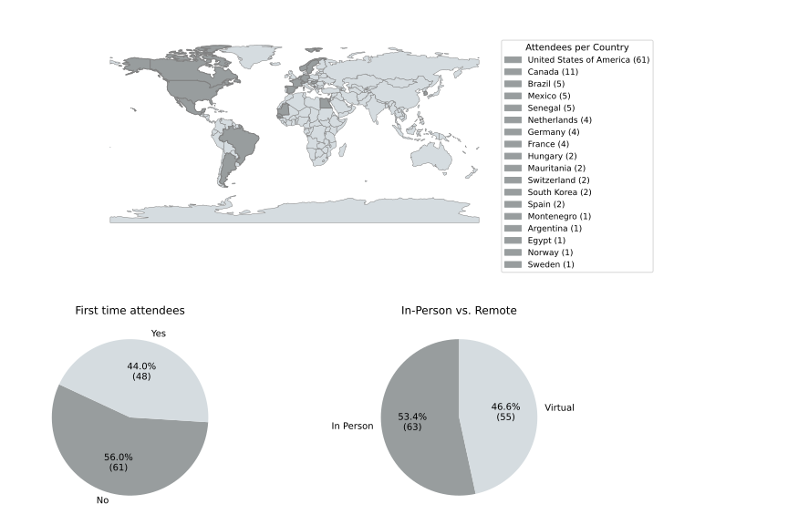

# Welcome to the web page for the 41st Project Week!

[This event](https://projectweek.na-mic.org/PW41_2024_Boston/README.html) will take place June 24th - June 28th, 2024 at MIT, Cambridge, MA. Project Week 41 will be a hybrid event with a strong in-person component. More details will be posted on this page as the event approaches. If you have any questions, you can contact the [organizers](#organizers).

## Location

Grier Rooms (34-401A, 34-401B), Building 34, 50 Vassar Street, Cambridge, MA

## Preparation meetings

We held weekly preparation meetings at 10am on Tuesdays on Zoom, starting April 30, 2024.
## Registration
Register at the link [here](https://cvent.me/dldl10).

## Discord
The **Discord** application is used to communicate between team members and organize activities before and during Project Week. Please join the Project Week [Discord server](https://discord.gg/AkxzKvqMBp) as soon as possible and explore its functionality before the workshop. For more information on the use of Discord before and during Project Week, please visit [this page](../common/Discord.md).

##  Agenda



## Breakout sessions

## Projects

To learn how to create or update project pages, please refer to the [contributing project pages](ContributingProjectPages.md) section.



## Registrants

Do not add your name to this list below. It is maintained by the organizers based on your registration.

List of registered participants so far (names will be added here after processing registrations):

<!-- Participants list is updated programmatically, please don't remove the comments -->
<!-- Participants list start -->

Updated on 2024-06-24.

1. Ekaterina Akhmad, Maastricht University, Netherlands, Virtual
1. Ron Alkalay, Beth Israel Deaconess Medical Center, USA, In Person
1. Tamaz Amiranashvili, University of Zurich, Switzerland, In Person
1. Dennis Anderson, Beth Israel Deaconess Medical Center, USA, In Person
1. Theodore Aptekarev, Slicer Community, Montenegro, Virtual
1. Amene Asgari, Brigham and women’s hospital, USA, In Person
1. Paul Baksic, INRIA - France, France, Virtual
1. Mikulas Bankovic, German Cancer Research Center, Germany, Virtual
1. Imre János Barabás, Semmelweis University, Hungary, In Person
1. Mohamed Alalli Bilal, Université Nouakchott Al-Asriya, Mauritania, Virtual
1. Owen Borders, Massachusetts General Hospital, USA, In Person
1. Sylvain Bouix, École de technologie supérieure, Canada, In Person
1. Charles Bricout, ETS, Canada, In Person
1. Mamadou Samba CAMARA, Université Cheikh Anta Diop de Dakar, Senegal, Virtual
1. Naomi Catwell, ÉTS, Canada, Virtual
1. Mirela Cazzolato, University of Sao Paulo, Brazil, Virtual
1. Lucia Cevidanes, University of Michigan, USA, Virtual
1. Gnaneswar Chundi, Rutgers University, USA, In Person
1. Cosmin Ciausu, Brigham and Women's Hospital, USA, In Person
1. Jeanne Claret, University of Michigan, USA, In Person
1. David Clunie, PixelMed, USA, Virtual
1. Carole-Anne COS, Paris Brain Institute, France, Virtual
1. Mariana Costa Bernardes Matias, Brigham and Women's Hospital, USA, In Person
1. Ghazal Danaee, École de technologie supérieure( ÉTS), Canada, Virtual
1. sedigheh dargahi, École de technologie supérieure, Canada, Virtual
1. Florian Davaux, Unaffiliated, , In Person
1. Paulo Eduardo de Barros Veiga, Universidade de São Paulo, Brazil, Virtual
1. Anton Deguet, Johns Hopkins University, USA, In Person
1. Chayanika Devi, University of Cincinnati, USA, Virtual
1. Mouhamed DIOP, Cheikh Anta Diop University of Dakar, Senegal, Virtual
1. Lucie Dole, Unaffiliated, , In Person
1. Reuben Dorent, Brigham and Women's Hospital, USA, In Person
1. Felix Dorfner, Massachusetts General Hospital and Charité - Universitätsmedizin Berlin, USA, In Person
1. Simon Drouin, École de technologie supérieure, Canada, In Person
1. Moumen El-Melegy, Assiut University, Brigham and Women's Hospital, USA, In Person
1. Zeinabou Babe Elemine, Cheikh Anta Diop University, Mauritania, Virtual
1. Andrey Fedorov, Brigham and Women's Hospital, USA, In Person
1. sara Fernandez Vidal, PARIS BRAIN INSTITUTE, France, In Person
1. Jean-Christophe Fillion-Robin, Kitware, USA, In Person
1. Sarah Frisken, Brigham and Women's Hospital, USA, In Person
1. Colin Galvin, Brigham and Women's Hospital, USA, In Person
1. Valeria Gomez Valdes, Slicer translation for Latin America- UAEMéx, Mexico, Virtual
1. Douglas Samuel Gonçalves, USP, Brazil, Virtual
1. Martin Gregorio, ICM, France, Virtual
1. Michael Halle, Open Anatomy Project, USA, In Person
1. Nazim Haouchine, BHW, USA, Virtual
1. Ahmed Hassan, Harvard Medical School, Netherlands, In Person
1. Carl Haugg, Harvard Medical School, USA, In Person
1. Enrique Hernandez-Laredo, Universidad Autónoma del Estado de México, Mexico, Virtual
1. Vy Hong, Technical University of Munich, Germany, In Person
1. Samantha Horvath, Kitware Inc, USA, In Person
1. Bing-Xing Huo, Broad Institute, USA, Virtual
1. Mike Jin, Brigham and Women's Hospital; Centaur Labs, USA, In Person
1. JANGRAE JO, University of Massachusetts, USA, Virtual
1. Megha Kalia, Brigham and Womens, USA, In Person
1. Tina Kapur, Brigham and Women's Hospital, Harvard Medical School, USA, In Person
1. Ron Kikinis, Brigham and Women's Hospital, Harvard Medical School, USA, In Person
1. Deepa Krishnaswamy, Brigham and Women's Hospital, USA, In Person
1. Andras Lasso, Queen's University, Canada, In Person
1. kyuheon lee, korea university, Republic of Korea, Virtual
1. Simon Leonard, Johns Hopkins University, USA, In Person
1. Gaelle Leroux, University of Michigan, USA, In Person
1. Rui Li, New York University, USA, Virtual
1. Wenjie Liang, Maastricht University, Netherlands, Virtual
1. Curtis Lisle, KnowledgeVis, LLC, USA, In Person
1. Xihan Ma, Worcester Polytechnic Institute, USA, In Person
1. Murat Maga, Seattle Childrens Research Institute, USA, Virtual
1. Nikolaos Makris, Massachusetts General Hospital, USA, In Person
1. Katie Mastrogiacomo, Brigham and Women's Hospital, USA, In Person
1. Moaid Mohamedosman, Unaffiliated, Egypt, Virtual
1. Reza Mojahed-Yazdi, AIM Lab, Brigham and Women Hospital, USA, In Person
1. Victor Manuel Montaño Serrano, Universidad Autónoma del Estado de México, Mexico, Virtual
1. Kaveh Moradkhani, École de technologie supérieure ÉTS, Canada, Virtual
1. Pedro Moreira, Brigham and Women's Hospital, USA, In Person
1. Luiz Murta, University of São Paulo, Brazil, Virtual
1. Fatou Bintou NDIAYE, Université Cheikh Anta Diop of Dakar, Senegal, Virtual
1. Leonard Nürnberg, MGB / Harvard, Netherlands, In Person
1. Ballambat Suraj Pai, Brigham and Womens Hospital, USA, In Person
1. Rafael Palomar, Oslo University Hospital, Norway, In Person
1. Umang Pandey, Clinica Universidad de Navarra, Madrid, Spain, Virtual
1. Tae Young Park, KIST, Republic of Korea, Virtual
1. Sam Pathak, NCI, USA, Virtual
1. Steve Pieper, Isomics, Inc., USA, In Person
1. Csaba Pinter, EBATINCA, Spain, Virtual
1. Juan Prieto, University of North Carolina, USA, In Person
1. Sonia Pujol, Brigham and Women's Hospital, Harvard Medical School, USA, In Person
1. Aneesh Rangnekar, Memorial Sloan Kettering Cancer Center, USA, Virtual
1. Monserrat Ríos-Hernández, Universidad Autónoma del Estado de México, Mexico, Virtual
1. Sara Rolfe, Seattle Children's Research Institute, USA, In Person
1. Jarrett Rushmore, Boston University School of Medicine, USA, In Person
1. Divya Sain, Velsera, USA, Virtual
1. Lucas Sanchez Silva, Universidade de São Paulo, Brazil, Virtual
1. Leonardo Seoane, Ochsner Health System, USA, In Person
1. Zahra Soltani, Beth Israel Deaconess Medical Center, USA, Virtual
1. Kyle Sunderland, Queen's University, Canada, In Person
1. Baye Balla SY, Military Health School of Dakar, Senegal, Virtual
1. Attila Tanács, University of Szeged, Hungary, Virtual
1. Jess Tate, University of Utah, USA, Virtual
1. Pape mady Thiao, Unaffiliated, , Virtual
1. Pape mady Thiao, EMS, Senegal, Virtual
1. Vamsi Thiriveedhi, Brigham and Women's Hospital, USA, In Person
1. Oshane Thomas, Seattle Children's Research Institute, USA, Virtual
1. Junichi Tokuda, Brigham and Women's Hospital, USA, In Person
1. Tamas Ungi, Queen's University, Canada, In Person
1. Jeff VanOss, BAMF Health, USA, Virtual
1. Benoit Verreman, ÉTS, Canada, In Person
1. Adriana H. Vilchis González, Facultad de Ingeniería- Facultad de Medicina _UAEMéx, Mexico, Virtual
1. William Wells, BWH, USA, In Person
1. Quinn Williams, Brigham and Women's Hospital, USA, In Person
1. Murong Xu, Univerisity of Zurich, Switzerland, In Person
1. Khaled Younis, MedAiConsult, United States Minor Outlying Islands, Virtual
1. Chi Zhang, Texas A&M University School of Dentistry, USA, In Person

<!-- Participants list end -->

## Statistics

## Organizers

* [@tkapur](https://github.com/tkapur) ([Tina Kapur, PhD](http://www.spl.harvard.edu/pages/People/tkapur)),
* [@drouin-simon](https://github.com/drouin-simon) ([Simon Drouin, PhD](https://drouin-simon.github.io/ETS-web//))
* [@rafaelpalomar](https://github.com/rafaelpalomar) ([Rafael Palomar, PhD](https://www.ntnu.edu/employees/rafaelp))
* [@piiq](https://github.com/piiq) ([Theodore Aptekarev](https://discourse.slicer.org/u/pll_llq))
* [@sjh26](https://github.com/sjh26) ([Sam Horvath, PhD](https://www.kitware.com/samantha-horvath/))

## History
Please read about our experience in running these events since 2005: [Increasing the Impact of Medical Image Computing Using
Community-Based Open-Access Hackathons: the NA-MIC and 3D Slicer Experience](http://perk.cs.queensu.ca/sites/perkd7.cs.queensu.ca/files/Kapur2016.pdf).
