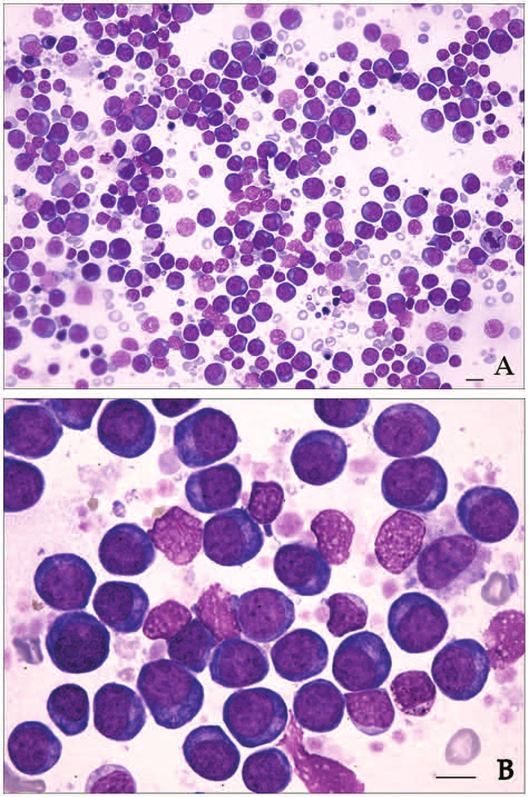

# Project Description

<!-- Add a short paragraph describing the project. -->

As the DICOM standard is increasingly used in digital pathology imaging, conversion of available datasets from proprietary formats into DICOM format can make the data more FAIR and improve transparency and reproducibility of research conducted with these data. For this reason, the NCI Imaging Data Commons (IDC) hosts all its data in DICOM format.

A set of bone marrow smear WSI available in MIRAX (.mrxs) format are to be ingested into the IDC. For that purpose they need to be converted into DICOM (.dcm) along with all available image and clinical metadata.
In addition, this dataset contains extensive deep-learning generated nuclei annotations (bounding boxes) that should also be converted into DICOM in a suitable way.

## Objective

<!-- Describe here WHAT you would like to achieve (what you will have as end result). -->

 1. **Objective A**: Have a working script for the conversion of the complete set of bone marrow smear WSI into DICOM format based on [wsidicomizer](https://github.com/imi-bigpicture/wsidicomizer).
 2. **Objective B**: Include clinical metadata in an IDC-conformant way.
 3. **Objective C (optional)**: Have a script that converts the nuclei annotations into DICOM. Consider this issue: https://github.com/imi-bigpicture/wsidicomizer/issues/56

## Approach and Plan

<!-- Describe here HOW you would like to achieve the objectives stated above. -->

**Objective A**
1. Implement and verify code for basic conversion of the .mrxs files as is into .dcm.
2. Investigate automatically filled metadata (including pixel spacing). wsidicomizer's default data can be found [here](https://github.com/imi-bigpicture/wsidicom/tree/ab16e38c678b4bb6eb8e2c670d4c7278c67edf03/wsidicom/metadata), an overview of attributes for VL Whole Slide Microscopy IOD [here](https://dicom.innolitics.com/ciods/vl-whole-slide-microscopy-image).
3. Add code for ingestion of metadata that are not obtained from the .mrxs files / correct potential falsely estimated metadata (via wsidicom API or JSON file).
4. Verify correct conversion with dciodvfy on every file and dcentvfy on every set of files in a series.
5. Have a few successfully converted samples and be ready to run code on complete collection.

**Objective B**
1. Prepare additional clinical and lab data as table such that they can be ingested into IDC as BigQuery table.

**Objective C (optional)**:
1. Discuss and decide in what way available annotations can be best encoded in DICOM.
2. Implement conversion pipeline for annotation conversion based on IDC annotation conversion code by Chris Bridge.

## Progress and Next Steps

<!-- Update this section as you make progress, describing of what you have ACTUALLY DONE.
     If there are specific steps that you could not complete then you can describe them here, too. -->

**Objective A**:
- We successfully wrote a conversion pipeline for .mrxs files into .dcm using wsidicomizer and have a couple of converted files. A few issues have been identified on the way, reported to wsidicomizer and mostly already been fixed by Erik Gabriellson.

**Objective B**:
- to be done

**Objective C**:
- We discussed and decided that the best way to encode available annotations is in DICOM Microscopy Bulk Simple Annotations.

**Next steps**:
- Run conversion script on whole dataset.
- Do Objective B: Prepare additional clinical and lab data as table such that they can be ingested into IDC as BigQuery table.
- Finish and run annotation conversion pipeline.

# Illustrations

<!-- Add pictures and links to videos that demonstrate what has been accomplished. -->

 \
*Example image of bone marrow smears. Taken from: [https://doi.org/10.1177/1040638712452731](https://doi.org/10.1177/1040638712452731).*

# Background and References

<!-- If you developed any software, include link to the source code repository.
     If possible, also add links to sample data, and to any relevant publications. -->

Background reading:
- Herrmann, M. D., Clunie, D. A., Fedorov, A., Doyle, S. W., Pieper, S., Klepeis, V., Le, L. P., Mutter, G. L., Milstone, D. S., Schultz, T. J., Kikinis, R., Kotecha, G. K., Hwang, D. H., Andriole, K. P., John Lafrate, A., Brink, J. A., Boland, G. W., Dreyer, K. J., Michalski, M., Golden, J. A., Louis, D. N. & Lennerz, J. K. Implementing the DICOM standard for digital pathology. J. Pathol. Inform. 9, 37 (2018). [http://dx.doi.org/10.4103/jpi.jpi_42_18]( http://dx.doi.org/10.4103/jpi.jpi_42_18)
- Clunie, D. A. DICOM format and protocol standardization-A core requirement for digital pathology success. Toxicol. Pathol. 49, 738–749 (2021). [http://dx.doi.org/10.1177/0192623320965893](http://dx.doi.org/10.1177/0192623320965893)

Further resources:
- [IDC Portal](https://portal.imaging.datacommons.cancer.gov/)
- Description of MIRAX format: [Introduction to MIRAX/MRXS](https://lists.andrew.cmu.edu/pipermail/openslide-users/2012-July/000373.html)
- Conversion tool: [wsidicomizer](https://github.com/imi-bigpicture/wsidicomizer)
- Annotation conversion scripts by Chris Bridge: [idc-sm-annotations-conversion](https://github.com/ImagingDataCommons/idc-sm-annotations-conversion/tree/0a5060d44e25f6cfa78074f0dde7a1ca1aa6bc53)
- Useful tools for inspection/verification of DICOM files: [dcmtk](https://dicom.offis.de/en/dcmtk/dcmtk-tools/), [dicom3tools](https://www.dclunie.com/dicom3tools.html)
- Related project from this project week: [Evaluation of imi-bigpicture/wsidicomizer as a tool for conversion into DICOM whole slide imaging format](https://projectweek.na-mic.org/PW42_2025_GranCanaria/Projects/EvaluationOfImiBigpictureWsidicomizerAsAToolForConversionIntoDicomWholeSlideImagingFormat/)
- Related earlier project from PW40: [WSI-DICOM Improvement - From Viewer to Analysis](https://projectweek.na-mic.org/PW40_2024_GranCanaria/Projects/WsiDicomImprovementFromViewerToAnalysis/)
