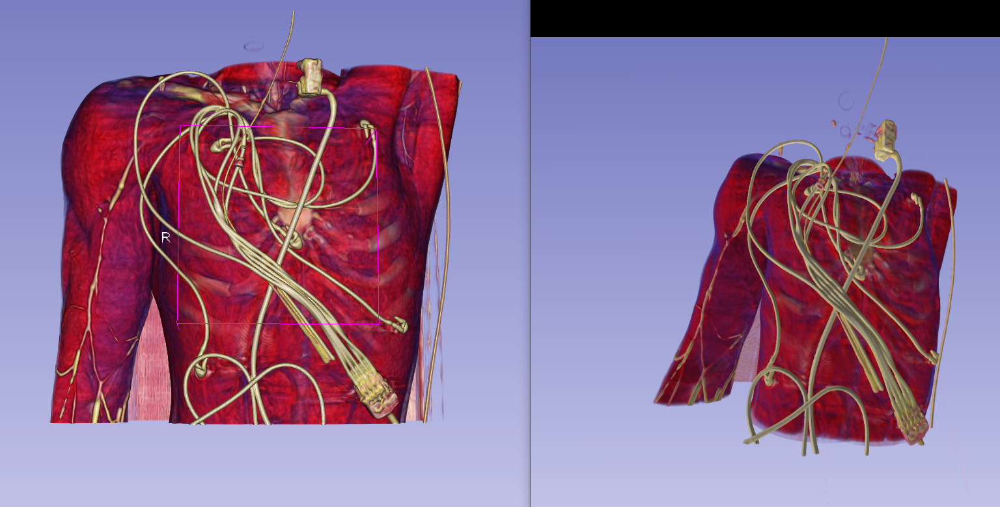
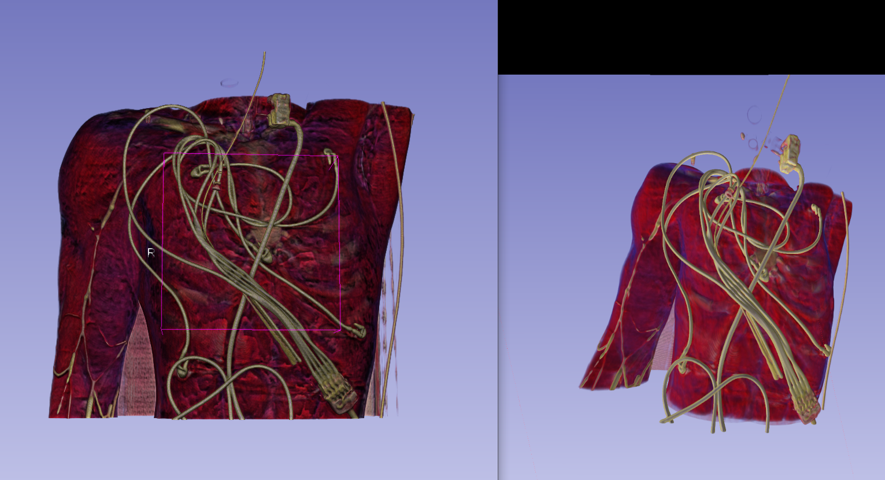
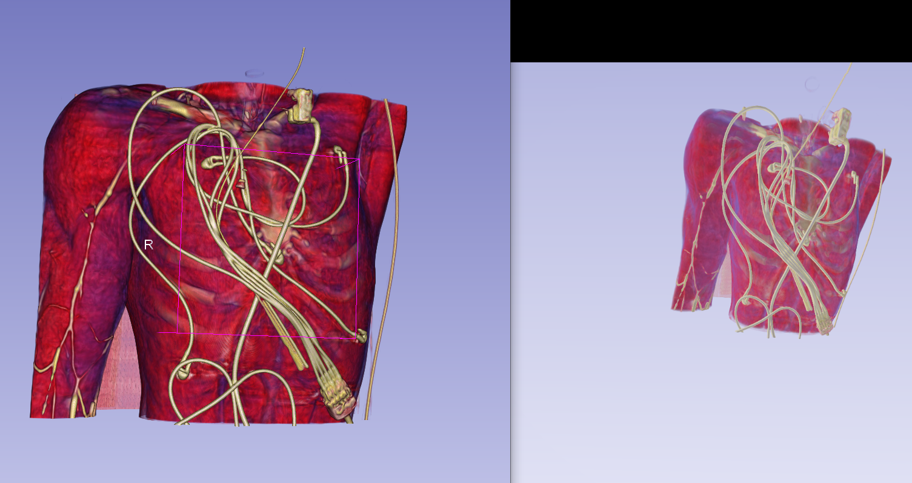
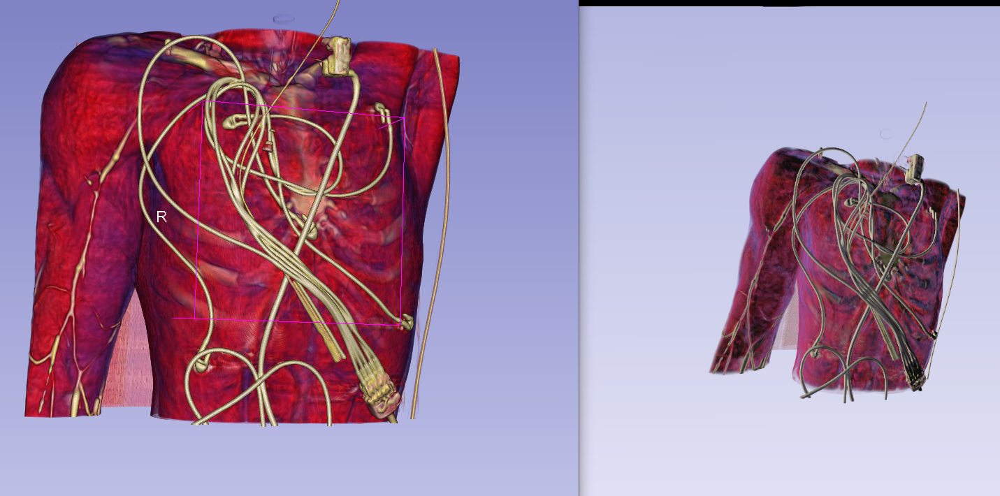

# Project Description

<!-- Add a short paragraph describing the project. -->

There is a regression with how latest SlicerVR lights the scene, both with the old VR and the new XR backend.
- OpenVR: Default lighting looks as expected, but now SSAO and Lights module options are not applied on the VR view (even if the view node IDs are explicitly selected)
- OpenXR: Default lighting looks washed out

## Objective

<!-- Describe here WHAT you would like to achieve (what you will have as end result). -->

1. Make both backends of SlicerVR work like before the regression
    * "Normal" lighting by default
    * Lights module changes have effect on VR view as well

## Approach and Plan

<!-- Describe here HOW you would like to achieve the objectives stated above. -->

1. Investigate the problem with the help of people directly involved in the OpenXR integration
2. If we find the root cause of either issues, try to address them

## Progress and Next Steps

<!-- Update this section as you make progress, describing of what you have ACTUALLY DONE.
     If there are specific steps that you could not complete then you can describe them here, too. -->

1. The Kitware team looked into the issue with OpenXR
    * The issue seems to be the SRGB conversion. There is already a workaround possible, with a proper solution suggested ([see comment](https://github.com/KitwareMedical/SlicerVirtualReality/issues/182#issuecomment-2624608363))
2. OpenVR support is being removed from Windows, so probably not worth trying to address the issue

# Illustrations

<!-- Add pictures and links to videos that demonstrate what has been accomplished. -->

The following screenshots demonstrate shadows vs no shadows in OpenVR: 

Left: Slicer view using OpenVR without shadows 
Right: VR view (with back lights / without two sided lighting)

Left: Slicer view using OpenVR with shadows
Right: VR view  (with back lights / without two sided lighting)

__________________________________________________________________________________________________________

The following screenshots demonstrate different lighting options in OpenXR: 

Left: Slicer view using OpenXR without shadows 
Right: VR view (with back lights / without two sided lighting) 

Left: Slicer view using OpenXR without shadows 
Right: VR view (without back lights / without two sided lighting) 

# Background and References

* [SlicerVirtualReality issue](https://github.com/KitwareMedical/SlicerVirtualReality/issues/182)

<!-- If you developed any software, include link to the source code repository.
     If possible, also add links to sample data, and to any relevant publications. -->

For those who have access to SlicerHeart internals, this is the link to the issue: https://github.com/JolleyLab/Internal/issues/205#event-14879920416

