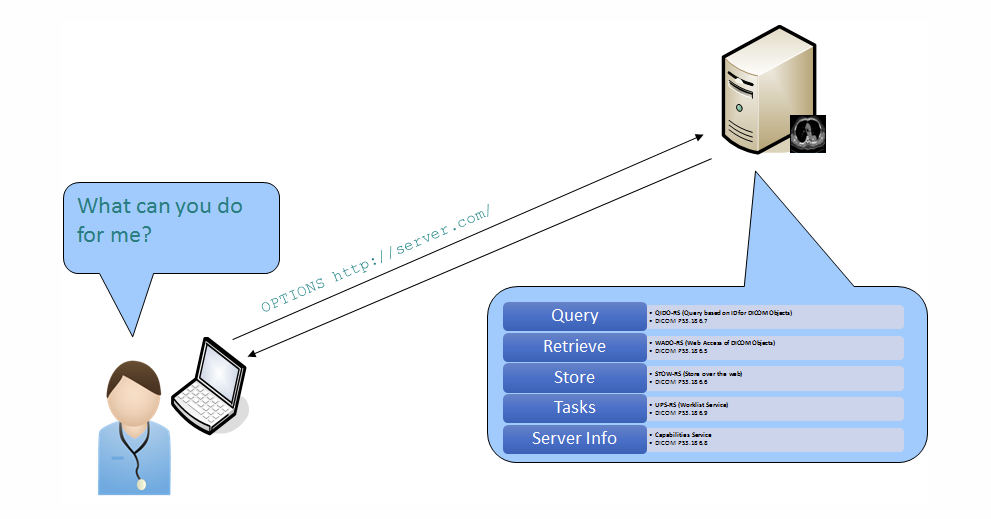

# Project Description

<!-- Add a short paragraph describing the project. -->

As the DICOM standard is increasingly used in digital pathology imaging, conversion of available datasets from proprietary formats into DICOM format can make the data more FAIR and improve transparency and reproducibility of research conducted with these data. For this reason, the NCI Imaging Data Commons (IDC) hosts all its data in DICOM format.

DICOMweb™ is a set of RESTful services that allows search, access and storage of DICOM objects via network. IDC data are also available (currently outdated, but soon to be updated) from a [DICOM store](https://cloud.google.com/healthcare-api/docs/resources/public-datasets/idc). This project aims to specifically try to optimize access to digital pathology IDC data via DICOMweb capable libraries ([wsidicom](), [dicomslide](), [ez-wsi-dicomweb](https://github.com/GoogleCloudPlatform/EZ-WSI-DICOMweb)) based on prior works on that issue. 

## Objective

<!-- Describe here WHAT you would like to achieve (what you will have as end result). -->

1. **Objective A**: Have a code snippet for randomly and efficiently selecting tiles of arbitrary size from the IDC-DICOM store. 
2. **Objective B (if time permits)**: Have an efficiency comparison for different libraries used for DICOMweb access.  

## Approach and Plan

<!-- Describe here HOW you would like to achieve the objectives stated above. -->

**Objective A**: 
1. Summarize current state.
2. Implement DICOMweb access (problems have priorily been observed wrt authorization).

**Objective B**: 
1. Create scripts for efficiency comparison. 
2. Summarize results.  

## Progress and Next Steps

<!-- Update this section as you make progress, describing of what you have ACTUALLY DONE.
     If there are specific steps that you could not complete then you can describe them here, too. -->

**Objective A**: 
1. Current state summarized in document (will be made public following PW).
2. Created scripts for access with dicomslide, wsidicom, ez-wsi-dicom. 

**Objective B**:
1. Time didn't permit further efficiency comparison. But based on previous results and discussions, it became clear that ez-wsi-dicom is currently the most efficient tool probably due to the use of multiple ways of parallelizing requests and caching.
2. The main downside of ez-wsi-dicom is that it only works with Google DICOMweb stores. 

# Illustrations

<!-- Add pictures and links to videos that demonstrate what has been accomplished. -->

 \
*Conceptual overview of DICOMweb. Taken from: https://www.dicomstandard.org/using/dicomweb/capabilities.*

# Background and References

<!-- If you developed any software, include link to the source code repository.
     If possible, also add links to sample data, and to any relevant publications. -->

Background reading: 
- [https://www.dicomstandard.org/using/dicomweb](https://www.dicomstandard.org/using/dicomweb)

Further resources: 
- Related earlier project from Project Week 40: [Current state of DICOMweb for pathology](https://projectweek.na-mic.org/PW40_2024_GranCanaria/Projects/CurrentStateOfDicomwebForPathology/).
- Extensive tutorial notebook of ez-wsi_dicomweb: [Getting Started with EZ-WSI DICOMweb](https://colab.research.google.com/github/GoogleCloudPlatform/EZ-WSI-DICOMweb/blob/main/ez_wsi_demo.ipynb#scrollTo=pK9lTJaN9tuk)

