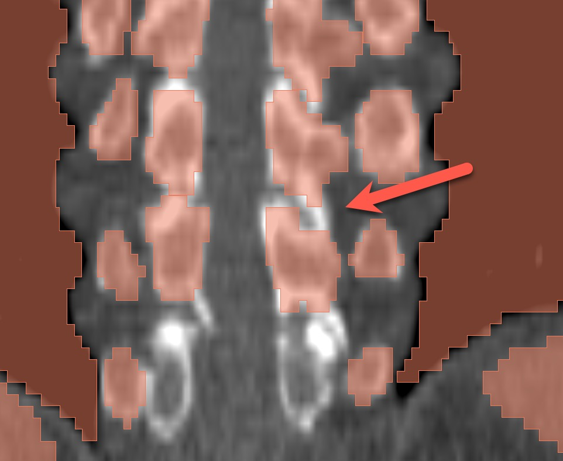
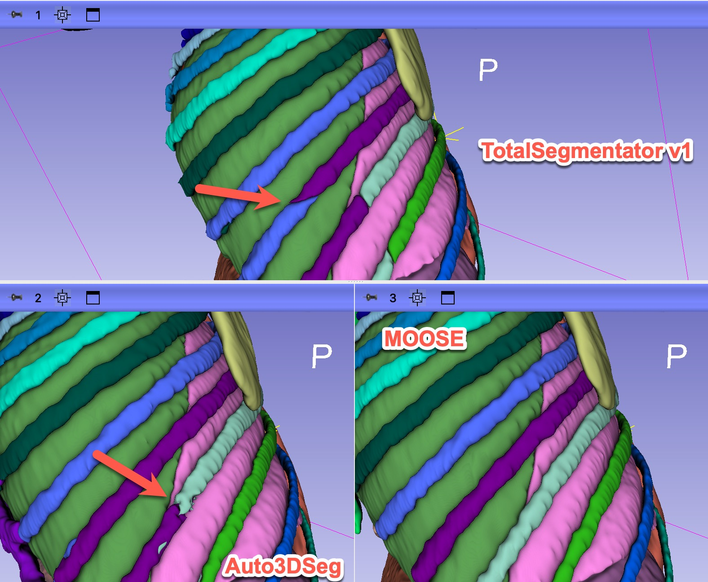

# Project Description

<!-- Add a short paragraph describing the project. -->


When initially released, TotalSegmentator was perceived to produce superior results, in comparison to the state-of-the-art at the time, anyway.

Over time, some of the deficiencies in the segmentations produced by TotalSegmentator have been identified. Further, new multi-organ segmentation models have been introduced.


## Objective

<!-- Describe here WHAT you would like to achieve (what you will have as end result). -->


1. Review segmentation results for a sample of images from IDC NLST collection, documenting the problems, across the publicly available multi-organ segmentation models. 


## Approach and Plan

<!-- Describe here HOW you would like to achieve the objectives stated above. -->

1. Identify set of cases to review.
2. Collect results from various methods (currently have for MOOSE and TotalSegmentator).
3. Review cases with Ron and David (using [SegmentationVerificationModule](https://projectweek.na-mic.org/PW41_2024_MIT/Projects/SegmentationVerificationModuleForFinalizingMultiLabelAiSegmentations/)
4. Identify more cases with failures, prepare interface/instructions how to help in identifying those.
5. Summarize the results of the review in a publicly available document.

## Progress and Next Steps

1. Instructions for downloading initial sample of images:

`pip install --upgrade idc-index`

```python
test_series = \
['1.2.840.113654.2.55.195946682403058845904768502826466194287', \
 '1.2.840.113654.2.55.221581533879834196356530174246594024639', \
 '1.2.840.113654.2.55.71263399928421039572326605504649736531', \
 '1.2.840.113654.2.55.79318439085250760439172236218713769408', \
 '1.2.840.113654.2.55.191661316001774647835097522264785668378', \
 '1.2.840.113654.2.55.304075689731327662774315497031574106725', \
 '1.2.840.113654.2.55.283399418711252976131557177419186072875', \
 '1.2.840.113654.2.55.21461438679308812574178613217680405233', \
 '1.2.840.113654.2.55.97114726565566537928831413367474015470', \
 '1.2.840.113654.2.55.122344168497038128022524906545138736420', \
 '1.2.840.113654.2.55.229650531101716203536241646069123704792', \
 '1.2.840.113654.2.55.257926562693607663865369179341285235858', \
 '1.3.6.1.4.1.14519.5.2.1.7009.9004.135383252566920035150987356231', \
 '1.3.6.1.4.1.14519.5.2.1.7009.9004.315696884435641630605419115484', \
 '1.3.6.1.4.1.14519.5.2.1.7009.9004.230644512623268816899910856967', \
 '1.3.6.1.4.1.14519.5.2.1.7009.9004.330739122093904668699523188451', \
 '1.3.6.1.4.1.14519.5.2.1.7009.9004.690272753571338193252806012518', \
 '1.3.6.1.4.1.14519.5.2.1.7009.9004.310718458447911706151879406927']

from idc_index import IDCClient 

c= IDCClient()

c.download_from_selection(downloadDir=".",seriesInstanceUID=test_series)
```

2. 1 session with Ron looking at the initial result for just one case. Issues identified: 1) unrealistic anatomy and large gap between ribs and and [erector spinae](https://www.kenhub.com/en/library/anatomy/erector-spinae-muscles); 2) incorrect segmentation of some vertebrae; 3) large gaps between the structure; 4) segmentation is too coarse.
3. Collected results from Auto3DSeg and OMAS, in addition to TotalSegmentator v1 and MOOSE for the test sample.
4. Finished [SNOMED mapping for OMAS](https://docs.google.com/spreadsheets/d/1pBicNskjMDJBnD3w4yAQroj8SGSAhDfA_TUK24dLEyc/edit?gid=1390863317#gid=1390863317).
5. Harmonized mapping from model-specific labels to SNOMED-CT codes and consistent colors for Auto3DSeg and MOOSE (see CSV files [here](https://github.com/NA-MIC/ProjectWeek/tree/master/PW42_2025_GranCanaria/Projects/ReviewOfSegmentationResultsQualityAcrossVariousMultiOrganSegmentationModels)) - [Google Sheet with current mapping](https://docs.google.com/spreadsheets/d/10VNy3kjaeXOgCRSgInCKH014134ZbD5Ezju7zZvVCRY/edit?gid=0#gid=0). Didn't finish this for OMAS!
6. Explored Slicer capabilities for joint visualization of the segmentation results, identified relevant features thanks to Steve!
7. Received Multitalent model segmentation results from Klaus Maier-Hein.
8. Co-authored with Perplexity a Google Apps script for coloring Google Sheets cells based on the RGB string - helpful for quickly evaluating color selection.







```js
function colorCellsFromRGB() {
  var sheet = SpreadsheetApp.getActiveSpreadsheet().getActiveSheet();
  var dataRange = sheet.getDataRange();
  var values = dataRange.getValues();
  
  for (var i = 0; i < values.length; i++) {
    for (var j = 0; j < values[i].length; j++) {
      var cell = values[i][j];
      if (typeof cell === 'string' && cell.match(/^\[\d{1,3}, \d{1,3}, \d{1,3}\]$/)) {
        var rgb = JSON.parse(cell);
        var color = rgbToHex(rgb[0], rgb[1], rgb[2]);
        sheet.getRange(i + 1, j + 1).setBackground(color);
      }
    }
  }
}

function rgbToHex(r, g, b) {
  return "#" + ((1 << 24) + (r << 16) + (g << 8) + b).toString(16).slice(1);
}
```

Feedback/features:
* identified some issues in SegmentationReview module - Andrey will try to submit a PR
* identified issues related to visualization of segmentations in Slicer - issue submitted https://github.com/Slicer/Slicer/issues/8190
* would be really helpful to be able to show what structure cursor points to in 3d View (Ron seconds this!)
* review of multiple segmentations is currently difficult - perhaps opportunity for improving SegmentationsReview module


# Illustrations

<!-- Add pictures and links to videos that demonstrate what has been accomplished. -->


_No response_

# Background and References

<!-- If you developed any software, include link to the source code repository.
     If possible, also add links to sample data, and to any relevant publications. -->
* Krishnaswamy, D., Thiriveedhi, V. K., Ciausu, C., Clunie, D., Pieper, S., Kikinis, R. & Fedorov, A. Rule-based outlier detection of AI-generated anatomy segmentations. arXiv [eess.IV] (2024). at [http://arxiv.org/abs/2406.14486](http://arxiv.org/abs/2406.14486)
* HuggingFace exploration dashboard: [https://huggingface.co/spaces/ImagingDataCommons/CloudSegmentatorResults](https://huggingface.co/spaces/ImagingDataCommons/CloudSegmentatorResults)

