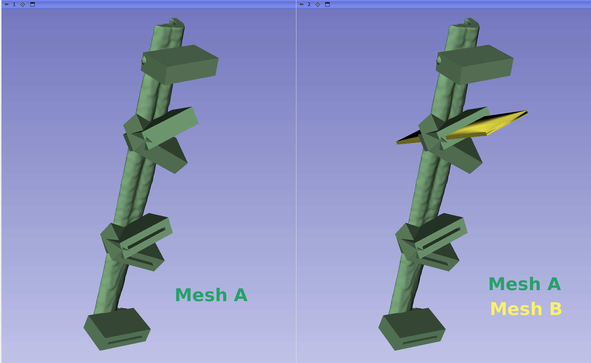
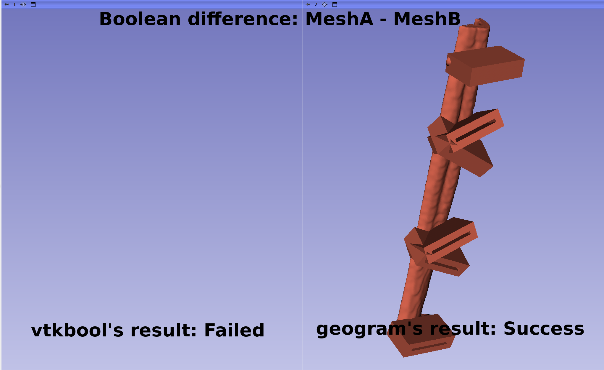

# Project Description

<!-- Add a short paragraph describing the project. -->

Support robust boolean operations for 2D triangle meshes inside VTK or Slicer through an external library. This would allow an alternative to current boolean operations engine, `vtkbool` (from Sandbox's extension CombineModels module), which is better than the default one of vtk but still unstable for complex meshes such as the ones used in the biomedical domain

## Objective

<!-- Describe here WHAT you would like to achieve (what you will have as end result). -->

1. Expose a robust boolean operations library (e.g. Geogram) in Slicer's logic and GUI
2. Compile a robust boolean operations library (e.g. Geogram) as a vtk external module

## Approach and Plan

<!-- Describe here HOW you would like to achieve the objectives stated above. -->

1. Add a CLI module for Slicer that encapsulates a robust boolean operation command line as part of Sandbox extension.
2. Create a draft PR to the upstream repo with the code changes that incorporate the feature and documentation on how to use it from GUI and a code snippet on how to use it from the python interpreter
3. If there is enough time, evaluate creating a boolean operations DynamicModeler tool

## Progress and Next Steps

<!-- Update this section as you make progress, describing of what you have ACTUALLY DONE.
     If there are specific steps that you could not complete then you can describe them here, too. -->

1. Table that compares most "popular" boolean operations libraries from the [awesome geometry processing](https://github.com/zishun/awesome-geometry-processing#general-libraries) projects list:
[https://docs.google.com/spreadsheets/d/1tWbNuMz7vTIB2efFZE7YdT4vBmRb45DdQlqy_kda32k/edit?usp=sharing](https://docs.google.com/spreadsheets/d/1tWbNuMz7vTIB2efFZE7YdT4vBmRb45DdQlqy_kda32k/edit?usp=sharing)
2. Tested `geogram` successfully with mesh that made `vtkbool` fail
3. Edited the CombineModels module to allow other boolean operations backend, `manifold` through `trimesh` python module
4. Discussed with the team how to expose geogram library to Slicer, mostly CMake related issues.
5. Achieved creation of a CLI module to execute geogram boolean operations that will be later added to Sandbox extensions
6. Next steps are to make all these alternative backends available on CombineModels module as a PRs. This will involve modifying Sandbox extension to be a superbuild extension

# Illustrations

<!-- Add pictures and links to videos that demonstrate what has been accomplished. -->

## Boolean operation example

## Working CLI module exposing geogram

# Background and References

<!-- If you developed any software, include link to the source code repository.
     If possible, also add links to sample data, and to any relevant publications. -->

- [Geogram's boolean operations](https://github.com/BrunoLevy/geogram/wiki/BooleanOps)
- [Manifold's boolean operations](https://github.com/elalish/manifold/wiki/Manifold-Library#mesh-boolean)
- [Trimesh (exposes manifold)](https://github.com/mikedh/trimesh)

