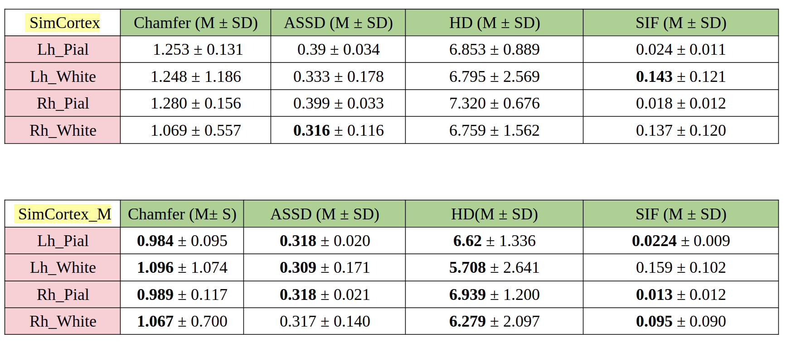
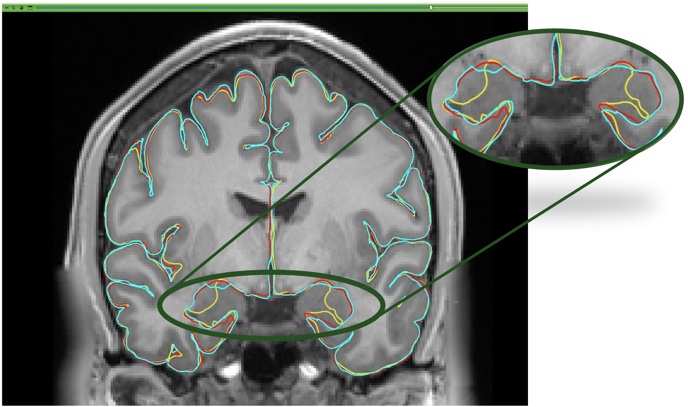
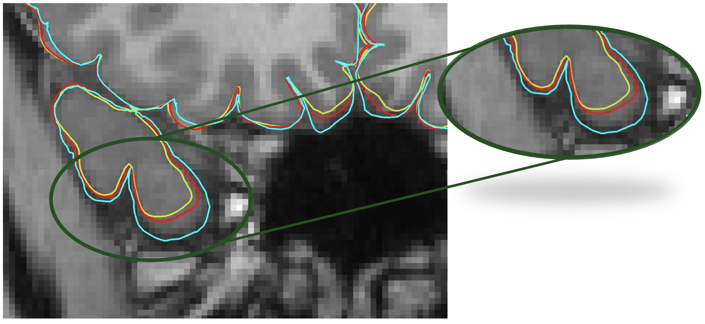
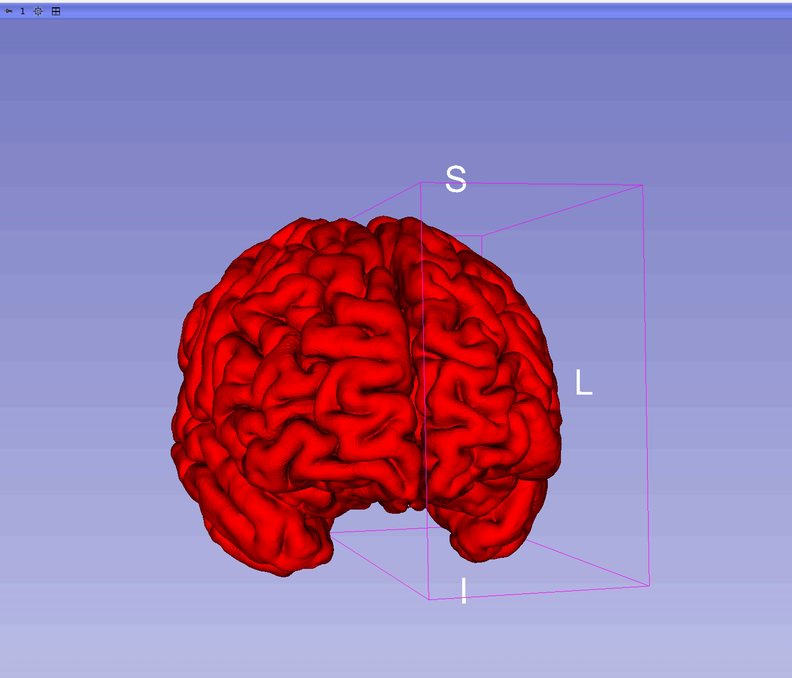

# Project Description

SimCortex is a deep-learning framework that reconstructs all four cortical surfaces (left/right white matter and pial) from T1-weighted MRI, with a focus on minimizing inter-surface collisions and self-intersections while maintaining high geometric fidelity. To improve robustness and generalization, we fine-tune SimCortex—originally trained on FreeSurfer-generated segmentations—using a set of 50 expert-annotated MRI volumes.

---

## Objectives

1. **Fine‐tune SimCortex with high‐quality, manually labeled data**  
   Fine-tune the pre‐trained SimCortex model using 50 expert‐annotated MRI segmentations to improve anatomical accuracy and reduce geometric artifacts.

2. **Compare fine‐tuned variants against the baseline**  
   Evaluate several fine‐tuned configurations using geometric metrics (Chamfer Distance, ASSD, HD) and topological consistency (SIF), and compare them to the baseline SimCortex model.

3. **Visually validate reconstructions in 3D Slicer**  
   Load predicted cortical surfaces into 3D Slicer and assess anatomical plausibility with expert guidance.

---

## Approach and Plan

1. **Preprocessing:** Convert expert-segmented MRI volumes into a format compatible with SimCortex.
2. **Model Fine-Tuning:** Use manual segmentations to fine-tune the original SimCortex model.
3. **Evaluation:** Measure Chamfer, ASSD, HD, and %SIF for each configuration.
4. **Baseline Comparison:** Compare all metrics with the baseline SimCortex model.
5. **Expert Review:** Collaborate with Prof. Jarrett Rushmore for visual validation.
6. **Selection:** Choose the best configuration based on both quantitative metrics and expert review.

---

## Progress and Next Steps

We fine-tuned the pre-trained SimCortex model (`SimCortex_M`) using 50 high-quality, expert-annotated MRI segmentations. The model was evaluated against the original SimCortex baseline using geometric and topological metrics, including **Chamfer Distance**, **Hausdorff Distance (HD)**, **Average Symmetric Surface Distance (ASSD)**, and **Self-Intersection Fraction (SIF)**.

Both **quantitative** and **visual evaluations** demonstrate the benefits of fine-tuning:

- `SimCortex_M` achieves **lower errors** across all evaluated metrics.
- The **red surface** (fine-tuned) shows better alignment with the **turquoise manual ground truth**, while the **yellow surface** (baseline) exhibits greater deviation.
- These results confirm that using expert-labeled data leads to improved anatomical and topological accuracy.

## 🚀 Future Direction
- As a next step, we plan to develop a more robust version of SimCortex as a **3D Slicer extension**. This extension will aim to produce more accurate cortical surfaces with **minimal inter-surface collisions** and **eliminate self-intersections**, enhancing its usability for both clinical and research workflows.
---

# Illustrations

## 📊 Quantitative Evaluation Results

The table below compares baseline and fine-tuned model performance across all surfaces.

## 🧠 Visual Comparison of Cortical Surfaces

This Figure illustrates the differences between ground truth and predictions.

- **Turquoise:** Manual ground truth
- **Red:** Fine-tuned model (SimCortex_M)
- **Yellow:** Baseline model (SimCortex)

###  🧩 Full Brain View

### 🔍 Zoomed-In View

###  🧠 Reconstructed Cortical Surfaces (Fine-Tuned Model)

