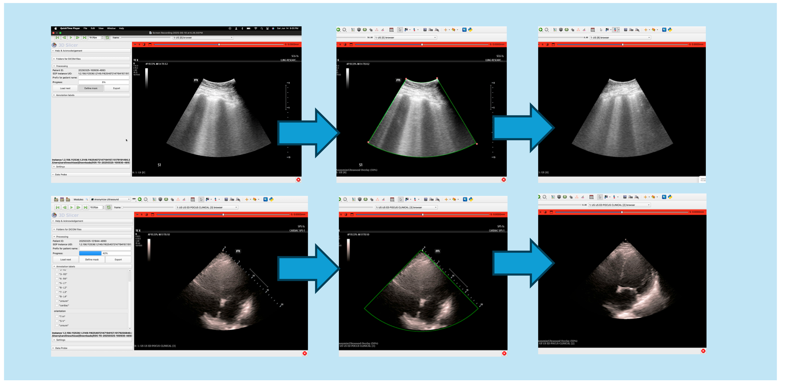

# Project Description

<!-- Add a short paragraph describing the project. -->

SlicerUltrasound is a 3D Slicer extension that currently includes two modules: Annotate, which supports expert labeling of image findings, and Anonymize, which removes both metadata-embedded PHI and burned-in text from DICOM images. The Anonymize module, the focus of this project, has been used at Brigham and Women’s Hospital (BWH), Lahey Hospital, and Indiana Methodist to remove PHI from over 1,000 patient exams. The Anonymizer module allows users to import DICOM ultrasound images from a local network folder and apply probe-specific masking templates to remove burned-in identifiers. Users specify the transducer type—curvilinear or phased array—which determines the expected fan shape. By marking three or four points on the image, the module interpolates the imaging sector and masks any visual PHI outside this region while preserving diagnostically relevant content. This flexible, semi-automated approach supports consistent anonymization across large datasets while accommodating variations in ultrasound geometry.

## Objective

<!-- Describe here WHAT you would like to achieve (what you will have as end result). -->

Our team members are onsite as well as working virtually to fix [open issues](https://github.com/SlicerUltrasound/SlicerUltrasound/issues) in the software to make it more user friendly, and to test AI models for automated fan segmentation.

## Approach and Plan

<!-- Describe here HOW you would like to achieve the objectives stated above. -->

We will be working on the open issues list and happy to discuss it with any PW43 participants who are interested. 

## Progress and Next Steps

<!-- Update this section as you make progress, describing of what you have ACTUALLY DONE.
     If there are specific steps that you could not complete then you can describe them here, too. -->

During PW43 we completed manual de-identification (fan segmentation by clicking on the corners of the fan) for 100 patient exams, and tested our AI system on them. Some rough edges, no pun intended, were revealed, which we plan to complete and before PW44. See illustration in the lower figure below.

# Illustrations

<!-- Add pictures and links to videos that demonstrate what has been accomplished. -->

  

Results from PW43 - WIP:

# Background and References

<!-- If you developed any software, include link to the source code repository.
     If possible, also add links to sample data, and to any relevant publications. -->

- [https://github.com/SlicerUltrasound](https://github.com/SlicerUltrasound)

